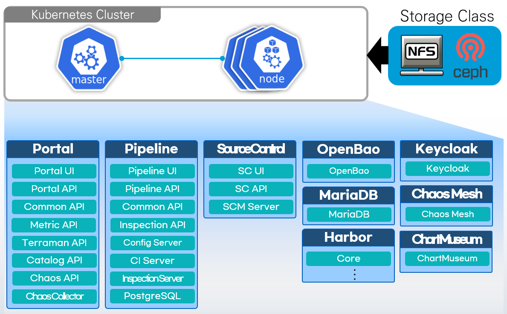

### [Index](https://github.com/K-PaaS/Guide/blob/master/README.md) > [CP Install](/install-guide/Readme.md) > 멀티 클러스터 서비스 형 컨테이너 플랫폼 포털 배포 가이드

<br>

## Table of Contents

1. [문서 개요](#1)  
   1.1. [목적](#1.1)  
   1.2. [범위](#1.2)  
   1.3. [시스템 구성도](#1.3)  
   1.4. [참고 자료](#1.4)

2. [Prerequisite](#2)  
   2.1. [방화벽 정보](#2.1)

3. [컨테이너 플랫폼 포털 배포](#3)  
   3.1. [컨테이너 플랫폼 포털 배포](#3.1)  
   3.1.1. [컨테이너 플랫폼 포털 Deployment 파일 다운로드](#3.1.1)  
   3.1.2. [컨테이너 플랫폼 포털 변수 정의](#3.1.2)    
   3.1.3. [컨테이너 플랫폼 포털 배포 스크립트 실행](#3.1.3)  
   3.1.4. [(참고) 컨테이너 플랫폼 포털 리소스 삭제](#3.1.4)

4. [컨테이너 플랫폼 포털 사용자 인증 서비스 구성](#4)      
   4.1. [컨테이너 플랫폼 포털 사용자 인증 구성 Deployment 다운로드](#4.1)      
   4.2. [컨테이너 플랫폼 포털 사용자 인증 구성 변수 정의](#4.2)      
   4.3. [컨테이너 플랫폼 포털 사용자 인증 구성 스크립트 실행](#4.3)          
   4.4. [(참고) 컨테이너 플랫폼 포털 사용자 인증 구성 해제](#4.4)

5. [컨테이너 플랫폼 포털 서비스 브로커](#5)       
   5.1. [컨테이너 플랫폼 포털 서비스 브로커 등록](#5.1)  
   5.2. [컨테이너 플랫폼 포털 서비스 조회 설정](#5.2)    
   5.3. [컨테이너 플랫폼 포털 사용 가이드](#5.3)

6. [컨네이너 플랫폼 포털 참고](#6)   
   6.1. [Kubernetes 리소스 생성 시 주의사항](#6.1)

<br>

## <span id='1'>1. 문서 개요
### <span id='1.1'>1.1. 목적
본 문서(멀티 클러스터 서비스 형 컨테이너 플랫폼 포털 배포 가이드)는 쿠버네티스 멀티 클러스터 환경에 컨테이너 플랫폼 서비스 형 포털 배포 방법을 기술하였다. <br><br>


### <span id='1.2'>1.2. 범위
설치 범위는 쿠버네티스 클러스터 배포를 기준으로 작성하였다.

<br>

### <span id='1.3'>1.3. 시스템 구성도
<p align="center"></p>

시스템 구성은 **Kubernetes Cluster(Master, Worker)** 환경과 데이터 관리를 위한 스토리지 서버로 구성되어 있다. Kubespray를 통해 설치된 Kubernetes Cluster 환경에 컨테이너 플랫폼 포털 이미지 및 Helm Chart를 관리하는 **Harbor**, 컨테이너 플랫폼 포털 사용자 인증을 관리하는 **Keycloak**, 인증 데이터를 관리하는 **Vault**, 메타 데이터를 관리하는 **MariaDB(RDBMS)** 등 미들웨어 환경을 컨테이너로 제공한다. 총 필요한 VM 환경으로는 **Master VM: 1개, Worker VM: 3개 이상**이 필요하고 본 문서는 Kubernetes Cluster에 컨테이너 플랫폼 포털 환경을 배포하는 내용이다.

<br>    

### <span id='1.4'>1.4. 참고 자료
> https://kubernetes.io/ko/docs<br>
> https://goharbor.io/docs<br>
> https://www.keycloak.org/documentation

<br>

## <span id='2'>2. Prerequisite
본 설치 가이드는 **Ubuntu 22.04** 환경에서 설치하는 것을 기준으로 작성하였다.

### <span id='2.1'>2.1. 방화벽 정보
IaaS Security Group의 열어줘야할 Port를 설정한다.

- Master Node

| <center>프로토콜</center> | <center>포트</center> | <center>비고</center> |  
| :---: | :---: | :--- |  
| TCP | 111 | NFS PortMapper |  
| TCP | 2049 | NFS |  
| TCP | 2379-2380 | etcd server client API |  
| TCP | 6443 | Kubernetes API Server |  
| TCP | 10250 | Kubelet API |  
| TCP | 10251 | kube-scheduler |  
| TCP | 10252 | kube-controller-manager |  
| TCP | 10255 | Read-Only Kubelet API |  
| UDP | 4789 | Calico networking VXLAN |  

- Worker Node

| <center>프로토콜</center> | <center>포트</center> | <center>비고</center> |  
| :---: | :---: | :--- |  
| TCP | 111 | NFS PortMapper |  
| TCP | 2049 | NFS |  
| TCP | 10250 | Kubelet API |  
| TCP | 10255 | Read-Only Kubelet API |  
| TCP | 30000-32767 | NodePort Services |  
| UDP | 4789 | Calico networking VXLAN |  

<br>

## <span id='3'>3. 컨테이너 플랫폼 포털 배포

### <span id='3.1'>3.1. 컨테이너 플랫폼 포털 배포

#### <span id='3.1.1'>3.1.1. 컨테이너 플랫폼 포털 Deployment 파일 다운로드
컨테이너 플랫폼 포털 배포를 위해 컨테이너 플랫폼 포털 Deployment 파일을 다운로드 받아 아래 경로로 위치시킨다.<br>
+ 컨테이너 플랫폼 포털 Deployment 파일 다운로드 :
  [cp-portal-deployment-v1.5.0.tar.gz](https://nextcloud.k-paas.org/index.php/s/SSo9H3qjLsFn3ob/download)

```bash
# Deployment 파일 다운로드 경로 생성
$ mkdir -p ~/workspace/container-platform
$ cd ~/workspace/container-platform

# Deployment 파일 다운로드 및 파일 경로 확인
$ wget --content-disposition https://nextcloud.k-paas.org/index.php/s/SSo9H3qjLsFn3ob/download

$ ls ~/workspace/container-platform
  cp-portal-deployment-v1.5.0.tar.gz

# Deployment 파일 압축 해제
$ tar -xvf cp-portal-deployment-v1.5.0.tar.gz
```


- Deployment 파일 디렉토리 구성
```bash
cp-portal-deployment
├── script          # 싱글 클러스터 컨테이너 플랫폼 포털 배포 관련 변수 및 스크립트 파일 위치
├── script_mc       # 멀티 클러스터 컨테이너 플랫폼 포털 배포 관련 변수 및 스크립트 파일 위치
├── images          # 컨테이너 플랫폼 포털 이미지 파일 위치
├── charts          # 컨테이너 플랫폼 포털 Helm Charts 파일 위치
├── values_orig     # 컨테이너 플랫폼 포털 Helm Charts values 파일 위치
├── vault_orig      # 컨테이너 플랫폼 포털 인증 데이터 관리를 위한 Vault 배포 파일 위치
├── keycloak_orig   # 컨테이너 플랫폼 포털 사용자 인증 관리를 위한 Keycloak 배포 파일 위치
└── istio_mc        # 서비스 메시 관련 파일 위치 
```

<br>

#### <span id='3.1.2'>3.1.2. 컨테이너 플랫폼 포털 변수 정의
컨테이너 플랫폼 포털을 배포하기 전 변수 값 정의가 필요하다. 배포에 필요한 정보를 확인하여 변수를 설정한다.

:bulb: Keycloak 기본 배포 프로토콜은 **HTTP**이며 인증서를 통한 **HTTPS**를 설정하고자 하는 경우 아래 내용을 참조하여 선처리한다.
  <details>
  <summary><h4> :lock: Keycloak Ingress TLS 설정 방법</h4></summary>

  <h1></h1>

  ```bash
  $ cd ~/workspace/container-platform/cp-portal-deployment/script_mc
  $ vi cp-portal-vars-mc.sh
  ```
  ```bash
  # KEYCLOAK (해당 주석 위치로 이동)
  KEYCLOAK_URL="https://keycloak.${HOST_DOMAIN}"                 # keycloak url (if apply TLS, https:// )
  ...
  KEYCLOAK_INGRESS_TLS_ENABLED="true"　                          # keycloak ingress tls enabled (if apply TLS, true)
  KEYCLOAK_TLS_CERT_PATH="/home/ubuntu/tls/tls.crt" (예시)       # keycloak tls cert file path (if apply TLS, cert file path)
  KEYCLOAK_TLS_KEY_PATH="/home/ubuntu/tls/tls.key"  (예시)       # keycloak tls key file path (if apply TLS, key file path)
  ```
#### Keycloak 변수 값 변경
+  **KEYCLOAK_URL** <br> http -> `https` 로 변경 <br><br>
+  **KEYCLOAK_INGRESS_TLS_ENABLED** <br> `true`로 변경<br><br>
+  **KEYCLOAK_TLS_CERT_PATH** <br> TLS cert 파일 경로 추가<br><br>
+  **KEYCLOAK_TLS_KEY_PATH** <br> TLS key 파일 경로 추가
  <h1></h1>
  <br>
  </details>

```bash
$ cd ~/workspace/container-platform/cp-portal-deployment/script_mc
$ vi cp-portal-vars-mc.sh
```

```bash                                                 
# COMMON VARIABLE (Please change the value of the variables below.)
CLUSTER1_CONFIG[CTX]="{cluster1 context name}"                                  # Cluster1 Context Name
CLUSTER1_CONFIG[MASTER_NODE_IP]="{cluster1 master node public ip}"              # Cluster1 Master Node Public IP
CLUSTER1_CONFIG[API_SERVER]="https://${CLUSTER1_CONFIG[MASTER_NODE_IP]}:6443"   # Cluster1 API Server
CLUSTER1_CONFIG[STORAGECLASS]="cp-storageclass"                                 # Cluster1 StorageClass Name
CLUSTER1_CONFIG[IAAS_TYPE]="1"                                                  # Cluster1 Cluster IaaS Type ([1] AWS, [2] OPENSTACK, [3] NAVER, [4] NHN, [5] KT)

CLUSTER2_CONFIG[CTX]="{cluster2 context name}"                                  # Cluster2 Context Name
CLUSTER2_CONFIG[MASTER_NODE_IP]="{cluster2 master node public ip}"              # Cluster2 Master Node Public IP
CLUSTER2_CONFIG[API_SERVER]="https://${CLUSTER2_CONFIG[MASTER_NODE_IP]}:6443"   # Cluster2 API Server
CLUSTER2_CONFIG[STORAGECLASS]="cp-storageclass"                                 # Cluster2 StorageClass Name
CLUSTER2_CONFIG[IAAS_TYPE]="1"                                                  # Cluster2 Cluster IaaS Type ([1] AWS, [2] OPENSTACK, [3] NAVER, [4] NHN, [5] KT)

HOST_DOMAIN="{host domain}"                                                     # Host Domain (e.g. xx.xxx.xxx.xx.nip.io)
PROVIDER_TYPE="{container platform portal provider type}"                       # Container Platform Portal Provider Type (Please enter 'standalone' or 'service')
```
```bash    
# Example
# 컨테이너 플랫폼을 통해 배포된 클러스터인 경우
CLUSTER1_CONFIG[CTX]="ctx-1"
CLUSTER1_CONFIG[MASTER_NODE_IP]="103.xxx.xxx.xxx"
CLUSTER1_CONFIG[API_SERVER]="https://${CLUSTER1_CONFIG[MASTER_NODE_IP]}:6443"
CLUSTER1_CONFIG[STORAGECLASS]="cp-storageclass"
CLUSTER1_CONFIG[IAAS_TYPE]="2"

# 타 Kubernetes 클러스터인 경우
CLUSTER2_CONFIG[CTX]="ctx-2"
CLUSTER2_CONFIG[MASTER_NODE_IP]="104.xxx.xxx.xxx"
CLUSTER2_CONFIG[API_SERVER]="https://63c4f2d9-xxxx.xxxx.com"
CLUSTER2_CONFIG[STORAGECLASS]="block-storage"
CLUSTER2_CONFIG[IAAS_TYPE]="4"

HOST_DOMAIN="105.xxx.xxx.xxx.nip.io"
PROVIDER_TYPE="service"
```

|변수|설명|상세 내용|
|---|---|---|
|**CTX**|해당 클러스터 컨텍스트 명 입력|| 
|**MASTER_NODE_IP**|Kubernetes Master Node<br> Public IP 입력|Master Node에 접근하기 어려운 경우<br>Worker Node Public IP 입력|
|**API_SERVER**|Kubernetes API Server URL 입력|컨테이너 플랫폼을 통해 배포된 클러스터는 <br> 기본으로 <b>`https://${K8S_MASTER_NODE_IP}:6443`</b>이다. <br> Master Node의 6443번 포트 수신 형식이 아닐 경우 값을 수정한다.|
|**STORAGECLASS**|StorageClass 명 입력|컨테이너 플랫폼을 통해 배포된 클러스터는 <br> 기본으로 <b>`cp-storageclass`</b>이다. <br> 다른 StorageClass 사용 시 해당 리소스 명을 입력한다.|
|**IAAS_TYPE**|Kubernetes Cluster IaaS 환경 입력|[1] AWS [2] OPENSTACK [3] NAVER [4] NHN [5] KT 번호 입력|
|**HOST_DOMAIN**|Host Domain 값 입력 |<b>* 클러스터 Cluster1 *</b>의 <br> <b>`{ingress-nginx-controller 서비스의 EXTERNAL-IP}.nip.io`</b> 입력<br> [아래 내용 확인](#host_domain)|
|**PROVIDER_TYPE**|컨테이너 플랫폼 포털 제공 타입 입력|본 가이드는 포털 서비스 배포 형 설치 가이드로<br> **service** 값 입력 필요|

#### 조회
```bash
# 클러스터 컨텍스트 조회
$ kubectl config get-contexts
CURRENT  NAME          CLUSTER    AUTHINFO         NAMESPACE
*        ctx-1 (입력)  cluster1   cluster1-admin
         ctx-2 (입력)  cluster2   cluster2-admin

# Kubernetes API Server 조회
$ kubectl config view
apiVersion: v1
clusters:
- cluster:
    certificate-authority-data: DATA+OMITTED
    server: https://63c4f2d9-xxxx.xxxx.com (입력)

# StorageClass 조회
$ kubectl get storageclass 
NAME                   PROVISIONER
block-storage (입력)   blk.csi...
```
#### HOST_DOMAIN
<b>cluster1</b>으로 지정할 클러스터의 Ingress NGINX Controller 서비스 <b>EXTERNAL-IP</b>`(외부에서 접속 가능 IP)`와 <br> 무료 wildcard DNS 서비스 <b>nip.io</b> 를 사용 <br>

컨테이너 플랫폼 포털은 Kubernetes 리소스 Ingress를 통해 각 서비스를 라우팅하며, 그에 필요한 아래 두 서비스를 클러스터 설치 시 포함한다.<br>
> <b>[MetalLB](https://metallb.universe.tf/)</b> (베어메탈 클러스터 환경에서 로드 밸런서 기능 제공)<br>
> <b>[Ingress NGINX Controller](https://kubernetes.github.io/ingress-nginx/)</b> (Kubernetes용 Ingress 컨트롤러) <br>

MetalLB를 통해 할당된 Ingress NGINX Controller 서비스의 EXTERNAL-IP가 외부에서 접속불가인 경우<br>
각 클라우드 서비스에서 해당 IP의 네트워크 인터페이스 생성, 플로팅 IP 연결, 클러스터 노드에 인터페이스 연결 추가 등 작업이 필요하다.
```bash
# cluster1의 'ingress-nginx-controller' 서비스 EXTERNAL-IP 조회 (LoadBalancer 타입)
$ kubectl get svc -n ingress-nginx --context=ctx-1
NAME                        TYPE           CLUSTER-IP      EXTERNAL-IP            PORT(S)                      AGE
ingress-nginx-controller    LoadBalancer   10.233.49.255   192.168.0.xxx (확인)   80:30465/TCP,443:32226/TCP   26h

# 외부에서 EXTERNAL-IP curl 통신, 연결 불가
$ curl http://192.168.0.xxx
curl: (28) Failed to connect to 192.168.0.xxx port 80

# 클라우드 서비스에서 인터페이스 생성, 플로팅 ip 연결, 클러스터 노드에 인터페이스 연결 추가
192.168.0.xxx -> 105.xxx.xxx.xxx (플로팅 ip)

# 연결된 플로팅 ip로 외부에서 curl 통신, 404 에러 반환 시 정상 
$ curl http://105.xxx.xxx.xxx
<html>
<head><title>404 Not Found</title></head>
<body>
<center><h1>404 Not Found</h1></center>
<hr><center>nginx</center>
</body>
</html>

# 연결된 플로팅 ip의 nip.io로 호스트 도메인 값 입력
HOST_DOMAIN="105.xxx.xxx.xxx.nip.io"
```


<br>

#### <span id='3.1.3'>3.1.3. 컨테이너 플랫폼 포털 배포 스크립트 실행
컨테이너 플랫폼 포털 배포를 위한 스크립트를 실행한다.

```bash
$ chmod +x deploy-cp-portal-mc.sh
$ ./deploy-cp-portal-mc.sh
```
<br>

컨테이너 플랫폼 포털 관련 리소스가 정상적으로 배포되었는지 확인한다.<br>
리소스 Pod의 경우 Node에 바인딩 및 컨테이너 생성 후 Running 상태로 전환되기까지 몇 초가 소요된다.
> 클러스터 컨텍스트 정보 변수 설정
```
export CLUSTER1_CTX="{클러스터 cluster1 컨텍스트 명}"  #(e.g. ctx-1)
export CLUSTER2_CTX="{클러스터 cluster2 컨텍스트 명}"  #(e.g. ctx-2)
```

<br>

- **Vault Pod 조회**
>`$ kubectl get pods -n vault --context=${CLUSTER1_CTX}`
```bash
$ kubectl get pods -n vault --context=${CLUSTER1_CTX}
NAME                                       READY   STATUS    RESTARTS   AGE
cp-vault-0                                 2/2     Running   0          3m56s
cp-vault-agent-injector-5944578cff-4l8n8   2/2     Running   0          3m56s
```

- **Harbor Pod 조회**
>`$ kubectl get pods -n harbor --context=${CLUSTER1_CTX}`
```bash
$ kubectl get pods -n harbor --context=${CLUSTER1_CTX}
NAME                                       READY   STATUS    RESTARTS   AGE
cp-harbor-chartmuseum-7b6ff56dcf-rbc8t     2/2     Running   0          3m54s
cp-harbor-core-85cd645798-w52m2            2/2     Running   0          3m54s
cp-harbor-database-0                       2/2     Running   0          3m54s
cp-harbor-jobservice-595c74c64c-cxpxf      2/2     Running   0          3m54s
cp-harbor-notary-server-6979f49574-c499c   2/2     Running   0          3m54s
cp-harbor-notary-signer-6847644b76-8w6mn   2/2     Running   0          3m54s
cp-harbor-portal-8649c6cffc-svsjg          2/2     Running   0          3m54s
cp-harbor-redis-0                          2/2     Running   0          3m54s
cp-harbor-registry-fb9cfbb8b-t6h25         3/3     Running   0          3m54s
cp-harbor-trivy-0                          2/2     Running   0          3m54s
```  

- **MariaDB Pod 조회**
>`$ kubectl get pods -n mariadb --context=${CLUSTER2_CTX}`
```bash
$ kubectl get pods -n mariadb --context=${CLUSTER2_CTX}
NAME           READY   STATUS    RESTARTS   AGE
cp-mariadb-0   2/2     Running   0          3m8s
```    

- **Keycloak Pod 조회**
>`$ kubectl get pods -n keycloak --context=${CLUSTER1_CTX}`
```bash
$ kubectl get pods -n keycloak --context=${CLUSTER1_CTX}
NAME                           READY   STATUS    RESTARTS   AGE
cp-keycloak-77bc59dd98-9mft6   2/2     Running   0          3m38s
cp-keycloak-77bc59dd98-zvs2v   2/2     Running   0          3m38s
```

- **컨테이너 플랫폼 포털 Pod 조회**
>`$ kubectl get pods -n cp-portal --context=${CLUSTER1_CTX}` <br>
>`$ kubectl get pods -n cp-portal --context=${CLUSTER2_CTX}`
```bash
$ kubectl get pods -n cp-portal --context=${CLUSTER1_CTX}
NAME                                                   READY   STATUS    RESTARTS   AGE
cp-portal-api-deployment-5d4964986b-sgbr2              2/2     Running   0          3m47s
cp-portal-service-broker-deployment-76ccb4557b-9nfrs   2/2     Running   0          3m45s
cp-portal-terraman-deployment-7b996fbbc7-v2nfq         2/2     Running   0          3m46s
cp-portal-ui-deployment-5f7c4dc5dc-79cqt               2/2     Running   0          3m48s

$ kubectl get pods -n cp-portal --context=${CLUSTER2_CTX}
NAME                                               READY   STATUS    RESTARTS    AGE
cp-portal-common-api-deployment-5b987579bf-czshx   2/2     Running   0           4m1s
cp-portal-metric-api-deployment-5f99f8f7fb-mbr8t   2/2     Running   0           4m
```    

<br>

#### <span id='3.1.4'>3.1.4. (참고) 컨테이너 플랫폼 포털 리소스 삭제
배포된 컨테이너 플랫폼 포털 리소스의 삭제를 원하는 경우 아래 스크립트를 실행한다.<br>
:loudspeaker: (주의) 컨테이너 플랫폼 포털이 운영되는 상태에서 해당 스크립트 실행 시, **운영에 필요한 리소스가 모두 삭제**되므로 주의가 필요하다.<br>
> 컨테이너 플랫폼을 통해 설치된 클러스터의 StorageClass 타입이 `NFS`인 경우 reclaim 정책은 `Retain`이다.<br>
> `Retain`정책은 Persistent Volume을 삭제하여도 스토리지 NFS 서버에 데이터가 여전히 존재하므로<br> 수동으로 데이터 정리가 필요하다.
```bash
$ cd ~/workspace/container-platform/cp-portal-deployment/script_mc
$ chmod +x uninstall-cp-portal-mc.sh
$ ./uninstall-cp-portal-mc.sh
Are you sure you want to delete the container platform portal? <y/n> y
```

<br>    

## <span id='4'>4. 컨테이너 플랫폼 포털 사용자 인증 서비스 구성
컨테이너 플랫폼 포털 사용자 인증은 Keycloak 서비스를 통해 관리된다. K-PaaS의 애플리케이션 플랫폼 포털 사용자 계정(UAA 서비스)으로 컨테이너 플랫폼 포털 접속을 위해
UAA 서비스를 ID 제공자(Identity Provider)로, Keycloak 서비스를 서비스 제공자(Service Provider)로 구성하는 단계가 필요하다.

#### <span id='4.1'>4.1. 컨테이너 플랫폼 포털 사용자 인증 구성 Deployment 다운로드
UAA 서비스와 Keycloak 서비스 인증 구성을 위한 Deployment 파일을 다운로드 받아 아래 경로로 위치시킨다.<br>
:bulb: 해당 작업은 애플리케이션 플랫폼이 설치된 **BOSH Inception**에서 진행한다.

+ 컨테이너 플랫폼 포털 사용자 인증 구성 Deployment 다운로드 :  
  [cp-saml-deployment-v1.5.0.tar.gz](https://nextcloud.k-paas.org/index.php/s/eeDFTGo6CzpGRNq/download)

```bash
# Deployment 파일 다운로드 경로 생성
$ mkdir -p ~/workspace/container-platform
$ cd ~/workspace/container-platform

# Deployment 파일 다운로드 및 파일 경로 확인
$ wget --content-disposition https://nextcloud.k-paas.org/index.php/s/eeDFTGo6CzpGRNq/download

$ ls ~/workspace/container-platform
  cp-saml-deployment-v1.5.0.tar.gz

# Deployment 파일 압축 해제
$ tar -xvf cp-saml-deployment-v1.5.0.tar.gz
```
<br>

#### <span id='4.2'>4.2. 컨테이너 플랫폼 포털 사용자 인증 구성 변수 정의
UAA 서비스와 Keycloak 서비스 인증 구성을 위한 변수 값 정의가 필요하다. 구성에 필요한 정보를 확인하여 변수를 설정한다.

```bash
$ cd ~/workspace/container-platform/cp-saml-deployment
$ vi cp-saml-vars.sh
```

```bash                                                 
# COMMON VARIABLE (Please change the value of the variables below.)
SYSTEM_DOMAIN="xx.xxx.xx.xxx.nip.io"                      # K-PaaS System Domain
UAA_CLIENT_ADMIN_ID="admin"                               # UAA Admin Client ID (e.g. admin)
UAA_CLIENT_ADMIN_SECRET="admin-secret"                    # UAA Admin Client Secret (e.g. admin-secret)
KEYCLOAK_URL="http://keycloak.{HOST_DOMAIN}"              # keycloak url (if apply TLS, https:// )
```

- **SYSTEM_DOMAIN** <br> 애플리케이션 플랫폼 배포 시 지정했던 K-PaaS System Domain 명 입력<br><br>
- **UAA_CLIENT_ADMIN_ID** <br>UAAC Admin Client Admin ID 입력, 기본 값 : `admin` <br><br>
- **UAA_CLIENT_ADMIN_SECRET** <br>UAAC Admin Client에 접근하기 위한 Secret 입력, 기본 값 : `admin-secret` <br><br>
- **KEYCLOAK_URL** <br>컨테이너 플랫폼 포털 Keycloak URL 입력
    + [[3.1.2. 컨테이너 플랫폼 포털 변수 정의]](#3.1.2) 에서 정의한 `HOST_DOMAIN` 값 입력
    + Keycloak TLS 적용한 경우  http -> `https` 로 변경

  <br>

  ```bash
  # Kubernetes Master Node에서 Keycloak URL 조회
  $ kubectl get cm cp-portal-configmap -n cp-portal -o yaml | grep KEYCLOAK_URI
  KEYCLOAK_URI: http://keycloak.xxx.xxx.xxx.xxx.nip.io
  ```
<br>

#### <span id='4.3'>4.3. 컨테이너 플랫폼 포털 사용자 인증 구성 스크립트 실행
UAA 서비스와 Keycloak 서비스 인증 구성을 위한 스크립트를 실행한다.

```bash
$ chmod +x create-service-provider.sh
$ ./create-service-provider.sh
```

<br>

구성이 정상적으로 처리되었는지 확인한다. (**RESPONSE BODY 내 결과 확인**)
- UAAC Service Providers 조회
>`$ uaac curl /saml/service-providers --insecure`
```bash
$ uaac curl /saml/service-providers --insecure
GET https://uaa.xx.xxx.xxx.xx.nip.io/saml/service-providers

200 OK
RESPONSE HEADERS:
  Cache-Control: no-cache, no-store, max-age=0, must-revalidate
  Content-Type: application/json
....   
RESPONSE BODY:
[
  {
    "config": "{\"metaDataLocation\": .... }",
    "id": "c86dd09a-2d47-4005-943d-a4fc717efd0e",
    "entityId": "http://keycloak.xxx.xxx.xxx.xxx.nip.io/auth/realms/cp-realm",
    "name": "cp-saml-sp",
    "version": 0,
    "created": 1651815898042,
    "lastModified": 1651815898042,
    "active": true,
    "identityZoneId": "uaa"
  }
]
```    

<br>

#### <span id='4.4'>4.4. (참고) 컨테이너 플랫폼 포털 사용자 인증 구성 해제
UAA 서비스와 Keycloak 서비스 인증 구성 해제를 원하는 경우 아래 스크립트를 실행한다.<br>
:loudspeaker: (주의) 컨테이너 플랫폼 포털이 운영되는 상태에서 해당 스크립트 실행 시, 사용자 인증 구성이 불가하므로 주의가 필요하다.<br>


##### 해제할 Service Provider ID 조회
UAAC Service Providers 조회 후 **RESPONSE BODY** 결과 내 아래 조건을 가진 **Service Provider ID**를 조회한다.
- `entityId : http://keycloak.{HOST_DOMAIN}/auth/realms/cp-realm` <br>
- `name : cp-saml-sp` <br>

```bash 
$ uaac curl /saml/service-providers --insecure

....
RESPONSE BODY:
[
  {
    "config": "{\"metaDataLocation\": .... }",
    "id": "c86dd09a-2d47-4005-943d-a4fc717efd0e",  # 해제할 Service Provider ID
    "entityId": "http://keycloak.xxx.xxx.xxx.xxx.nip.io/auth/realms/cp-realm",
    "name": "cp-saml-sp",
    "version": 0,
    "created": 1651815898042,
    "lastModified": 1651815898042,
    "active": true,
    "identityZoneId": "uaa"
  }
....    
]
```    

<br>

해제할 **Service Provider ID** 조회 후 인증 구성 해제 스크립트를 실행한다.

```bash
$ cd ~/workspace/container-platform/cp-saml-deployment
$ chmod +x uninstall-service-provider.sh
$ ./uninstall-service-provider.sh {Service_Provider_ID}
```

```bash
$ ./uninstall-service-provider.sh c86dd09a-2d47-4005-943d-a4fc717efd0e
....  
Are you sure you want to delete this service provider? <y/n> y
DELETE https://uaa.xx.xxx.xxx.xx.nip.io/saml/service-providers/c86dd09a-2d47-4005-943d-a4fc717efd0e

200 OK
....    
```

<br>

## <span id='5'>5. 컨테이너 플랫폼 포털 서비스 브로커
애플리케이션 플랫폼 K-PaaS 포털과 컨테이너 플랫폼 포털 서비스 연동을 위해서 브로커 등록이 필요하다. 
K-PaaS 운영자 포털을 통해 서비스를 등록하고 공개하면, K-PaaS 사용자 포털에서 서비스를 신청하여 사용할 수 있다. <br>

### <span id='5.1'>5.1. 컨테이너 플랫폼 포털 서비스 브로커 등록
:bulb: 해당 작업은 애플리케이션 플랫폼이 설치된 **BOSH Inception**에서 진행한다.

<br> 

:round_pushpin: **컨테이너 플랫폼 포털 서비스 브로커 URL**  : `http://portal.{HOST_DOMAIN}/cpbroker`
+ [[3.1.2. 컨테이너 플랫폼 포털 변수 정의]](#3.1.2) 에서 정의한 `HOST_DOMAIN` 값 입력

<br>

##### 서비스 브로커 목록을 확인한다.
>`$ cf service-brokers`
```bash
$ cf service-brokers
Getting service brokers as admin...
No service brokers found
```


##### 컨테이너 플랫폼 포털 서비스 브로커를 등록한다.
>`$ cf create-service-broker {서비스팩 이름} {서비스팩 사용자ID} {서비스팩 사용자비밀번호} http://{서비스팩 URL}`

서비스팩 이름 : 서비스팩 명칭<br>
서비스팩 사용자 ID/비밀번호 : 서비스팩에 접근할 수 있는 사용자 ID/비밀번호<br>
서비스팩 URL : 서비스팩이 제공하는 API를 사용할 수 있는 URL<br>

###### 컨테이너 플랫폼 포털 서비스 브로커 등록
>`$ cf create-service-broker cp-portal-service-broker admin cloudfoundry http://portal.{HOST_DOMAIN}/cpbroker`

```bash
$ cf create-service-broker cp-portal-service-broker admin cloudfoundry http://portal.{HOST_DOMAIN}/cpbroker
Creating service broker cp-portal-service-broker as admin...
OK
```    

##### 등록된 컨테이너 플랫폼 포털 서비스 브로커를 확인한다.
>`$ cf service-brokers`
```bash
$ cf service-brokers
Getting service brokers as admin...
name                       url
cp-portal-service-broker   http://portal.{HOST_DOMAIN}/cpbroker
```

##### 특정 조직에 해당 서비스 접근 허용을 할당한다.

###### 컨테이너 플랫폼 운영자 포털 서비스 접근 허용 할당
>`$ cf enable-service-access cp-portal-service-broker`

```bash
$ cf enable-service-access cp-portal-service-broker
Enabling access to all plans of service offering cp-portal-service-broker for all orgs as admin...
OK
```


##### 접근 가능한 서비스 목록을 확인한다.
>`$ cf service-access`

```bash
$ cf service-access
Getting service access as admin...

broker: cp-portal-service-broker
   offering                   plan       access   orgs
   cp-portal-service-broker   Advenced   all
```

<br>

### <span id='5.2'>5.2. 컨테이너 플랫폼 포털 서비스 조회 설정
해당 설정은 애플리케이션 플랫폼 K-PaaS 포털에서 컨테이너 플랫폼 포털 서비스를 조회하고 신청할 수 있도록 하기 위한 설정이다.

##### K-PaaS 운영자 포털에 접속한다.
![image 007]


##### 메뉴 [운영관리]-[카탈로그] 의 '앱 서비스' 목록 중 'Container Platform Portal 서비스' 를 선택한다.
![image 008]

##### 'Container Platform Portal 서비스' 상세 정보를 아래와 같이 설정 후 저장한다.
>`'서비스' 항목 : 'cp-portal-service-broker' 로 선택` <br>
>`'공개' 항목 : 'Y' 로 체크`

![image 009]

##### K-PaaS 사용자 포털에 접속하여 컨테이너 플랫폼 포털 서비스를 생성한다.
![image 010]

<br>

### <span id='5.3'/>5.3. 컨테이너 플랫폼 포털 사용 가이드
- 컨테이너 플랫폼 포털 사용방법은 아래 사용가이드를 참고한다.
    + [컨테이너 플랫폼 포털 사용 가이드](../../use-guide/portal/container-platform-portal-guide.md)

<br>

## <span id='6'>6. 컨네이너 플랫폼 포털 참고

### <span id='6.1'>6.1. Kubernetes 리소스 생성 시 주의사항

컨테이너 플랫폼 이용 중 리소스 생성 시 다음과 같은 prefix를 사용하지 않도록 주의한다.

|Resource 명|생성 시 제외해야 할 prefix|
|---|---|
|전체 Resource|kube*|
|Namespace|all|
||kubernetes-dashboard|
||cp-portal-temp-namespace|
|Role|cp-init-role|
||cp-admin-role|
|ResourceQuota|cp-low-resourcequota|
||cp-medium-resourcequota|
||cp-high-resourcequota|
|LimitRanges|cp-low-limitrange|
||cp-medium-limitrange|
||cp-high-limitrange|
|Pod|nodes|
||resources|

<br>

### [Index](https://github.com/K-PaaS/Guide/blob/master/README.md) > [CP Install](/install-guide/Readme.md) > 멀티 클러스터 서비스 형 컨테이너 플랫폼 포털 배포 가이드

[image 001]:../images/portal/cp-001.png
[image 002]:../images/portal/cp-002.png
[image 003]:../images/portal/cp-003.png
[image 004]:../images/portal/cp-004.png
[image 005]:../images/portal/cp-005.png
[image 006]:../images/portal/cp-006.png
[image 007]:../images/portal/cp-007.png
[image 008]:../images/portal/cp-008.png
[image 009]:../images/portal/cp-009.png
[image 010]:../images/portal/cp-010.png
[image 011]:../images/portal/cp-011.png
[image 012]:../images/portal/cp-012.png
[image 013]:../images/portal/cp-013.png
[image 014]:../images/portal/cp-014.png
[image 015]:../images/portal/cp-015.png
[image 016]:../images/portal/cp-016.png
[image 017]:../images/portal/cp-017.png
[image 018]:../images/portal/cp-018.png
[image 019]:../images/portal/cp-019.png
[image 020]:../images/portal/cp-020.png
[image 021]:../images/portal/cp-021.png