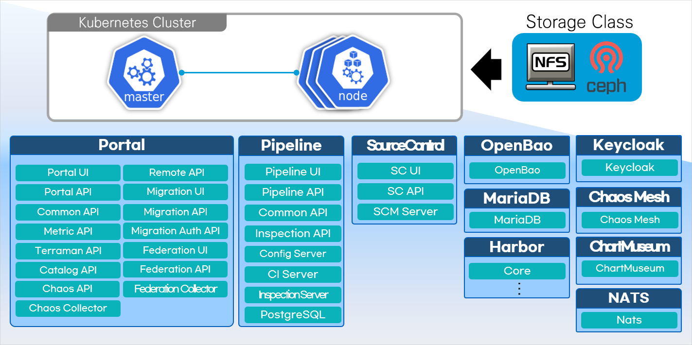

### [Index](https://github.com/K-PaaS/Guide/blob/master/README.md) > [CP Install](/install-guide/Readme.md) > 페더레이션 클러스터 컨테이너 플랫폼 포털 배포 가이드

<br>

## Table of Contents

1. [문서 개요](#1)  
   1.1. [목적](#1.1)  
   1.2. [범위](#1.2)  
   1.3. [시스템 구성도](#1.3)  
   1.4. [참고 자료](#1.4)

2. [참고](#2)  
   2.1 [Prerequisite](#2.1)  
   2.2. [방화벽 정보](#2.2)    
   2.3. [설치 목록](#2.3)

3. [컨테이너 플랫폼 포털 배포](#3)   
   3.1. [컨테이너 플랫폼 포털 Deployment 파일 다운로드](#3.1)  
   3.2. [컨테이너 플랫폼 포털 변수 정의](#3.2)  
   3.3. [페더레이션 멤버 클러스터 설정 구성](#3.3)  
   3.4. [컨테이너 플랫폼 포털 배포 스크립트 실행](#3.4)  
   3.5. [(참고) 컨테이너 플랫폼 포털 리소스 삭제](#3.5)  

5. [컨테이너 플랫폼 포털 접속](#4)      
   4.1. [컨테이너 플랫폼 포털 관리자 계정 로그인](#4.1)      
   4.2. [컨테이너 플랫폼 포털 사용자 계정 로그인](#4.2)      
   4.3. [컨테이너 플랫폼 포털 사용 가이드](#4.3)

6. [컨네이너 플랫폼 포털 참고](#5)       
   5.1. [Kubernetes 리소스 생성 시 주의사항](#5.1)

<br>

## <span id='1'>1. 문서 개요
### <span id='1.1'>1.1. 목적
본 문서(페더레이션 클러스터 컨테이너 플랫폼 포털 배포 가이드)는 Karmada 기반 호스트·멤버 클러스터 환경에서 컨테이너 플랫폼 포털 배포 방법을 기술하였다. <br><br>

### <span id='1.2'>1.2. 범위
설치 범위는 Karmada 호스트 클러스터와 멤버 클러스터로 구성된 환경을 기준으로 작성하였다.

<br>

### <span id='1.3'>1.3. 시스템 구성도
<p align="center"></p>

시스템 구성은 **Kubernetes Cluster(Master, Worker)** 환경과 데이터 관리를 위한 스토리지 서버로 구성되어 있다.
Kubespray를 통해 설치된 Kubernetes Cluster 환경에 비밀 정보 및 인증 데이터를 관리하는 **OpenBao**, 메타 데이터를 관리하는 **MariaDB(RDBMS)**, 컨테이너 이미지를 관리하는 **Harbor**,  컨테이너 플랫폼 포털 사용자 인증을 관리하는 **Keycloak**,
Helm 차트를 관리하는 **ChartMuseum**, Kubernetes 내 여러 유형의 오류를 시뮬레이션할 수 있는 **Chaos Mesh**, 페더레이션 클러스터의 상태·메트릭 정보를 전달하는 **NATS** 등 미들웨어 환경을 컨테이너로 제공한다.
총 필요한 VM 환경으로는 **Master VM: 1개, Worker VM: 3개 이상**이 필요하고 본 문서는 Kubernetes Cluster에 컨테이너 플랫폼 포털 환경을 배포하는 내용이다.

<br>    

### <span id='1.4'>1.4. 참고 자료
> https://kubernetes.io/ko/docs<br>

<br>

## <span id='2'>2. 참고

### <span id='2.1'>2.1. Prerequisite
본 설치 가이드는 **Ubuntu 22.04** 환경에서 설치하는 것을 기준으로 한다.

#### Karmada 기반 호스트·멤버 클러스터 환경 구성
컨테이너 플랫폼 포털을 배포하기 위해서는 Karmada 기반의 호스트 클러스터가 사전에 구축되어 있어야 한다. <br>
필요한 경우 멤버 클러스터를 구성하여 연동할 수 있으며, 멤버 클러스터가 준비되지 않은 환경에서는 해당 단계를 생략할 수 있다.

클러스터 설치·구성 절차는 아래 가이드를 참고한다.
> [페더레이션 클러스터 구성 가이드](../standalone/cp-cluster-install-federation.md)

<br>

### <span id='2.2'>2.2. 방화벽 정보
IaaS Security Group의 열어줘야할 Port를 설정한다.

- Master Node

| <center>프로토콜</center> | <center>포트</center> | <center>비고</center> |  
| :---: | :---: | :--- |  
| TCP | 111 | NFS PortMapper |  
| TCP | 2049 | NFS |  
| TCP | 2379-2380 | etcd server client API |  
| TCP | 6443 | Kubernetes API Server |  
| TCP | 10250 | Kubelet API |  
| TCP | 10251 | kube-scheduler |  
| TCP | 10252 | kube-controller-manager |  
| TCP | 10255 | Read-Only Kubelet API |  
| UDP | 4789 | Calico networking VXLAN |  

- Worker Node

| <center>프로토콜</center> | <center>포트</center> | <center>비고</center> |  
| :--- | :---: | :--- |  
| TCP | 111 | NFS PortMapper |  
| TCP | 2049 | NFS |  
| TCP | 10250 | Kubelet API |  
| TCP | 10255 | Read-Only Kubelet API |  
| TCP | 30000-32767 | NodePort Services |  
| UDP | 4789 | Calico networking VXLAN |  


<br>

### <span id='2.3'>2.3. 설치 목록
컨테이너 플랫폼 포털에 포함되어 배포되는 서비스 정보는 다음과 같다.
|서비스|Application 버전|Chart 버전|
|:--- | :---:|  :--- |  
|[OpenBao](https://github.com/openbao/openbao)|v2.4.1|0.19.0|
|[MariaDB](https://github.com/mariadb)|12.0.2|23.2.1 (Bitnami)|
|[Harbor](https://github.com/goharbor/harbor)|2.14.0|1.18.0|
|[Keycloak](https://github.com/keycloak/keycloak)|26.3.3|25.2.0 (Bitnami)|
|[ChartMuseum](https://github.com/helm/chartmuseum)|0.16.3|3.10.4|
|[Chaos Mesh](https://github.com/chaos-mesh/chaos-mesh)|2.8.0|2.8.0|
|[NATS](https://github.com/nats-io/nats-server)|2.11.8|9.0.28 (Bitnami)|
<br>

## <span id='3'>3. 컨테이너 플랫폼 포털 배포

### <span id='3.1'>3.1. 컨테이너 플랫폼 포털 Deployment 파일 다운로드
컨테이너 플랫폼 포털 배포를 위해 컨테이너 플랫폼 포털 Deployment 파일을 다운로드 받아 아래 경로로 위치시킨다.<br>
:bulb: 해당 내용은 **Master Node**에서 진행한다.

+ 컨테이너 플랫폼 포털 Deployment 파일 다운로드 :
  [cp-portal-deployment-v1.7.0.tar.gz](https://nextcloud.k-paas.org/index.php/s/qrApL4sP5eC2WMX/download)

```bash
# Deployment 파일 다운로드 경로 생성
$ mkdir -p ~/workspace/container-platform
$ cd ~/workspace/container-platform

# Deployment 파일 다운로드 및 파일 경로 확인
$ wget --content-disposition https://nextcloud.k-paas.org/index.php/s/qrApL4sP5eC2WMX/download

$ ls ~/workspace/container-platform
  cp-portal-deployment-v1.7.0.tar.gz

# Deployment 파일 압축 해제
$ tar -xvf cp-portal-deployment-v1.7.0.tar.gz
```

- Deployment 파일 디렉토리 구성
```bash
cp-portal-deployment
├── script          # (싱글) 포털 배포를 위한 변수 및 스크립트 파일 위치
├── script_mc       # (멀티) 포털 배포를 위한 변수 및 스크립트 파일 위치
├── script_fed      # (페더레이션) 포털 배포를 위한 변수 및 스크립트 파일 위치
├── values_orig     #  Helm 차트 values 파일 위치
├── secmg_orig      #  시크릿 관리 시스템 배포 파일 위치
└── istio_mc        #  Istio 서비스 메시 관련 파일 위치
```

<br>

### <span id='3.2'>3.2. 컨테이너 플랫폼 포털 변수 정의
컨테이너 플랫폼 포털 배포에 필요한 변수 값을 정의한다.
```bash
$ cd ~/workspace/container-platform/cp-portal-deployment/script
$ vi cp-portal-vars.sh
```

```bash                                                 
# COMMON VARIABLE (Please change the value of the variables below.)
K8S_MASTER_NODE_IP="{k8s master node public ip}"                     # Kubernetes Master Node Public IP
K8S_CLUSTER_API_SERVER="https://${K8S_MASTER_NODE_IP}:6443"          # kubernetes API Server (e.g. https://${K8S_MASTER_NODE_IP}:6443)
K8S_STORAGECLASS="cp-storageclass"                                   # Kubernetes StorageClass Name (e.g. cp-storageclass)
HOST_CLUSTER_IAAS_TYPE="1"                                           # Kubernetes Cluster IaaS Type ([1] AWS, [2] OPENSTACK, [3] NAVER, [4] NHN, [5] KT)
HOST_DOMAIN="{host domain}"                                          # Host Domain (e.g. xx.xxx.xxx.xx.nip.io)
```
```bash    
# (값 입력 예시)
K8S_MASTER_NODE_IP="103.xxx.xxx.xxx"
K8S_CLUSTER_API_SERVER="https://${K8S_MASTER_NODE_IP}:6443"
K8S_STORAGECLASS="cp-storageclass"
HOST_CLUSTER_IAAS_TYPE="2"
HOST_DOMAIN="105.xxx.xxx.xxx.nip.io"
```

|변수|설명|상세 내용|
|---|---|---|
|**K8S_MASTER_NODE_IP**|Kubernetes Master Node<br> Public IP 입력|Master Node에 접근하기 어려운 경우<br>Worker Node Public IP 입력| 
|**K8S_CLUSTER_API_SERVER**|Kubernetes API Server URL 입력|컨테이너 플랫폼을 통해 배포된 클러스터는 <br> 기본으로 `https://${K8S_MASTER_NODE_IP}:6443`이다. <br> Master Node의 6443번 포트 수신 형식이 아닐 경우 값을 수정한다. <br><br>:small_blue_diamond:**HA Control Plane 구성일 경우**<br>`https://{Load Balancer IP or Domain}:6443` 입력|
|**K8S_STORAGECLASS**|StorageClass 명 입력|컨테이너 플랫폼을 통해 배포된 클러스터는 <br> 기본으로 `cp-storageclass`이다. <br> 다른 StorageClass 사용 시 해당 리소스 명을 입력한다.|
|**HOST_CLUSTER_IAAS_TYPE**|Kubernetes Cluster IaaS 환경 입력|[1] AWS [2] OPENSTACK [3] NAVER [4] NHN [5] KT 번호 입력|
|**HOST_DOMAIN**|Host Domain 값 입력 |`{ingress-nginx-controller 서비스의 EXTERNAL-IP}.nip.io` 입력<br> [아래 내용 확인](#host_domain)|

#### 조회
```bash
# Kubernetes API Server 조회
## Master Node의 6443번 포트 수신 형식이 아닐 경우
$ kubectl config view
apiVersion: v1
clusters:
- cluster:
    certificate-authority-data: DATA+OMITTED
    server: https://63c4f2d9-xxxx.xxxx.com (입력)

# StorageClass 조회
$ kubectl get storageclass 
NAME                   PROVISIONER
block-storage (입력)   blk.csi...
```
#### HOST_DOMAIN
Ingress NGINX Controller 서비스의 <b>EXTERNAL-IP</b>`(외부에서 접속 가능 IP)`와 무료 wildcard DNS 서비스 <b>nip.io</b> 를 사용 <br>

싱글 클러스터 환경 내 컨테이너 플랫폼 포털은 Kubernetes 리소스 Ingress를 통해 각 서비스를 라우팅하며, 그에 필요한 아래 두 서비스를 클러스터 설치 시 포함한다.<br>
> <b>[MetalLB](https://metallb.universe.tf/)</b> (베어메탈 클러스터 환경에서 로드 밸런서 기능 제공)<br>
> <b>[Ingress NGINX Controller](https://kubernetes.github.io/ingress-nginx/)</b> (Kubernetes용 Ingress 컨트롤러) <br>

MetalLB를 통해 할당된 Ingress NGINX Controller 서비스의 EXTERNAL-IP가 외부에서 접속불가인 경우<br>
각 클라우드 서비스에서 해당 IP의 네트워크 인터페이스 생성, 플로팅 IP 연결, 클러스터 노드에 인터페이스 연결 추가 등 작업이 필요하다.
```bash
# 'ingress-nginx-controller' 서비스 EXTERNAL-IP 조회 (LoadBalancer 타입)
$ kubectl get svc -n ingress-nginx
NAME                        TYPE           CLUSTER-IP      EXTERNAL-IP            PORT(S)                      AGE
ingress-nginx-controller    LoadBalancer   10.233.49.255   192.168.0.xxx (확인)   80:30465/TCP,443:32226/TCP   26h

# 외부에서 EXTERNAL-IP curl 통신, 연결 불가
$ curl http://192.168.0.xxx
curl: (28) Failed to connect to 192.168.0.xxx port 80

# 클라우드 서비스에서 인터페이스 생성, 플로팅 ip 연결, 클러스터 노드에 인터페이스 연결 추가
192.168.0.xxx -> 105.xxx.xxx.xxx (플로팅 ip)

# 연결된 플로팅 ip로 외부에서 curl 통신, 404 에러 반환 시 정상 
$ curl http://105.xxx.xxx.xxx
<html>
<head><title>404 Not Found</title></head>
<body>
<center><h1>404 Not Found</h1></center>
<hr><center>nginx</center>
</body>
</html>

# 연결된 플로팅 ip의 nip.io로 호스트 도메인 값 입력
HOST_DOMAIN="105.xxx.xxx.xxx.nip.io"
```

#### TLS_CERT_AUTO_GENERATED
##### :bulb: 컨테이너 플랫폼 포털을 통해 배포되는 모든 서비스는 **HTTPS** 연결로 구성된다. <br>
포털 배포 과정에서 HOST_DOMAIN 값을 기반으로 TLS 인증서가 자동으로 생성된다. 기존에 별도의 인증서를 보유하고<br> 이를 사용하려는 경우 아래 변수 값을 수정한다.
```bash
# 기존 별도의 인증서를 사용하는 경우
...
# TLS_CERT (해당 주석위치로 이동)
TLS_CERT_AUTO_GENERATED="N"  # N으로 변경   
TLS_CERT_PATH="/home/ubuntu/tls/mydomain.crt"  # host_domain crt 파일의 절대경로 입력
TLS_KEY_PATH="/home/ubuntu/tls/mydomain.key"   # host_domain key 파일의 절대경로 입력
```

<details>
<summary><h4> ⚠️ [참고사항] CRI-O가 아닌 컨테이너 런타임 환경에서 포털 설치 시 </h4></summary>
<h1></h1>

K-PaaS 클러스터 설치 시 기본 컨테이너 런타임은 **CRI-O (crio)** 이다. K-PaaS 클러스터 설치 사용자는 본 절의 내용을 생략한다.  
단, 다른 컨테이너 런타임 (containerd 등)을 사용하는 클러스터에 포털 설치 시 아래 설정 변경이 필요하다.

<br>

포털 설치 시 함께 배포되는 **Chaos Mesh**는 Container Runtime 설정이 필요하다. 클러스터 환경별 Runtime 및 socketPath 를 확인한 뒤 아래 값을 수정하여 설치를 진행한다.

**참고 설정값**

> 본 가이드는 참고용이며, 정확한 값 및 최신 정보는 [[Install Chaos Mesh in different environments]](https://chaos-mesh.org/docs/production-installation-using-helm/#step-4-install-chaos-mesh-in-different-environments) 문서를 참고한다.

| Runtime      | runtime 값   | socketPath 예시                    |
|--------------|--------------|-----------------------------------|
| CRI-O        | `crio`       | `/var/run/crio/crio.sock`         |
| containerd   | `containerd` | `/run/containerd/containerd.sock` |

#### Runtime, socketPath 수정

```bash
$ cd ~/workspace/container-platform/cp-portal-deployment/values_orig
$ vi chaos-mesh.yaml
```

```yaml
···
chaosDaemon:
  runtime: crio # 변경
  socketPath: /var/run/crio/crio.sock # 변경
···
```

<h1></h1>
</details>


<br>

### <span id='3.3'>3.3. 페더레이션 멤버 클러스터 설정 구성
> 멤버 클러스터가 준비되지 않은 경우에는 본 구성 단계를 생략할 수 있다.

멤버 클러스터 정보를 구성하려면 `kubectl config`에 해당 클러스터의 컨텍스트가 미리 설정되어 있어야 하므로, 각 클러스터에 접근 가능한 컨텍스트를 사전에 준비해야 한다.

:loudspeaker: 각 클러스터 kubeconfig 파일 내 cluster, context, user 명이 중복되지 않도록 한다.
```bash
# .kube 디렉터리 생성 및 이동
$ mkdir -p ${HOME}/.kube
$ cd ${HOME}/.kube

# 각 cluster kubeconfig 파일 위치 (아래 파일명은 예시이다.)
$ ls ${HOME}/.kube
host.config  member1.config  member2.config

# kubeconfig 파일 경로 설정
$ export KUBECONFIG="${HOME}/.kube/host.config:${HOME}/.kube/member1.config:${HOME}/.kube/member2.config"
```
##### :bulb:  `NAME`, `CLUSTER`, `AUTHINFO` 값 출력 정상 확인
```bash
# 컨텍스트 조회
$ kubectl config get-contexts
CURRENT   NAME      CLUSTER   AUTHINFO   NAMESPACE
*         host      host      host
          member1   member1   member1
          member2   member2   member2
```
##### 멤버 클러스터 접근 정상 확인
```bash
$ kubectl get nodes --context=member1
NAME        STATUS   ROLES           AGE   VERSION
cp-mem1-1   Ready    control-plane   2d    v1.33.5
cp-mem1-2   Ready    <none>          2d    v1.33.5

$ kubectl get nodes --context=member2
NAME                    STATUS   ROLES    AGE   VERSION
default-worker-node-0   Ready    <none>   2d    v1.33.4
default-worker-node-1   Ready    <none>   2d    v1.33.4
default-worker-node-2   Ready    <none>   2d    v1.33.4
```

등록할 멤버 클러스터의 개수와 각 클러스터의 정보를 구성하기 위해 아래 스크립트를 실행한다. <br> 스크립트 실행 시 선택한 컨텍스트 정보를 바탕으로 API 서버와 클러스터명이 채워진 설정 파일이 생성된다.
```bash
$ cd ~/workspace/container-platform/cp-portal-deployment/script_fed
$ chmod +x gen-cluster-config.sh
$ ./gen-cluster-config.sh
```

```bash
# 선택된 컨텍스트는 이후 선택 목록에서 중복 방지를 위해 자동으로 제외된다.
# 멤버 클러스터 2개 등록 예시

▶ Member Cluster Configuration Generator
How many member clusters do you want to register? (1-10): 2

You selected 2 member cluster(s).

▶ Select context for cluster 1
  1) host
  2) member1
  3) member2
Enter the number of the context for cluster 1: 2  # 컨텍스트 선택
Selected context       : member1
Cluster name in config : member1
Detected API server    : https://xxx.xxx.xxx.xxx:6443

▶ Select context for cluster 2
  1) host
  2) member2
Enter the number of the context for cluster 2: 2  # 컨텍스트 선택
Selected context       : member2
Cluster name in config : member2
Detected API server    : https://default.container.com:6443


Configuration written to: member-cluster-config.sh
Please review API_SERVER, NAME, and fill IAAS_TYPE before deployment.
```

스크립트 실행 후 `member-cluster-config.sh` 파일이 생성되며, 선택한 컨텍스트 정보를 바탕으로 채워진 기본 값이 포함된다. <br>
:bulb: 환경에 맞게 API 서버 엔드포인트와 클러스터명은 필요 시 수정하며, **IAAS 타입은 수동 입력이 필요하다.**

```bash
$ vi member-cluster-config.sh
```
```bash
# Auto-generated member cluster config
# Edit API_SERVER or NAME if needed, and fill IAAS_TYPE manually.

# Cluster 1
CLUSTER1_CTX="member1"
CLUSTER1_API_SERVER="https://xxx.xxx.xxx.xxx:6443"   # Auto-detected. Change if using a different endpoint.
CLUSTER1_NAME="member1"                              # Auto-detected. Change if naming differs from your env.
CLUSTER1_IAAS_TYPE="1"                               # Fill manually (1 OPENSTACK, 2 NAVER, 3 NHN, 4 KT)

# Cluster 2
CLUSTER2_CTX="member2"
CLUSTER2_API_SERVER="https://default.container.com:6443"   # Auto-detected. Change if using a different endpoint.
CLUSTER2_NAME="member2"                                    # Auto-detected. Change if naming differs from your env.
CLUSTER2_IAAS_TYPE="3"                                     # Fill manually (1 OPENSTACK, 2 NAVER, 3 NHN, 4 KT)
```

<br>

### <span id='3.4'>3.4. 컨테이너 플랫폼 포털 배포 스크립트 실행
컨테이너 플랫폼 포털 배포 스크립트는 기본적으로 포털 구성 요소만 설치하며, 멤버 클러스터 등록 기능을 포함하려면 `--join` 옵션을 추가하여 실행한다.
```bash
$ cd ~/workspace/container-platform/cp-portal-deployment/script_fed
$ chmod +x deploy-cp-portal-fed.sh
```
* 포털만 설치
```bash
$ ./deploy-cp-portal-fed.sh
```
* 멤버 클러스터 등록 포함하여 포털 설치
```bash
$ ./deploy-cp-portal-fed.sh --join
```
<br>

컨테이너 플랫폼 포털 관련 리소스가 정상적으로 배포되었는지 확인한다.<br>
리소스 Pod의 경우 Node에 바인딩 및 컨테이너 생성 후 Running 상태로 전환되기까지 몇 초가 소요된다. <br>

> **Keycloak**은 초기 기동에 수 분이 소요될 수 있다. 이 기간 동안 OIDC 기반으로 동작하는 UI는 인증 서버가 준비되지 않아
Pod 재시작이 반복될 수 있으며, Keycloak이 Ready 상태가 되면 순차적으로 안정화된다.

<br>

- **OpenBao Pod 조회**
>`$ kubectl get pods -n openbao`
```bash
NAME                                      READY   STATUS    RESTARTS   AGE
openbao-0                                 1/1     Running   0          6m12s
openbao-agent-injector-59777b5b64-zz27b   1/1     Running   0          6m12s
```

- **MariaDB Pod 조회**
>`$ kubectl get pods -n mariadb`
```bash
NAME        READY   STATUS    RESTARTS   AGE
mariadb-0   1/1     Running   0          6m24s
```    

- **Harbor Pod 조회**
>`$ kubectl get pods -n harbor`
```bash
NAME                                 READY   STATUS    RESTARTS   AGE
harbor-core-bd5d959b4-5tptp          1/1     Running   0          6m29s
harbor-database-0                    1/1     Running   0          6m29s
harbor-jobservice-76f4ccd496-j4jlx   1/1     Running   0          6m29s
harbor-portal-645d97998c-s4jr5       1/1     Running   0          6m29s
harbor-redis-0                       1/1     Running   0          6m29s
harbor-registry-78c8bbf446-85twg     2/2     Running   0          6m29s
harbor-trivy-0                       1/1     Running   0          6m29s
```  

- **Keycloak Pod 조회**
>`$ kubectl get pods -n keycloak`
```bash
NAME         READY   STATUS    RESTARTS   AGE
keycloak-0   1/1     Running   0          5m54s
keycloak-1   1/1     Running   0          5m53s
```

- **컨테이너 플랫폼 포털 Pod 조회**
>`$ kubectl get pods -n cp-portal`
```bash
NAME                                                         READY   STATUS    RESTARTS   AGE
cp-portal-api-deployment-6b5c84fbdf-jhnpl                    1/1     Running   0          5m29s
cp-portal-catalog-api-deployment-85795db844-snwkn            1/1     Running   0          5m28s
cp-portal-chaos-api-deployment-68f8dc64fc-6kh85              1/1     Running   0          5m28s
cp-portal-chaos-collector-deployment-859df489f4-7vg6l        1/1     Running   0          5m29s
cp-portal-common-api-deployment-59f65d7dd6-z9j2p             1/1     Running   0          5m29s
cp-portal-federation-api-deployment-755cdc5b8-zz2q2          1/1     Running   0          5m29s
cp-portal-federation-collector-deployment-7b8c8ff7bf-vq6cz   1/1     Running   0          5m29s
cp-portal-federation-ui-deployment-869fd6c6b9-gvlsd          1/1     Running   0          5m29s
cp-portal-metric-api-deployment-756b4585d5-72wjx             1/1     Running   0          5m29s
cp-portal-migration-api-deployment-9b79789c6-5f5q2           1/1     Running   0          5m29s
cp-portal-migration-auth-deployment-96995bc65-hckg7          1/1     Running   0          5m29s
cp-portal-migration-ui-deployment-c5948cc9c-v7tz9            1/1     Running   0          5m29s
cp-portal-remote-api-deployment-788f46bc9d-kmdbs             1/1     Running   0          5m29s
cp-portal-terraman-deployment-57dd8649cd-rjmqv               1/1     Running   0          5m29s
cp-portal-ui-deployment-7df6cbc75c-nbxnc                     1/1     Running   0          5m29s
nats-0                                                       1/1     Running   0          5m32s
```

- **ChartMuseum Pod 조회**
>`$ kubectl get pods -n chartmuseum`
```bash
NAME                           READY   STATUS    RESTARTS   AGE
chartmuseum-648968c7dd-ck2k2   1/1     Running   0          6m27s
```

- **Chaos Mesh Pod 조회**
>`$ kubectl get pods -n chaos-mesh`
```bash
NAME                                        READY   STATUS    RESTARTS   AGE
chaos-controller-manager-7c4857547f-r7mcv   1/1     Running   0          6m10s
chaos-daemon-48768                          1/1     Running   0          6m11s
chaos-daemon-8r86r                          1/1     Running   0          6m10s
chaos-daemon-wz8gk                          1/1     Running   0          6m11s
chaos-dashboard-799b6d9f6-2njzr             1/1     Running   0          6m10s
chaos-dns-server-5f9bb85c75-hcjlr           1/1     Running   0          6m10s
```

- **서비스 접속 Host 조회**
>`$ kubectl get ingress -A`
```bash
NAMESPACE     NAME                CLASS   HOSTS                                ADDRESS         PORTS     AGE
chartmuseum   chartmuseum         nginx   chartmuseum.xxx.xxx.xxx.xxx.nip.io   172.xx.xx.xxx   80, 443   6m51s
cp-portal     cp-portal-ingress   nginx   portal.xxx.xxx.xxx.xxx.nip.io        172.xx.xx.xxx   80, 443   6m15s
harbor        harbor-ingress      nginx   harbor.xxx.xxx.xxx.xxx.nip.io        172.xx.xx.xxx   80, 443   7m44s
keycloak      keycloak            nginx   keycloak.xxx.xxx.xxx.xxx.nip.io      172.xx.xx.xxx   80, 443   6m52s
openbao       openbao             nginx   openbao.xxx.xxx.xxx.xxx.nip.io       172.xx.xx.xxx   80, 443   7m55s
```

<br>

#### <span id='3.5'>3.5. (참고) 컨테이너 플랫폼 포털 리소스 삭제
※ 본 스크립트는 포털 관련 리소스만 삭제하며, Karmada 시스템 구성 요소에는 영향을 주지 않는다.

배포된 컨테이너 플랫폼 포털 리소스의 삭제를 원하는 경우 아래 스크립트를 실행한다.<br>
:loudspeaker: (주의) 컨테이너 플랫폼 포털이 운영되는 상태에서 해당 스크립트 실행 시, **포털 운영에 필요한 리소스가 삭제** 되므로 주의가 필요하다.<br>
> 컨테이너 플랫폼을 통해 설치된 클러스터의 StorageClass 타입이 `NFS`인 경우 reclaim 정책은 `Retain`이다.<br>
> `Retain`정책은 Persistent Volume을 삭제하여도 스토리지 NFS 서버에 데이터가 여전히 존재하므로<br> 수동으로 데이터 정리가 필요하다.
```bash
$ cd ~/workspace/container-platform/cp-portal-deployment/script_fed
$ chmod +x uninstall-cp-portal-fed.sh
$ ./uninstall-cp-portal-fed.sh
Are you sure you want to delete the container platform portal? <y/n> y # y 입력
```

<br>    

## <span id='4'>4. 컨테이너 플랫폼 포털 접속
컨테이너 플랫폼 포털에 접속한다.<br><br>
**컨테이너 플랫폼 포털 URL** : `https://portal.${HOST_DOMAIN}`
+ [[3.2. 컨테이너 플랫폼 포털 변수 정의]](#3.2) 에서 정의한 `HOST_DOMAIN` 값 입력

<br>

### <span id='4.1'/>4.1. 컨테이너 플랫폼 포털 관리자 계정 로그인
관리자 계정은 패스워드 초기화 설정이 필요하므로 아래 내용을 참조하여 선처리한다.
<details>
<summary><h4> :key: 컨테이너 플랫폼 포털 관리자 계정 패스워드 설정 </h4></summary>

<h1></h1>  

### 1. Keycloak Admin 계정 정보 조회
Keycloak Admin 계정 정보는 아래 명령어를 통해 확인한다.
```bash
# Keycloak Admin Username 조회
$ kubectl get secret cp-portal-secret -n cp-portal -o jsonpath="{.data.KEYCLOAK_ADMIN_USERNAME}" | base64 -d; echo
# Keycloak Admin Password 조회
$ kubectl get secret cp-portal-secret -n cp-portal -o jsonpath="{.data.KEYCLOAK_ADMIN_PASSWORD}" | base64 -d; echo
```

<br>

### 2. Keycloak Admin Console 접속 및 로그인
Keycloak Admin Console에 접속 후 조회한 Keycloak Admin 계정으로 로그인한다.<br><br>

**Keycloak Admin Console URL** : `https://keycloak.${HOST_DOMAIN}`
+ [[3.2. 컨테이너 플랫폼 포털 변수 정의]](#3.2) 에서 정의한 `HOST_DOMAIN` 값 입력

![image 011]

<br>

### 3. 컨테이너 플랫폼 관리자 계정 패스워드 초기화
- 왼쪽 상단의 Realm 정보를 `Cp-realm` 으로 변경한다.

![image 012]

- 메뉴 [Users] 선택 후 Username 이 `admin`인 계정을 클릭한다.

![image 013]

- 메뉴 [Credentials] 선택 후 버튼 [Reset password]을 클릭하여 패스워드 초기화를 진행한다.
    + **Password** : `초기화할 패스워드 값 입력`
    + **Temporary** : `Off` 선택
        - 'On' 으로 선택할 경우 사용자는 다음 로그인 시 비밀번호 재변경 필요

![image 014]
![image 015]

<h1></h1>

</details>

- 관리자 계정으로 컨테이너 플랫폼 포털에 로그인한다.
    + **Username** : `admin`
    + **Password** : `초기화한 패스워드 값`

![image 002]

<br>

### <span id='4.2'/>4.2. 컨테이너 플랫폼 포털 사용자 계정 로그인
#### 사용자 회원가입
- 하단의 'Register' 버튼을 클릭한다.

![image 003]

- 등록할 사용자 계정정보를 입력 후 'Register' 버튼을 클릭하여 컨테이너 플랫폼 포털에 회원가입한다.

![image 004]

- 회원가입 후 바로 포털 접속이 불가하며 관리자로부터 해당 사용자가 이용할 Namespace와 Role을 할당 받은 후 포털 이용이 가능하다.
  Namespace와 Role 할당은 [[4.3. 컨테이너 플랫폼 사용자/운영자 포털 사용 가이드]](#4.3) 를 참고한다.

![image 005]

#### 사용자 로그인
- 회원가입을 통해 등록된 계정으로 컨테이너 플랫폼 포털에 로그인한다.

![image 006]

<br>    

### <span id='4.3'/>4.3. 컨테이너 플랫폼 포털 사용 가이드
- 컨테이너 플랫폼 포털 사용방법은 아래 사용가이드를 참고한다.
    + [컨테이너 플랫폼 포털 사용 가이드](../../use-guide/portal/cp-portal-use-guide.md)

<br>

## <span id='5'>5. 컨네이너 플랫폼 포털 참고

### <span id='5.1'>5.1. Kubernetes 리소스 생성 시 주의사항

컨테이너 플랫폼 이용 중 리소스 생성 시 다음과 같은 prefix를 사용하지 않도록 주의한다.

|Resource 명|생성 시 제외해야 할 prefix|
|---|---|
|전체 Resource|kube*|
|Namespace|all|
||kubernetes-dashboard|
||cp-portal-temp-namespace|
|Role|cp-init-role|
||cp-admin-role|
|ResourceQuota|cp-low-resourcequota|
||cp-medium-resourcequota|
||cp-high-resourcequota|
|LimitRanges|cp-low-limitrange|
||cp-medium-limitrange|
||cp-high-limitrange|
|Pod|nodes|
||resources|

<br>

### [Index](https://github.com/K-PaaS/Guide/blob/master/README.md) > [CP Install](/install-guide/Readme.md) > 페더레이션 클러스터 컨테이너 플랫폼 포털 배포 가이드

[image 001]:../images/portal/cp-001.png
[image 002]:../images/portal/cp-002.png
[image 003]:../images/portal/cp-003.png
[image 004]:../images/portal/cp-004.png
[image 005]:../images/portal/cp-005.png
[image 006]:../images/portal/cp-006.png
[image 007]:../images/portal/cp-007.png
[image 008]:../images/portal/cp-008.png
[image 009]:../images/portal/cp-009.png
[image 010]:../images/portal/cp-010.png
[image 011]:../images/portal/cp-011.png
[image 012]:../images/portal/cp-012.png
[image 013]:../images/portal/cp-013.png
[image 014]:../images/portal/cp-014.png
[image 015]:../images/portal/cp-015.png
[image 016]:../images/portal/cp-016.png
[image 017]:../images/portal/cp-017.png
[image 018]:../images/portal/cp-018.png
[image 019]:../images/portal/cp-019.png
[image 020]:../images/portal/cp-020.png
[image 021]:../images/portal/cp-021.png
