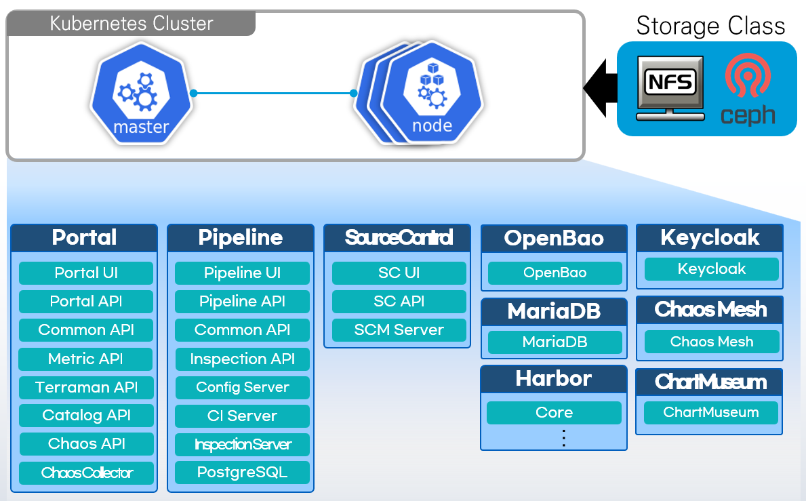

### [Index](https://github.com/K-PaaS/Guide/blob/master/README.md) > [CP Install](/install-guide/Readme.md) > 멀티 클러스터 컨테이너 플랫폼 포털 배포 가이드

<br>

## Table of Contents

1. [문서 개요](#1)  
   1.1. [목적](#1.1)  
   1.2. [범위](#1.2)  
   1.3. [시스템 구성도](#1.3)  
   1.4. [참고 자료](#1.4)

2. [참고](#2)  
   2.1 [Prerequisite](#2.1)  
   2.2. [방화벽 정보](#2.2)    
   2.3. [설치 목록](#2.3)

3. [컨테이너 플랫폼 포털 배포](#3)  
   3.1. [컨테이너 플랫폼 포털 Deployment 파일 다운로드](#3.1)  
   3.2. [컨테이너 플랫폼 포털 변수 정의](#3.2)    
   3.3. [컨테이너 플랫폼 포털 배포 스크립트 실행](#3.3)  
   3.4. [(참고) 컨테이너 플랫폼 포털 리소스 삭제](#3.4)

5. [컨테이너 플랫폼 포털 접속](#4)      
   4.1. [컨테이너 플랫폼 포털 관리자 계정 로그인](#4.1)      
   4.2. [컨테이너 플랫폼 포털 사용자 계정 로그인](#4.2)      
   4.3. [컨테이너 플랫폼 포털 사용 가이드](#4.3)

6. [컨네이너 플랫폼 포털 참고](#5)       
   5.1. [Kubernetes 리소스 생성 시 주의사항](#5.1)

<br>

## <span id='1'>1. 문서 개요
### <span id='1.1'>1.1. 목적
본 문서(멀티 클러스터 컨테이너 플랫폼 포털 배포 가이드)는 Istio 서비스 메시 기반 멀티 클라우드 환경의 쿠버네티스 클러스터에 컨테이너 플랫폼 포털 배포 방법을 기술하였다. <br><br>


### <span id='1.2'>1.2. 범위
설치 범위는 Istio 서비스 메시 기반 멀티 클라우드 환경 쿠버네티스 클러스터 기준으로 작성하였다.

<br>

### <span id='1.3'>1.3. 시스템 구성도
<p align="center"></p>

시스템 구성은 **Kubernetes Cluster(Master, Worker)** 환경과 데이터 관리를 위한 스토리지 서버로 구성되어 있다.
Kubespray를 통해 설치된 Kubernetes Cluster 환경에 비밀 정보 및 인증 데이터를 관리하는 **Vault**, 메타 데이터를 관리하는 **MariaDB(RDBMS)**, 컨테이너 이미지를 관리하는 **Harbor**,  컨테이너 플랫폼 포털 사용자 인증을 관리하는 **Keycloak**,
Helm 차트를 관리하는 **ChartMuseum**, Kubernetes 내 여러 유형의 오류를 시뮬레이션할 수 있는 **Chaos Mesh** 등 미들웨어 환경을 컨테이너로 제공한다.
총 필요한 VM 환경으로는 **Master VM: 1개, Worker VM: 3개 이상**이 필요하고 본 문서는 Kubernetes Cluster에 컨테이너 플랫폼 포털 환경을 배포하는 내용이다.

<br>    

### <span id='1.4'>1.4. 참고 자료
> https://kubernetes.io/ko/docs<br>
> https://istio.io/latest/docs

<br>

## <span id='2'>2. 참고

### <span id='2.1'>2.1. Prerequisite
본 설치 가이드는 **Ubuntu 22.04** 환경에서 설치하는 것을 기준으로 한다.

#### Istio 서비스 메시 기반 멀티 클라우드 환경 구성
Istio 서비스 메시 기반 멀티 클라우드 환경 구성이 필요하며, 쿠버네티스 클러스터 서비스 간 통신이 가능해야한다.
> [(멀티 클라우드 환경) K-PaaS 컨테이너 플랫폼 클러스터 설치 가이드](../standalone/cp-cluster-install-multi.md) <br>
> [CSP 쿠버네티스 서비스 Istio 멀티 클러스터 구성 가이드](../csp/cp-csp-istio-guide.md)

<br>

### <span id='2.2'>2.2. 방화벽 정보
IaaS Security Group의 열어줘야할 Port를 설정한다.

- Master Node

| <center>프로토콜</center> | <center>포트</center> | <center>비고</center> |  
| :---: | :---: | :--- |  
| TCP | 111 | NFS PortMapper |  
| TCP | 2049 | NFS |  
| TCP | 2379-2380 | etcd server client API |  
| TCP | 6443 | Kubernetes API Server |  
| TCP | 10250 | Kubelet API |  
| TCP | 10251 | kube-scheduler |  
| TCP | 10252 | kube-controller-manager |  
| TCP | 10255 | Read-Only Kubelet API |  
| UDP | 4789 | Calico networking VXLAN |  

- Worker Node

| <center>프로토콜</center> | <center>포트</center> | <center>비고</center> |  
| :--- | :---: | :--- |  
| TCP | 111 | NFS PortMapper |  
| TCP | 2049 | NFS |  
| TCP | 10250 | Kubelet API |  
| TCP | 10255 | Read-Only Kubelet API |  
| TCP | 30000-32767 | NodePort Services |  
| UDP | 4789 | Calico networking VXLAN |  


<br>

### <span id='2.3'>2.3. 설치 목록
컨테이너 플랫폼 포털에 포함되어 배포되는 서비스 정보는 다음과 같다.
|서비스|Application 버전|Chart 버전|
|:--- | :---:|  :---: |  
|[Vault](https://github.com/hashicorp/vault)|1.14.0|0.25.0|
|[Vault Secrets Operator](https://github.com/hashicorp/vault-secrets-operator)|0.9.0|0.9.0|
|[MariaDB](https://github.com/mariadb)|11.4.3|19.0.7|
|[Harbor](https://github.com/goharbor/harbor)|2.11.1|1.15.1|
|[Keycloak](https://github.com/keycloak/keycloak)|25.0.4|22.2.1|
|[ChartMuseum](https://github.com/helm/chartmuseum)|0.16.2|3.10.3|
|[Chaos Mesh](https://github.com/chaos-mesh/chaos-mesh)|2.7.0|2.7.0|

<br>


## <span id='3'>3. 컨테이너 플랫폼 포털 배포

### <span id='3.1'>3.1. 컨테이너 플랫폼 포털 Deployment 파일 다운로드
컨테이너 플랫폼 포털 배포를 위해 컨테이너 플랫폼 포털 Deployment 파일을 다운로드 받아 아래 경로로 위치시킨다.<br>
+ 컨테이너 플랫폼 포털 Deployment 파일 다운로드 :
  [cp-portal-deployment-v1.6.0.tar.gz](https://nextcloud.k-paas.org/index.php/s/ZcFt4cpeXj8d4o4/download)

```bash
# Deployment 파일 다운로드 경로 생성
$ mkdir -p ~/workspace/container-platform
$ cd ~/workspace/container-platform

# Deployment 파일 다운로드 및 파일 경로 확인
$ wget --content-disposition https://nextcloud.k-paas.org/index.php/s/ZcFt4cpeXj8d4o4/download

$ ls ~/workspace/container-platform
  cp-portal-deployment-v1.6.0.tar.gz

# Deployment 파일 압축 해제
$ tar -xvf cp-portal-deployment-v1.6.0.tar.gz
```


- Deployment 파일 디렉토리 구성
```bash
cp-portal-deployment
├── script          # (싱글) 포털 배포를 위한 변수 및 스크립트 파일 위치
├── script_mc       # (멀티) 포털 배포를 위한 변수 및 스크립트 파일 위치
├── images          # 이미지 파일 위치
├── charts          # Helm 차트 파일 위치
├── values_orig     # Helm 차트 values 파일 위치
├── vault_orig      # Vault 배포 파일 위치
└── istio_mc        # Istio 서비스 메시 관련 파일 위치
```

<br>

### <span id='3.2'>3.2. 컨테이너 플랫폼 포털 변수 정의
컨테이너 플랫폼 포털 배포에 필요한 변수 값을 정의한다.
```bash
$ cd ~/workspace/container-platform/cp-portal-deployment/script_mc
$ vi cp-portal-vars-mc.sh
```

```bash                                                 
# COMMON VARIABLE (Please change the value of the variables below.)
CLUSTER1_CONFIG[CTX]="{cluster1 context name}"                                  # Cluster1 Context Name
CLUSTER1_CONFIG[MASTER_NODE_IP]="{cluster1 master node public ip}"              # Cluster1 Master Node Public IP
CLUSTER1_CONFIG[API_SERVER]="https://${CLUSTER1_CONFIG[MASTER_NODE_IP]}:6443"   # Cluster1 API Server
CLUSTER1_CONFIG[STORAGECLASS]="cp-storageclass"                                 # Cluster1 StorageClass Name
CLUSTER1_CONFIG[IAAS_TYPE]="1"                                                  # Cluster1 Cluster IaaS Type ([1] AWS, [2] OPENSTACK, [3] NAVER, [4] NHN, [5] KT)

CLUSTER2_CONFIG[CTX]="{cluster2 context name}"                                  # Cluster2 Context Name
CLUSTER2_CONFIG[MASTER_NODE_IP]="{cluster2 master node public ip}"              # Cluster2 Master Node Public IP
CLUSTER2_CONFIG[API_SERVER]="https://${CLUSTER2_CONFIG[MASTER_NODE_IP]}:6443"   # Cluster2 API Server
CLUSTER2_CONFIG[STORAGECLASS]="cp-storageclass"                                 # Cluster2 StorageClass Name
CLUSTER2_CONFIG[IAAS_TYPE]="1"                                                  # Cluster2 Cluster IaaS Type ([1] AWS, [2] OPENSTACK, [3] NAVER, [4] NHN, [5] KT)

HOST_DOMAIN="{host domain}"                                                     # Host Domain (e.g. xx.xxx.xxx.xx.nip.io)
```
```bash
# (값 입력 예시)
# 컨테이너 플랫폼 클러스터의 경우
CLUSTER1_CONFIG[CTX]="ctx-1"
CLUSTER1_CONFIG[MASTER_NODE_IP]="103.xxx.xxx.xxx"
CLUSTER1_CONFIG[API_SERVER]="https://${CLUSTER1_CONFIG[MASTER_NODE_IP]}:6443"
CLUSTER1_CONFIG[STORAGECLASS]="cp-storageclass"
CLUSTER1_CONFIG[IAAS_TYPE]="2"

# CSP Kubernetes 서비스 클러스터인 경우
CLUSTER2_CONFIG[CTX]="ctx-2"
CLUSTER2_CONFIG[MASTER_NODE_IP]="104.xxx.xxx.xxx"
CLUSTER2_CONFIG[API_SERVER]="https://63c4f2d9-xxxx.xxxx.com"
CLUSTER2_CONFIG[STORAGECLASS]="cp-storageclass"
CLUSTER2_CONFIG[IAAS_TYPE]="4"

HOST_DOMAIN="105.xxx.xxx.xxx.nip.io"
```

|변수|설명|상세 내용|
|---|---|---|
|**CTX**|해당 클러스터 컨텍스트 명 입력|`kubectl config get-contexts`에 출력되는 컨텍스트 명 입력| 
|**MASTER_NODE_IP**|Kubernetes Master Node<br> Public IP 입력|Master Node IP에 접근이 어려운 경우 <br> Worker Node Public IP 입력|
|**API_SERVER**|Kubernetes API Server URL 입력|컨테이너 플랫폼을 통해 배포된 클러스터는 <br> 기본으로 `https://${K8S_MASTER_NODE_IP}:6443`이다. <br> Master Node의 6443번 포트 수신 형식이 아닐 경우 값을 수정한다. <br><br>:small_blue_diamond:**HA Control Plane 구성일 경우**<br>`https://{Load Balancer IP or Domain}:6443` 입력|
|**STORAGECLASS**|StorageClass 명 입력|컨테이너 플랫폼을 통해 배포된 클러스터는 <br> 기본으로 `cp-storageclass`이다. <br> 다른 StorageClass 사용 시 해당 리소스 명을 입력한다.|
|**IAAS_TYPE**|Kubernetes Cluster IaaS 환경 입력|[1] AWS [2] OPENSTACK [3] NAVER [4] NHN [5] KT 번호 입력|
|**HOST_DOMAIN**|Host Domain 값 입력 |<b>:small_blue_diamond: 클러스터 Cluster1 </b>의 <br> `{istio-ingressgateway 서비스의 EXTERNAL-IP}.nip.io` 입력<br> [아래 내용 확인](#host_domain)|

#### 조회
```bash
# 클러스터 컨텍스트 조회
$ kubectl config get-contexts
CURRENT  NAME          CLUSTER    AUTHINFO         NAMESPACE
*        ctx-1 (입력)  cluster1   cluster1-admin
         ctx-2 (입력)  cluster2   cluster2-admin

# Kubernetes API Server 조회
$ kubectl config view
apiVersion: v1
clusters:
- cluster:
    certificate-authority-data: DATA+OMITTED
    server: https://63c4f2d9-xxxx.xxxx.com (입력)

# StorageClass 조회
$ kubectl get storageclass 
NAME                   PROVISIONER
block-storage (입력)   blk.csi...
```
#### HOST_DOMAIN
<b>Cluster1</b>로 지정할 클러스터의 <b>Istio Ingress Gateways 서비스 EXTERNAL-IP</b>`(외부에서 접속 가능 IP)`와 <br> 무료 wildcard DNS 서비스 <b>nip.io</b> 를 사용 <br>

```bash
# cluster1의 'istio-ingressgateway' 서비스 EXTERNAL-IP 조회 (LoadBalancer 타입)
$ kubectl get svc -n istio-system --context=ctx-1
NAME                   TYPE           CLUSTER-IP      EXTERNAL-IP             PORT(S)
istio-ingressgateway   LoadBalancer   10.254.84.224   105.xxx.xxx.xxx (입력)   15021:32546/TCP,80:30884...
```
#### TLS_CERT_AUTO_GENERATED
##### :bulb: 컨테이너 플랫폼 포털을 통해 배포되는 모든 서비스는 **HTTPS** 연결로 구성된다. <br>
포털 배포 과정에서 HOST_DOMAIN 값을 기반으로 TLS 인증서가 자동으로 생성된다. 기존에 별도의 인증서를 보유하고<br> 이를 사용하려는 경우 아래 변수 값을 수정한다.
```bash
# 기존 별도의 인증서를 사용하는 경우
...
# TLS_CERT (해당 주석위치로 이동)
TLS_CERT_AUTO_GENERATED="N"  # N으로 변경   
TLS_CERT_PATH="/home/ubuntu/tls/mydomain.crt"  # host_domain crt 파일의 절대경로 입력
TLS_KEY_PATH="/home/ubuntu/tls/mydomain.key"   # host_domain key 파일의 절대경로 입력
```

<br>

### <span id='3.3'>3.3.  컨테이너 플랫폼 포털 배포 스크립트 실행
컨테이너 플랫폼 포털 배포를 위한 스크립트를 실행한다.

```bash
$ chmod +x deploy-cp-portal-mc.sh
$ ./deploy-cp-portal-mc.sh
```
<br>

컨테이너 플랫폼 포털 관련 리소스가 정상적으로 배포되었는지 확인한다.<br>
리소스 Pod의 경우 Node에 바인딩 및 컨테이너 생성 후 Running 상태로 전환되기까지 몇 초가 소요된다.
##### 클러스터 컨텍스트 정보 변수 설정
```bash
source ~/workspace/container-platform/cp-portal-deployment/script_mc/cp-portal-vars-mc.sh
```

<br>

- **Vault Pod 조회**
>`$ kubectl get pods -n vault --context=${CLUSTER1_CONFIG[CTX]}`
```bash
NAME                                                         READY   STATUS    RESTARTS   AGE
vault-0                                                      2/2     Running   0          4m34s
vault-agent-injector-9c6f7bddc-q2bbv                         2/2     Running   0          4m34s
vault-secrets-operator-controller-manager-67c494cf67-7lr5c   3/3     Running   0          4m33s
```

- **MariaDB Pod 조회**
>`$ kubectl get pods -n mariadb --context=${CLUSTER2_CONFIG[CTX]}`
```bash
NAME        READY   STATUS    RESTARTS   AGE
mariadb-0   2/2     Running   0          4m37s
```    

- **Harbor Pod 조회**
>`$ kubectl get pods -n harbor --context=${CLUSTER1_CONFIG[CTX]}`
```bash
NAME                                 READY   STATUS    RESTARTS   AGE
harbor-core-fc4678b57-stf5g          1/1     Running   0          4m43s
harbor-database-0                    1/1     Running   0          4m43s
harbor-jobservice-849bd887dd-xp25j   1/1     Running   0          4m43s
harbor-nginx-5f6cf644c6-zq44q        1/1     Running   0          4m43s
harbor-portal-67f54c96f6-ws4p8       1/1     Running   0          4m43s
harbor-redis-0                       1/1     Running   0          4m43s
harbor-registry-675656d75d-zrmds     2/2     Running   0          4m43s
harbor-trivy-0                       1/1     Running   0          4m43s
```  

- **Keycloak Pod 조회**
>`$ kubectl get pods -n keycloak --context=${CLUSTER1_CONFIG[CTX]}`
```bash
NAME         READY   STATUS    RESTARTS   AGE
keycloak-0   2/2     Running   0          3m36s
keycloak-1   2/2     Running   0          3m36s
```

- **컨테이너 플랫폼 포털 Pod 조회**
>`$ kubectl get pods -n cp-portal --context=${CLUSTER1_CONFIG[CTX]}`
```bash
NAME                                                    READY   STATUS    RESTARTS   AGE
cp-portal-api-deployment-768d6b9ccb-hxbp2               2/2     Running   0          3m12s
cp-portal-catalog-api-deployment-64947556ff-q5z68       2/2     Running   0          3m12s
cp-portal-chaos-api-deployment-777c5678b4-cqc92         2/2     Running   0          3m12s
cp-portal-chaos-collector-deployment-5d86f48545-x22gp   2/2     Running   0          3m12s
cp-portal-terraman-deployment-7b584498c7-96ght          2/2     Running   0          3m12s
cp-portal-ui-deployment-c7ff7cf67-xxkpw                 2/2     Running   0          3m12s
```
>`$ kubectl get pods -n cp-portal --context=${CLUSTER2_CONFIG[CTX]}`
```bash
NAME                                               READY   STATUS    RESTARTS   AGE
cp-portal-common-api-deployment-6d49b449bf-vjngc   2/2     Running   0          3m28s
cp-portal-metric-api-deployment-64c5745d76-wpdf4   2/2     Running   0          3m28s
```

- **ChartMuseum Pod 조회**
>`$ kubectl get pods -n chartmuseum  --context=${CLUSTER1_CONFIG[CTX]}`
```bash
NAME                          READY   STATUS    RESTARTS   AGE
chartmuseum-dd99f7685-vrm4c   1/1     Running   0          4m15s
```
- **Chaos Mesh Pod 조회**
>`$ kubectl get pods -n chaos-mesh --context=${CLUSTER1_CONFIG[CTX]}`
```bash
NAME                                        READY   STATUS    RESTARTS   AGE
chaos-controller-manager-744b49d8f4-f27dk   1/1     Running   0          3m56s
chaos-daemon-dspdl                          1/1     Running   0          3m56s
chaos-daemon-nmlcg                          1/1     Running   0          3m56s
chaos-dashboard-6f76b99746-km9wf            1/1     Running   0          3m56s
chaos-dns-server-5d58bb59dd-jvrgm           1/1     Running   0          3m56s
```

- **서비스 접속 Host 조회**
>`$ kubectl get virtualservices -n istio-system --context=${CLUSTER1_CONFIG[CTX]}`
```bash
NAME          GATEWAYS         HOSTS                                     AGE
chartmuseum   ["cp-gateway"]   ["chartmuseum.105.xxx.xxx.xxx.nip.io"]    6m21s
cp-portal     ["cp-gateway"]   ["portal.105.xxx.xxx.xxx.nip.io"]         6m21s
harbor        ["cp-gateway"]   ["harbor.105.xxx.xxx.xxx.nip.io"]         6m21s
keycloak      ["cp-gateway"]   ["keycloak.105.xxx.xxx.xxx.nip.io"]       6m21s
vault         ["cp-gateway"]   ["vault.105.xxx.xxx.xxx.nip.io"]          6m21s
```

<br>

### <span id='3.4'>3.4. (참고) 컨테이너 플랫폼 포털 리소스 삭제
배포된 컨테이너 플랫폼 포털 리소스의 삭제를 원하는 경우 아래 스크립트를 실행한다.<br>
:loudspeaker: (주의) 컨테이너 플랫폼 포털이 운영되는 상태에서 해당 스크립트 실행 시, **운영에 필요한 리소스가 모두 삭제**되므로 주의가 필요하다.<br>
> 컨테이너 플랫폼을 통해 설치된 클러스터의 StorageClass 타입이 `NFS`인 경우 reclaim 정책은 `Retain`이다.<br>
> `Retain`정책은 Persistent Volume을 삭제하여도 스토리지 NFS 서버에 데이터가 여전히 존재하므로<br> 수동으로 데이터 정리가 필요하다.
```bash
$ cd ~/workspace/container-platform/cp-portal-deployment/script_mc
$ chmod +x uninstall-cp-portal-mc.sh
$ ./uninstall-cp-portal-mc.sh
Are you sure you want to delete the container platform portal? <y/n> y # y 입력
```
<br>    

## <span id='4'>4. 컨테이너 플랫폼 포털 접속
컨테이너 플랫폼 포털에 접속한다.<br><br>
**컨테이너 플랫폼 포털 URL** : `https://portal.${HOST_DOMAIN}`
+ [[3.2. 컨테이너 플랫폼 포털 변수 정의]](#3.2) 에서 정의한 `HOST_DOMAIN` 값 입력

<br>

### <span id='4.1'/>4.1. 컨테이너 플랫폼 포털 관리자 계정 로그인
관리자 계정은 패스워드 초기화 설정이 필요하므로 아래 내용을 참조하여 선처리한다.
<details>
<summary><h4> :key: 컨테이너 플랫폼 포털 관리자 계정 패스워드 설정 </h4></summary>

<h1></h1>  

### 1. Keycloak Admin 계정 정보 조회
Keycloak Admin 계정 정보는 아래 명령어를 통해 확인한다.
```bash
# Keycloak Admin 계정 조회
$ kubectl get cm cp-portal-configmap -n cp-portal -o yaml | grep KEYCLOAK_ADMIN
KEYCLOAK_ADMIN_USERNAME: ********* (Username)
KEYCLOAK_ADMIN_PASSWORD: ********* (Password)
```

<br>

### 2. Keycloak Admin Console 접속 및 로그인
Keycloak Admin Console에 접속 후 조회한 Keycloak Admin 계정으로 로그인한다.<br><br>

**Keycloak Admin Console URL** : `https://keycloak.${HOST_DOMAIN}`
+ [[3.2. 컨테이너 플랫폼 포털 변수 정의]](#3.2) 에서 정의한 `HOST_DOMAIN` 값 입력

![image 011]

<br>

### 3. 컨테이너 플랫폼 관리자 계정 패스워드 초기화
- 왼쪽 상단의 Realm 정보를 `Cp-realm` 으로 변경한다.

![image 012]

- 메뉴 [Users] 선택 후 Username 이 `admin`인 계정을 클릭한다.

![image 013]

- 메뉴 [Credentials] 선택 후 버튼 [Reset password]을 클릭하여 패스워드 초기화를 진행한다.
    + **Password** : `초기화할 패스워드 값 입력`
    + **Temporary** : `Off` 선택
        - 'On' 으로 선택할 경우 사용자는 다음 로그인 시 비밀번호 재변경 필요

![image 014]
![image 015]

<h1></h1>

</details>

- 관리자 계정으로 컨테이너 플랫폼 포털에 로그인한다.
    + **Username** : `admin`
    + **Password** : `초기화한 패스워드 값`

![image 002]

<br>

### <span id='4.2'/>4.2. 컨테이너 플랫폼 포털 사용자 계정 로그인
#### 사용자 회원가입
- 하단의 'Register' 버튼을 클릭한다.

![image 003]

- 등록할 사용자 계정정보를 입력 후 'Register' 버튼을 클릭하여 컨테이너 플랫폼 포털에 회원가입한다.

![image 004]

- 회원가입 후 바로 포털 접속이 불가하며 관리자로부터 해당 사용자가 이용할 Namespace와 Role을 할당 받은 후 포털 이용이 가능하다.
  Namespace와 Role 할당은 [[4.3. 컨테이너 플랫폼 사용자/운영자 포털 사용 가이드]](#4.3) 를 참고한다.

![image 005]

#### 사용자 로그인
- 회원가입을 통해 등록된 계정으로 컨테이너 플랫폼 포털에 로그인한다.

![image 006]

<br>    

### <span id='4.3'/>4.3. 컨테이너 플랫폼 포털 사용 가이드
- 컨테이너 플랫폼 포털 사용방법은 아래 사용가이드를 참고한다.
    + [컨테이너 플랫폼 포털 사용 가이드](../../use-guide/portal/cp-portal-use-guide.md)

<br>

## <span id='5'>5. 컨네이너 플랫폼 포털 참고

### <span id='5.1'>5.1. Kubernetes 리소스 생성 시 주의사항

컨테이너 플랫폼 이용 중 리소스 생성 시 다음과 같은 prefix를 사용하지 않도록 주의한다.

|Resource 명|생성 시 제외해야 할 prefix|
|---|---|
|전체 Resource|kube*|
|Namespace|all|
||kubernetes-dashboard|
||cp-portal-temp-namespace|
|Role|cp-init-role|
||cp-admin-role|
|ResourceQuota|cp-low-resourcequota|
||cp-medium-resourcequota|
||cp-high-resourcequota|
|LimitRanges|cp-low-limitrange|
||cp-medium-limitrange|
||cp-high-limitrange|
|Pod|nodes|
||resources|

<br>

### [Index](https://github.com/K-PaaS/Guide/blob/master/README.md) > [CP Install](/install-guide/Readme.md) > 멀티 클러스터 컨테이너 플랫폼 포털 배포 가이드

[image 001]:../images/portal/cp-001.png
[image 002]:../images/portal/cp-002.png
[image 003]:../images/portal/cp-003.png
[image 004]:../images/portal/cp-004.png
[image 005]:../images/portal/cp-005.png
[image 006]:../images/portal/cp-006.png
[image 007]:../images/portal/cp-007.png
[image 008]:../images/portal/cp-008.png
[image 009]:../images/portal/cp-009.png
[image 010]:../images/portal/cp-010.png
[image 011]:../images/portal/cp-011.png
[image 012]:../images/portal/cp-012.png
[image 013]:../images/portal/cp-013.png
[image 014]:../images/portal/cp-014.png
[image 015]:../images/portal/cp-015.png
[image 016]:../images/portal/cp-016.png
[image 017]:../images/portal/cp-017.png
[image 018]:../images/portal/cp-018.png
[image 019]:../images/portal/cp-019.png
[image 020]:../images/portal/cp-020.png
[image 021]:../images/portal/cp-021.png