### [Index](https://github.com/K-PaaS/container-platform/blob/master/README.md) > [CP Use](/use-guide/Readme.md) > Pipeline 서비스 사용 가이드

# K-PaaS Container Platform 파이프라인 사용자 가이드

## 목차
1. [문서 개요](#1)
	* [1.1. 목적](#1-1)
	* [1.2. 범위](#1-2)
2. [컨테이너 ](#2)
	* [2.1. 서비스형 컨테이너 플랫폼 파이프라인 접속](#2-1)
	* [2.2. 단독 배포형 컨테이너 플랫폼 파이프라인 ](#2-2)
3. [컨테이너 플랫폼 파이프라인 사용자 매뉴얼](#3)
	* [3.1. 컨테이너 플랫폼 파이프라인 사용자 메뉴 구성](#3-1)
	* [3.2. 컨테이너 플랫폼 파이프라인 사용자 메뉴 설명](#3-2)
	* [3.2.1. 사용자 관리](#3-2-1)
	* [3.2.1.1. 사용자 대시보드](#3-2-1-1)
	* [3.2.1.1.1. 사용자 목록 검색 조회](#3-2-1-1-1)
	* [3.2.1.1.2. 사용자 상세 조회/수정](#3-2-1-1-2)
	* [3.2.2. 파이프라인](#3-2-2)
	* [3.2.2.1. 나의 파이프라인](#3-2-2-1)
	* [3.2.2.2. 파이프라인 신규 생성](#3-2-2-2)
	* [3.2.2.2.1. 파이프라인 신규 생성(1)](#3-2-2-2-1)
	* [3.2.2.2.2. 파이프라인 신규 생성(2)](#3-2-2-2-2)
	* [3.2.2.2.3. 파이프라인 신규 생성(3)](#3-2-2-2-3)
	* [3.2.2.3.   파이프라인 대시보드](#3-2-2-3)
	* [3.2.2.3.1. 파이프라인 목록 검색 조회](#3-2-2-3-1)
	* [3.2.2.3.2. 파이프라인 상세 정보 조회](#3-2-2-3-2)
	* [3.2.2.3.3. 파이프라인 수정](#3-2-2-3-3)
	* [3.2.2.3.4. 파이프라인 삭제](#3-2-2-3-4)
	* [3.2.2.4.   파이프라인 상세](#3-2-2-4)
	* [3.2.2.4.1. 참여자 관리](#3-2-2-4-1)
	* [3.2.2.4.1.1. 참여자 추가](#3-2-2-4-1-1)
	* [3.2.2.4.1.2.    참여자 목록 검색 조회](#3-2-2-4-1-2)
	* [3.2.2.4.1.3.    참여자 상세 정보 조회/수정](#3-2-2-4-1-3)
	* [3.2.2.4.1.4.    참여자 삭제](#3-2-2-4-1-4)
	* [3.2.2.4.2. 빌드 Job](#3-2-2-4-2)
	* [3.2.2.4.2.1.    빌드 Job 생성](#3-2-2-4-2-1)
	* [3.2.2.4.2.2.    빌드 Job 구성 조회/수정](#3-2-2-4-2-2)
	* [3.2.2.4.2.3.    빌드 Job 실행](#3-2-2-4-2-3)
	* [3.2.2.4.2.4.    빌드 Job 정지](#3-2-2-4-2-4)
	* [3.2.2.4.2.5.    빌드 Job 로그/히스토리](#3-2-2-4-2-5)
	* [3.2.2.4.2.6.    빌드 Job 추가](#3-2-2-4-2-6)
	* [3.2.2.4.2.7.    빌드 Job 복제](#3-2-2-4-2-7)
	* [3.2.2.4.2.8.    빌드 Job 삭제](#3-2-2-4-2-8)
	* [3.2.2.4.3. 정적분석 Job](#3-2-2-4-3)
	* [3.2.2.4.3.1.    정적분석 Job 생성](#3-2-2-4-3-1)
	* [3.2.2.4.3.2.    정적분석 Job 구성 조회/수정](#3-2-2-4-3-2)
	* [3.2.2.4.3.3.    정적분석 Job 실행](#3-2-2-4-3-3)
	* [3.2.2.4.3.4.    정적분석 Job 정지](#3-2-2-4-3-4)
	* [3.2.2.4.3.5.    정적분석 Job 로그/히스토리](#3-2-2-4-3-5)
	* [3.2.2.4.3.6.    정적분석 Job 추가](#3-2-2-4-3-6)
	* [3.2.2.4.3.7.    정적분석 Job 품질 이슈 결과](#3-2-2-4-3-7)
	* [3.2.2.4.3.8.    정적분석 Job 복제](#3-2-2-4-3-8)
	* [3.2.2.4.3.9.    정적분석 Job 삭제](#3-2-2-4-3-9)
	* [3.2.2.4.4. 테스트 Job](#3-2-2-4-4)
	* [3.2.2.4.4.1.    테스트 Job 생성](#3-2-2-4-4-1)
	* [3.2.2.4.4.2.    테스트 Job 구성 조회/수정](#3-2-2-4-4-2)
	* [3.2.2.4.4.3.    테스트 Job 실행](#3-2-2-4-4-3)
	* [3.2.2.4.4.4.    테스트 Job 정지](#3-2-2-4-4-4)
	* [3.2.2.4.4.5.    테스트 Job 로그/히스토리](#3-2-2-4-4-5)
	* [3.2.2.4.4.6.    테스트 Job 추가](#3-2-2-4-4-6)
	* [3.2.2.4.4.7.    테스트 Job 결과](#3-2-2-4-4-7)
	* [3.2.2.4.4.8.    테스트 Job 복제](#3-2-2-4-4-8)
	* [3.2.2.4.4.9.    테스트 Job 삭제](#3-2-2-4-4-9)
	* [3.2.2.4.5. 배포 Job](#3-2-2-4-5)
	* [3.2.2.4.5.1.    배포 Job 생성](#3-2-2-4-5-1)
	* [3.2.2.4.5.2.    배포 Job 구성 조회/수정](#3-2-2-4-5-2)
	* [3.2.2.4.5.3.    배포 Job 실행](#3-2-2-4-5-3)
	* [3.2.2.4.5.4.    배포 Job 정지](#3-2-2-4-5-4)
	* [3.2.2.4.5.5.    배포 Job 로그/히스토리](#3-2-2-4-5-5)
	* [3.2.2.4.5.6.    배포 Job 현재 작업으로 롤백](#3-2-2-4-5-6)
	* [3.2.2.4.5.7.    배포 Job 추가](#3-2-2-4-5-7)
	* [3.2.2.4.5.8.    배포 Job 복제](#3-2-2-4-5-8)
	* [3.2.2.4.5.9.    배포 Job 삭제](#3-2-2-4-5-9)
	* [3.2.2.4.6. Job 작업 정렬](#3-2-2-4-6)
	* [3.2.2.4.7. 새 작업 그룹 추가](#3-2-2-4-7)
	* [3.2.3.     파이프라인 관리](#3-2-3)
	* [3.2.3.1.   Kubernetes 정보 관리](#3-2-3-1)
	* [3.2.3.1.1. Kubernetes 정보 등록](#3-2-3-1-1)
	* [3.2.3.1.2. Kubernetes 정보 수정](#3-2-3-1-2)
	* [3.2.3.2.   JOB 감사 추적](#3-2-3-2)
	* [3.2.3.2.1. JOB 감사 추적 조회](#3-2-3-2-1)
	* [3.2.3.2.2. JOB 감사 추적 검색 조회](#3-2-3-2-2)
	* [3.2.4.     품질 관리](#3-2-4)
	* [3.2.4.1.   품질 이슈](#3-2-4-1)
	* [3.2.4.2.   코딩 규칙](#3-2-4-2)
	* [3.2.4.3.   품질 프로파일](#3-2-4-3)
	* [3.2.4.3.1. 품질 프로파일 생성](#3-2-4-3-1)
	* [3.2.4.3.2. 품질 프로파일 복제](#3-2-4-3-2)
	* [3.2.4.3.3. 품질 프로파일 수정](#3-2-4-3-3)
	* [3.2.4.3.4. 품질 프로파일 프로젝트 연결](#3-2-4-3-4)
	* [3.2.4.3.5. 품질 프로파일 삭제](#3-2-4-3-5)
	* [3.2.4.4.   품질 게이트](#3-2-4-4)
	* [3.2.4.4.1. 품질 게이트 생성](#3-2-4-4-1)
	* [3.2.4.4.2. 품질 게이트 복제](#3-2-4-4-2)
	* [3.2.4.4.3. 품질 게이트 수정](#3-2-4-4-3)
	* [3.2.4.4.4. 품질 게이트 조건 추가](#3-2-4-4-4)
	* [3.2.4.4.5. 품질 게이트 프로젝트 연결](#3-2-4-4-5)
	* [3.2.4.4.6. 품질 게이트 삭제](#3-2-4-4-6)
	* [3.2.4.5.   스테이징 관리](#3-2-4-5)
	* [3.2.4.5.1. 환경 정보 관리](#3-2-4-5-1)
	* [3.2.4.5.1.1. 환경 정보 등록](#3-2-4-5-1-1)
	* [3.2.4.5.1.2. 환경 정보 목록 검색](#3-2-4-5-1-2)
	* [3.2.4.5.1.3. 환경 정보 삭제](#3-2-4-5-1-3)
	

# <div id='1'/> 1. 문서 개요

## <div id='1-1'/> 1.1 목적
본 문서는 컨테이너 플랫폼 파이프라인 서비스를 사용할 사용자를 위한 사용 방법에 대해 기술하였다.

## <div id='1-2'/> 1.2 범위
본 문서는 Windows 환경을 기준으로 컨테이너 플랫폼 파이프라인 서비스를 사용할 사용자를 위한 사용 방법에 대해 작성되었다.

# <div id='2'/> 2. 컨테이너 플랫폼 파이프라인 접속

## <div id='2-1'/> 2.1 서비스형 컨테이너 플랫폼 파이프라인 접속
1. K-PaaS 포탈의 스페이스 페이지에서 신청된 배포 파이프라인의 “대시보드” 버튼을 클릭하여 접속을 진행한다.

2. 컨테이너 플랫폼 파이프라인 접속을 확인한다.
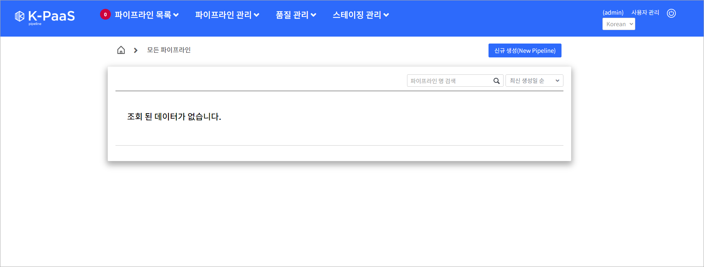

3. 이 때 ***컨테이너 플랫폼 배포 파이프라인 서비스를 처음 생성한 사용자가 관리자가 된다.*** 우측 상단의 사용자 관리 메뉴를 클릭하여 사용자 대시보드로 이동한다.

## <div id='2-2'/> 2.2 단독 배포 컨테이너 플랫폼 파이프라인 접속
1. 배포한 클러스터의 공인 IP로 웹 브라우저에서 http://{K8S_MASTER_NODE_IP}:30084 로 접속하여 진행한다.
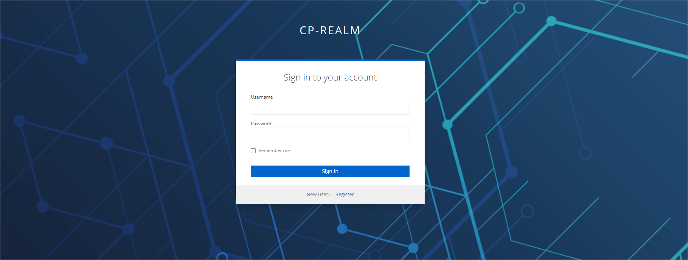
2. 컨테이너 플랫폼 파이프라인 접속 초기 정보를 확인한 후 파이프라인에 로그인한다.

	**초기 계정정보는 아래 명령어를 통해 확인**
	```
	$ kubectl get configmap -n cp-portal cp-portal-configmap -o yaml | grep KEYCLOAK_ADMIN
	```

3. 컨테이너 플랫폼 파이프라인 접속을 확인한다.


# <div id='3'/> 3. 컨테이너 플랫폼 파이프라인 사용자 매뉴얼
본 장에서는 컨테이너 플랫폼 파이프라인의 메뉴 구성 및 화면 설명에 대해서 기술하였다.

## <div id='3-1'/> 3.1 컨테이너 플랫폼 파이프라인 사용자 메뉴 구성
컨테이너 플랫폼 파이프라인 서비스는 파이프라인을 조회 및 관리하는 부분과 Kubernetes cluster 접속 정보를 관리하는 부분 및 Job 감사 추적하는 부분, 소스 코드의 품질을 관리하는 부분, 배포된 애플리케이션의 설정을 관리하는 부분, 부여된 권한에 따라 사용자를 관리할 수 있는 사용자 관리 부분으로 구성되어 있다.

***※ 기본적으로 사용자는 사용자 관리, 파이프라인 관리, 품질 관리 메뉴가 보이지 않는다.***
<table>
  <tr>
    <td>메뉴</td>
    <td>분류</td>
		<td>설명</td>
  </tr>
  <tr>
    <td>사용자 관리</td>
    <td>사용자 대시보드</td>
	  <td>컨테이너 플랫폼 파이프라인을 사용하는 사용자들의 정보 조회 및 관리</td>
  </tr>
  <tr>
		<td>파이프라인</td>
		<td>파이프라인 대시보드</td>
		<td>파이프라인 등록, 목록 및 상세 조회, 삭제, 참여자 권한 등의 기능을 관리</td>
  </tr>
	<tr>
		<th rowspan="2">파이프라인 관리</th>
		<td>Kubernetes 정보 관리</td>
		<td>Kubernetes 클러스터 접속 정보(kubeconfig)를 관리</td>
  </tr>
	<tr>
		<td>JOB 감사 추적</td>
		<td>컨테이너 플랫폼 배포 파이프라인에서 수행되는 job의 실행 상태를 추적 관리</td>
  </tr>
	<tr>
		<th rowspan="4">품질 관리</th>
		<td>품질 이슈</td>
		<td>수행된 소스 코드의 오류 해결 여부 및 오류의 수준, 활성화 상태를 관리</td>
  </tr>
	<tr>
		<td>코딩 규칙</td>
		<td>표준화된 소스 코드의 코딩 양식을 관리</td>
	</tr>
	<tr>
		<td>품질 프로파일</td>
		<td>소스 코드의 품질을 분석하기 위한 기준이 되는 코딩 규칙을 관리</td>
	</tr>
	<tr>
		<td>품질 게이트</td>
		<td>소스 코드의 품질 분석 결과 정해진 품질 기준 값을 초과하거나 미달하지 않았는지에 대한 기준을 관리</td>
	</tr>
	<tr>
		<td>스테이징 관리</td>
		<td>환경정보 관리</td>
		<td>배포된 애플리케이션의 환경 설정 정보를 관리</td>
  </tr>
</table>


## <div id='3-2'/> 3.2 컨테이너 플랫폼 파이프라인 사용자 메뉴 설명
본 장에서는 컨테이너 플랫폼 배포 파이프라인의 4개 메뉴에 대한 설명을 기술한다.

### <div id='3-2-1'/> 3.2.1. 사용자 관리
사용자 관리 메뉴는 관리자에게만 보이는 메뉴로써 본 장에서는 컨테이너 플랫폼 파이프라인 서비스를 사용하는 사용자들의 권한 관리 및 정보 조회와 관리에 대한 설명을 기술한다.

#### <div id='3-2-1-1'/> 3.2.1.1. 사용자 대시보드
##### <div id='3-2-1-1-1'/> 3.2.1.1.1. 사용자 목록 검색 조회
1. 상단의 우측 메뉴에 “사용자 관리” 버튼을 클릭한다.

2. 사용자 대시보드로 이동한다.
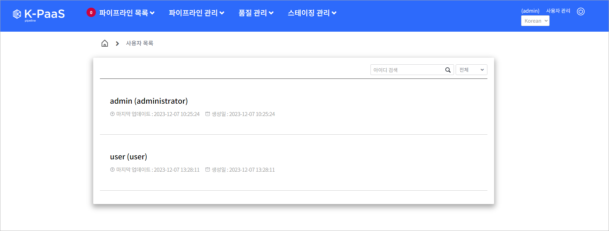
3. 사용자 대시보드 목록에서 검색할 수 있는 조건에는 사용자 아이디를 검색어로 하는 검색과 검색 타입이 관리자/사용자인 검색 2개가 있다. 검색어를 입력 후 “ENTER”를 하거나 “돋보기” 버튼을 클릭한다.
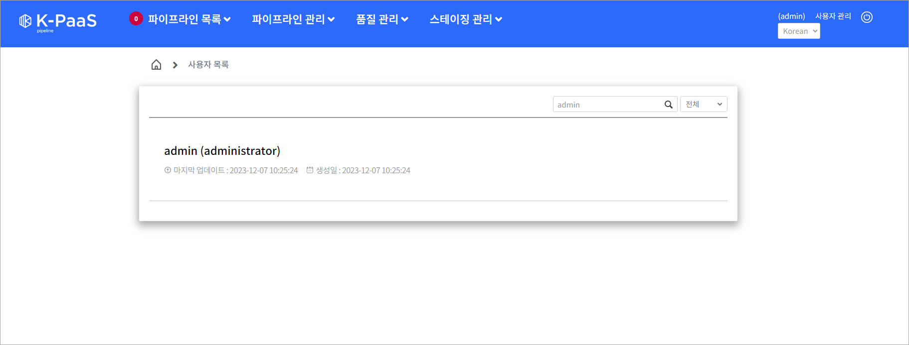
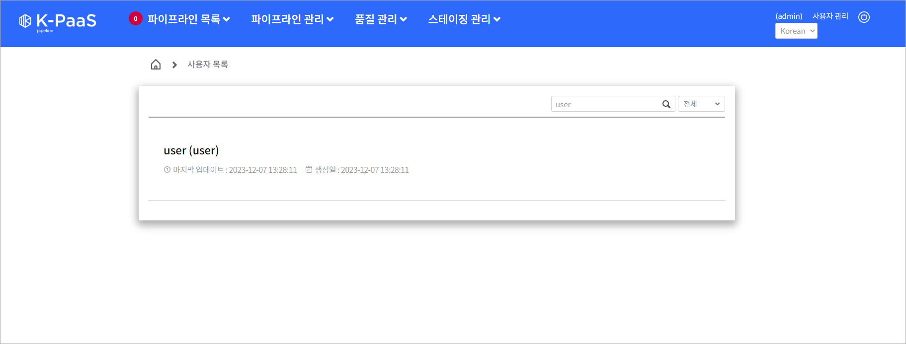

##### <div id='3-2-1-1-2'/> 3.2.1.1.2. 사용자 상세 조회/수정
1. 사용자 대시보드에서 아이디를 선택하여 사용자 상세 조회/수정 페이지로 이동한다.

2. 사용자의 정보를 상세 조회한다.

3. 정보를 수정하고자 할 때 입력 값을 새롭게 입력한다. 권한은 관리자/사용자로 선택할 수 있다.
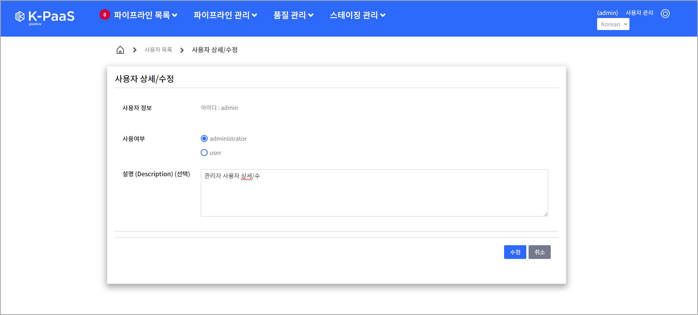
4. 입력 값을 수정 후 “수정” 버튼을 클릭한다.
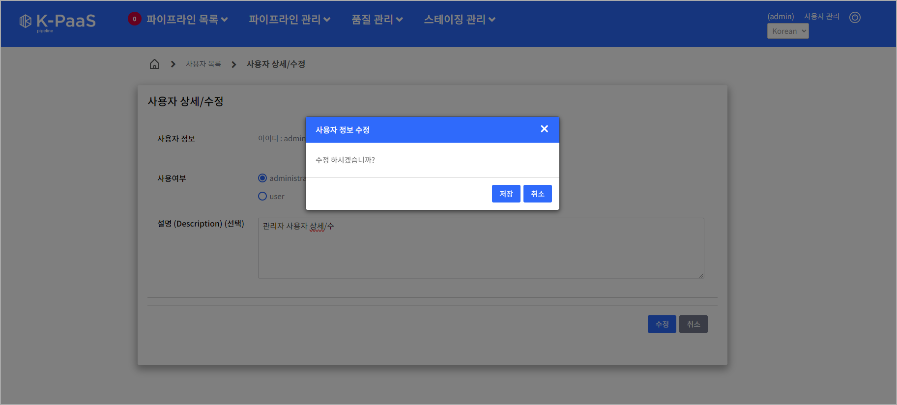
5. 수정된 정보를 확인한다.


### <div id='3-2-2'/> 3.2.2. 파이프라인
본 장에서는 파이프라인을 관리하는 2개 방법에 대한 설명을 기술한다.

***※ 기본적으로 사용자는 파이프라인을 보기만 할 수 있고, 생성, 조회, 수정, 삭제할 수 없다. 하지만 파이프라인 참여자 권한이 부여되었을 경우에는 조건에 따라 파이프라인 생성, 조회, 수정, 삭제가 가능해진다.***

#### <div id='3-2-2-1'/> 3.2.2.1. 나의 파이프라인
1.	어떤 페이지에 있든 상관없이 Drop down 메뉴의 나의 파이프라인 버튼을 클릭하면 대시보드로 이동한다.
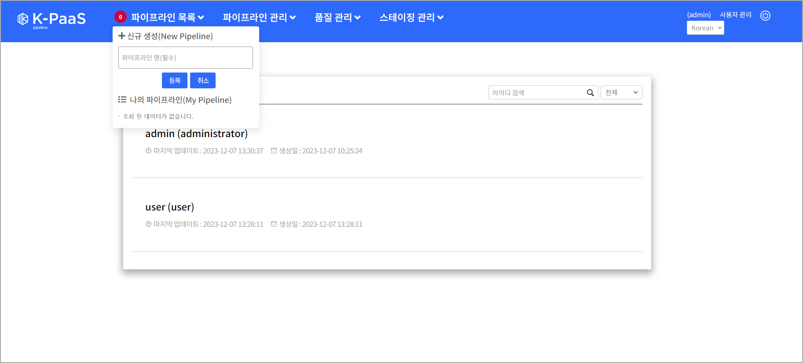

2.	나의 파이프라인에서 목록의 파이프라인 명을 클릭하면 해당 파이프라인의 상세 페이지로 이동한다.


#### <div id='3-2-2-2'/> 3.2.2.2. 파이프라인 신규 생성
##### <div id='3-2-2-2-1'/> 3.2.2.2.1. 파이프라인 신규 생성(1)
1. 상단 메뉴의 “파이프라인 목록” 을 클릭하면 파이프라인 명 입력만으로 즉시 파이프라인을 신규 생성할 수 있다.
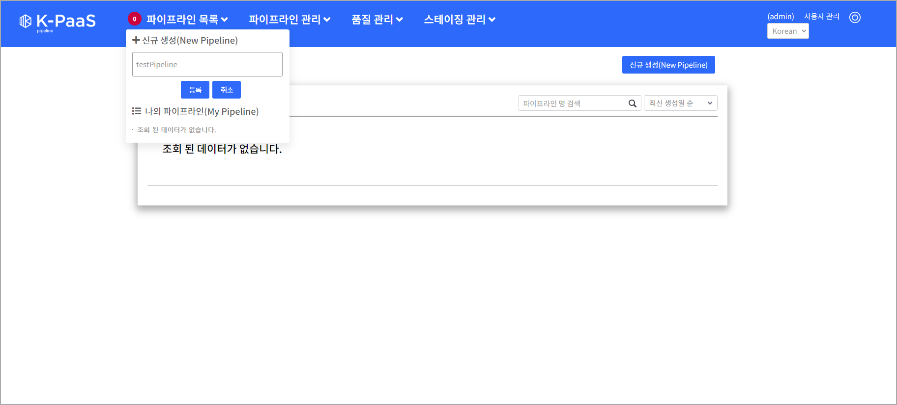
2. 등록 버튼을 누른 후 대시보드에 추가된 파이프라인을 확인할 수 있다.

3. Drop down 메뉴에도 등록된 파이프라인을 확인할 수 있다.

##### <div id='3-2-2-2-2'/> 3.2.2.2.2. 파이프라인 신규 생성(2)
1.	오른쪽 상단의 “신규 생성” 버튼을 클릭한다.

	***※ 사용자는 “신규 생성” 버튼이 활성화되지 않는다.***

2.	파이프라인 신규 생성 페이지로 이동한다.
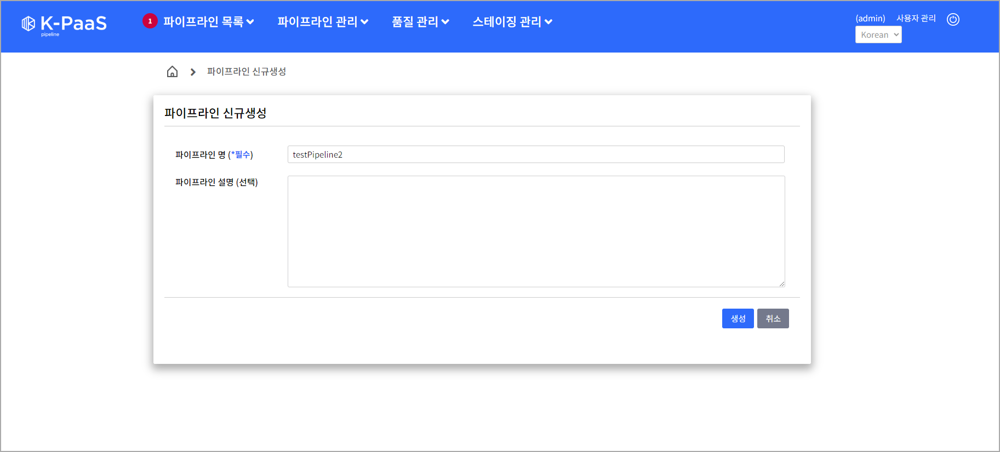
3.	파이프라인 명은 필수로 입력받기 때문에 파이프라인 명을 반드시 입력한 후 “생성” 버튼을 클릭한다.
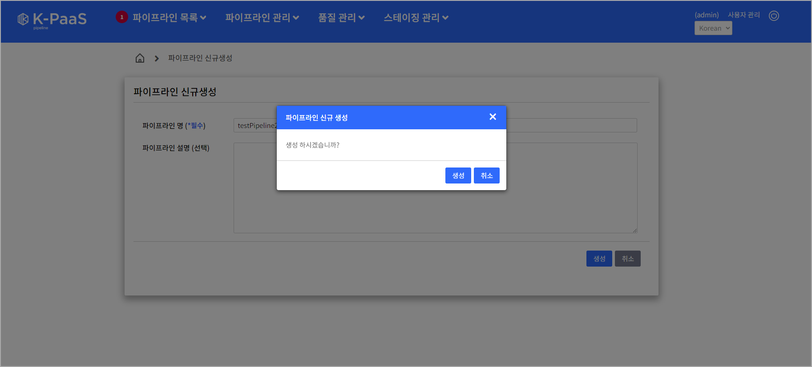
4.	생성된 후 파이프라인 대시보드에서 새로 추가된 파이프라인 명을 확인한다.


#### <div id='3-2-2-3'/> 3.2.2.3. 파이프라인 대시보드
##### <div id='3-2-2-3-1'/> 3.2.2.3.1. 파이프라인 목록 검색 조회
1. 목록에서 검색할 수 있는 조건은 파이프라인 명과 날짜/업데이트/이름순 필터 2개이다.
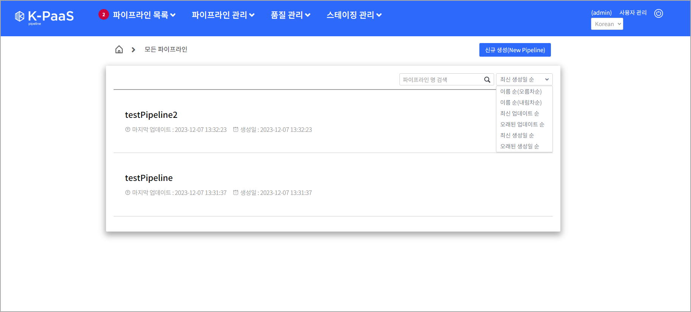
2.	검색어를 입력 후 “ENTER”를 하거나 “돋보기” 버튼을 클릭한다.
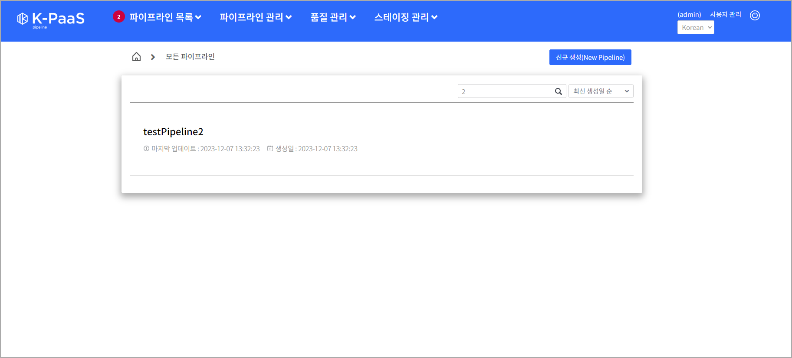
3.	목록 조회/검색 목록 조회일 때 모두 검색 타입 필터를 선택하면 즉시 반영된다.
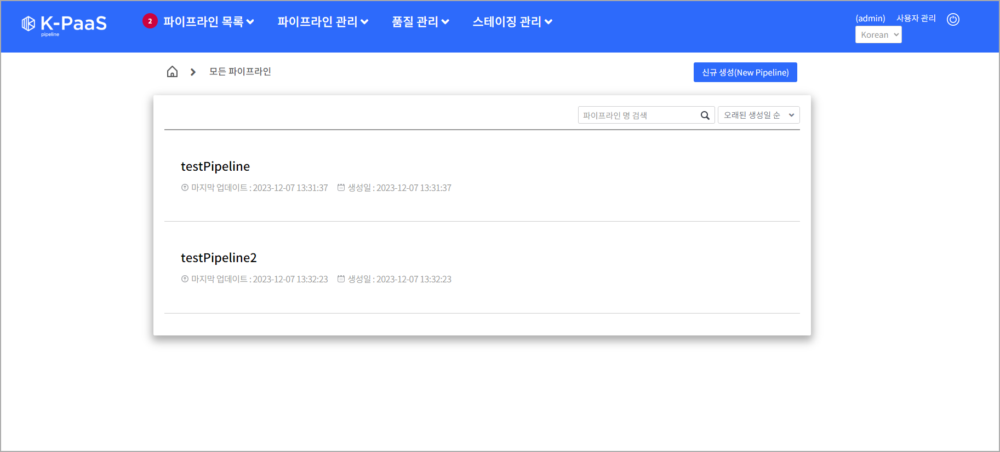

##### <div id='3-2-2-3-2'/> 3.2.2.3.2. 파이프라인 상세 정보 조회
1.	파이프라인 대시보드에서 파이프라인 명을 눌러 파이프라인 상세 페이지로 이동한다.
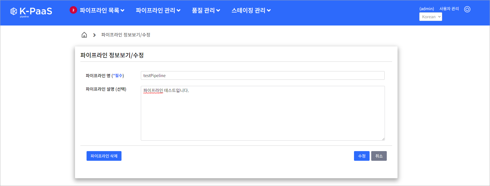
2.	파이프라인 상세페이지에서 오른쪽 상단에 “정보보기/수정” 버튼을 클릭한다.
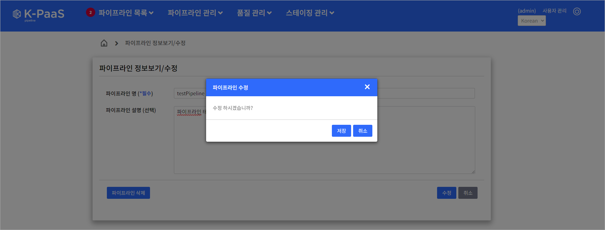
3.	파이프라인 정보보기/수정 페이지로 이동하여 해당 파이프라인의 정보를 상세 조회한다.


##### <div id='3-2-2-3-3'/> 3.2.2.3.3. 파이프라인 수정
1.	파이프라인 정보보기/수정 페이지에서 입력 값을 수정 후 “수정” 버튼을 클릭한다.


2.	수정하고 나면 파이프라인 상세 페이지로 이동한다. 다시 “정보보기/수정” 버튼을 클릭하여 변경된 값을 확인한다.


##### <div id='3-2-2-3-4'/> 3.2.2.3.4. 파이프라인 삭제
1.	파이프라인 정보보기/수정 페이지에서 “파이프라인 삭제” 버튼을 클릭한다.
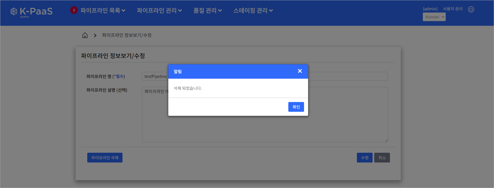
2.	삭제 후에 파이프라인 대시보드로 이동하여 파이프라인이 삭제되었는지 확인한다.
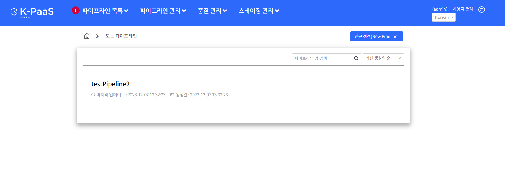


#### <div id='3-2-2-4'/> 3.2.2.4. 파이프라인 상세
본 장에서는 파이프라인에 참여하는 참여자 추가, 수정, 삭제 및 권한 부여 등 전반적인 참여자 관리와 하나의 파이프라인에 대한 Job들을 생성 및 실행, 삭제, 로그/히스토리 조회, 참여자 등을 관리하는 방법에 대해 기술한다.
##### <div id='3-2-2-4-1'/> 3.2.2.4.1. 참여자 관리
###### <div id='3-2-2-4-1-1'/> 3.2.2.4.1.1. 참여자 추가
***※	관리자는 파이프라인 생성자이므로 기본적으로 생성 권한을 가진 참여자이다.***
1.	파이프라인 상세페이지에서 참여자 탭을 선택한다.
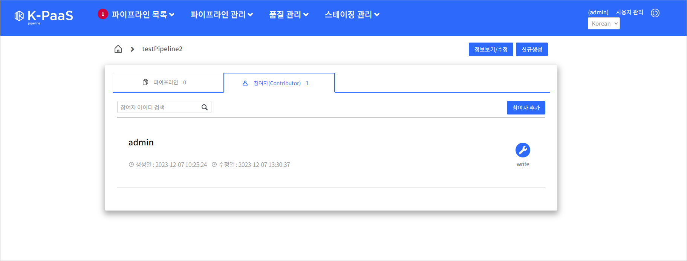
2.	우측 상단에 “참여자 추가” 버튼을 클릭한다.

3.	참여자 추가 페이지로 이동하여 현재 배포 파이프라인에 초대된 사용자를 검색하고, 선택한다. 권한은 보기, 생성, 실행 권한 중 한 개를 선택하여 “추가” 버튼을 클릭한다.
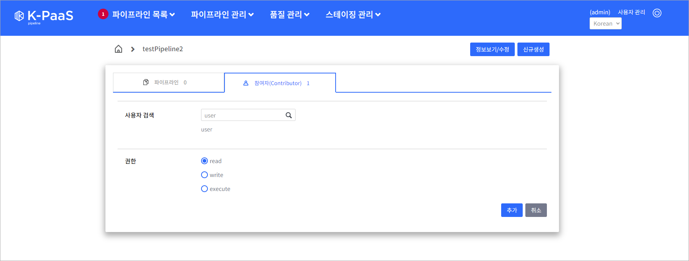
4.	참여자 탭에서 추가된 참여자를 확인한다.
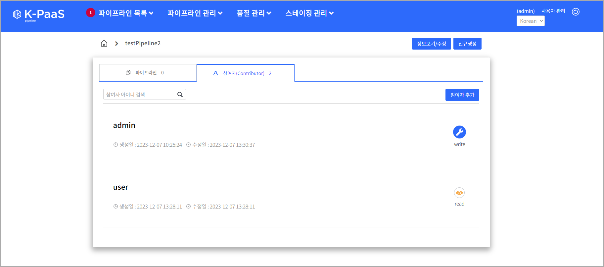

###### <div id='3-2-2-4-1-2'/> 3.2.2.4.1.2. 참여자 목록 검색 조회
1.	참여자 목록에서 검색할 수 있는 조건은 참여자 아이디 검색 1개이다.
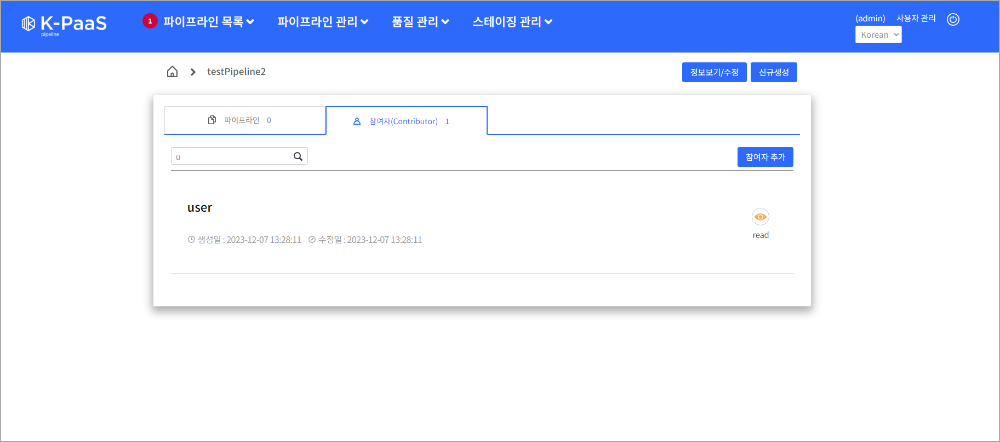

###### <div id='3-2-2-4-1-3'/> 3.2.2.4.1.3.	참여자 상세 정보 조회/수정
1.	참여자 목록에서 정보 조회할 참여자 아이디를 선택한다.

2.	참여자 상세 정보 조회/수정 페이지로 이동하여 참여자의 상세 정보를 조회한다.

3.	수정하고자 하는 권한을 선택하여 “수정” 버튼을 클릭한다.
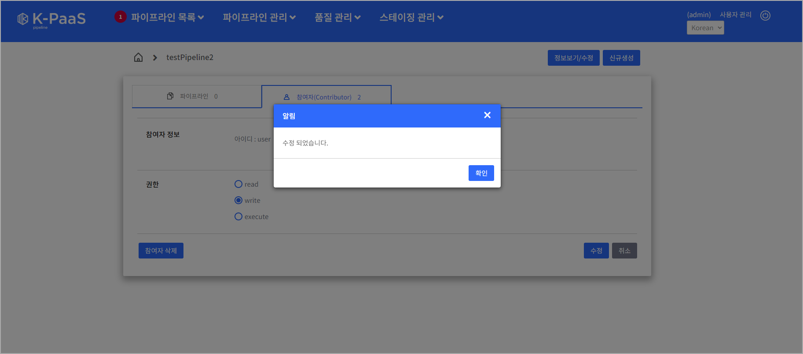
4.	참여자 목록에서 수정된 참여자의 권한을 확인한다.
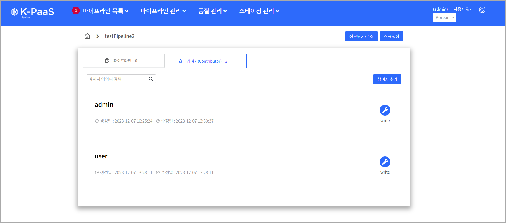


###### <div id='3-2-2-4-1-4'/> 3.2.2.4.1.4.	참여자 삭제
1.	참여자 목록에서 삭제할 참여자 아이디를 선택한다.

2.	참여자 상세 정보 조회/수정 페이지로 이동한다.
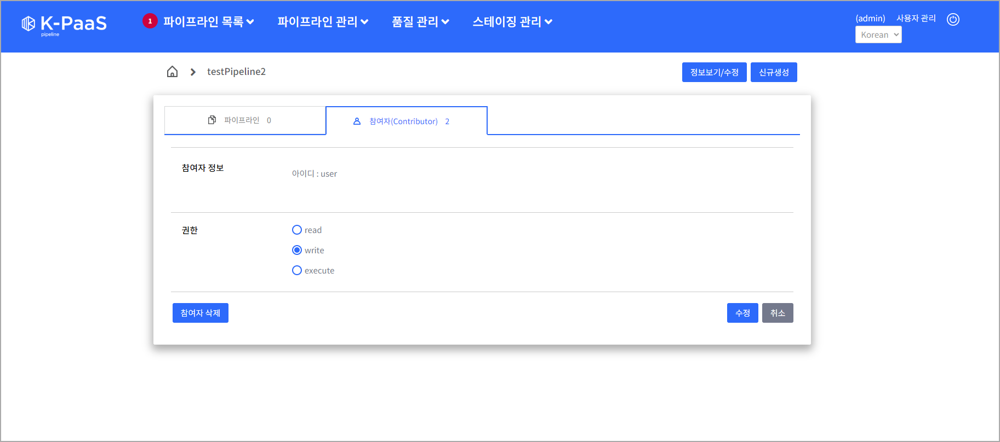
3.	“참여자 삭제” 버튼을 클릭한다.

4.	참여자 목록에서 참여자가 삭제되었음을 확인한다.
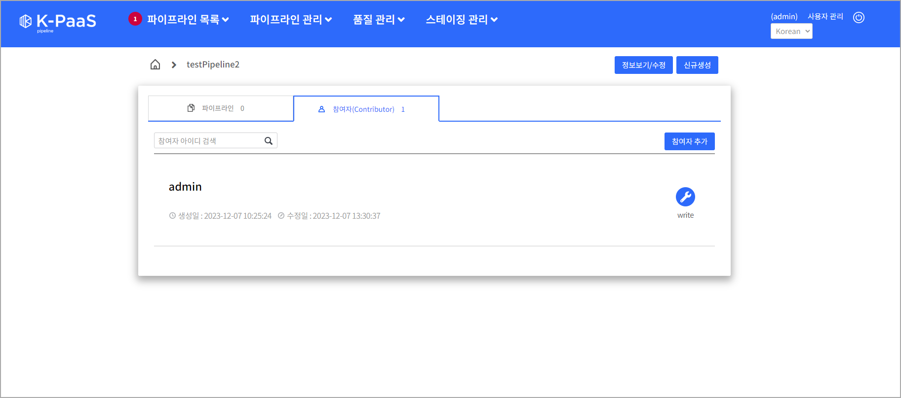


##### <div id='3-2-2-4-2'/> 3.2.2.4.2. 빌드 Job
###### <div id='3-2-2-4-2-1'/> 3.2.2.4.2.1. 빌드 Job 생성
1.	파이프라인 상세 페이지에서 ‘이곳을 클릭하여 새 작업 추가’ 버튼을 클릭한다.
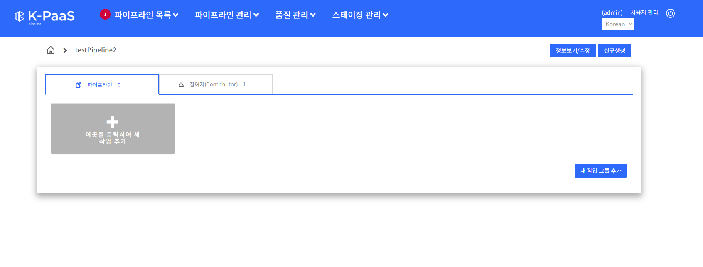
2.	구성 상세페이지로 이동한다.
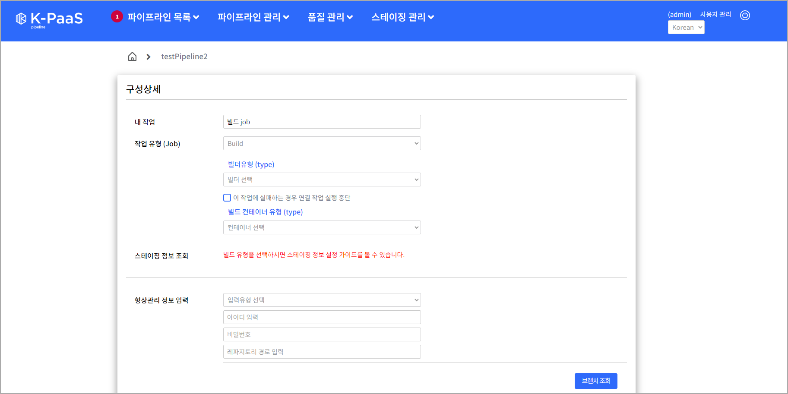
3. 작업 유형을 선택한 후 빌드 유형으로 선택한다. 그 후 Harbor에 저장할 이미지 이름을 입력한다. <br>
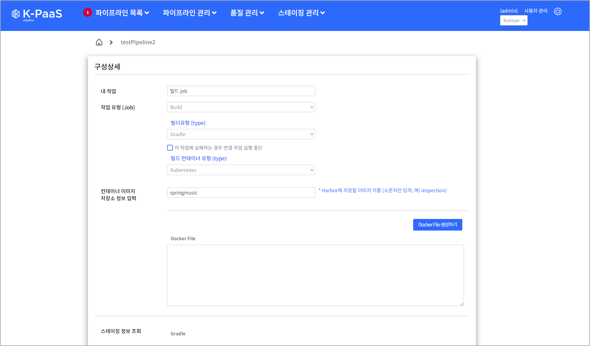

	***※ Gradle을 선택한 경우 소스 빌드 및 테스트, 정적 분석의 경우 Gradle wrapper 설정을 반영한다.***

4. Docker File 생성하기 버튼을 클릭한다.
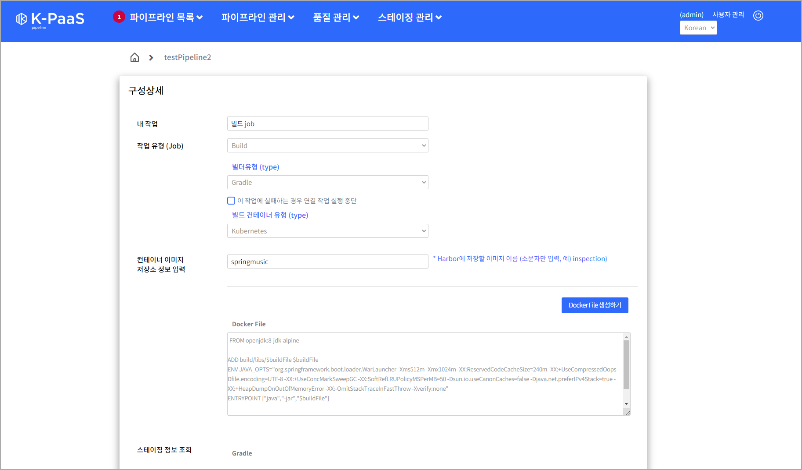
5. 스테이징 정보 조회 내 빌더유형에 맞는 이름을 클릭하면, Spring Config Client 설정 방법 예시 정보가 조회된다.
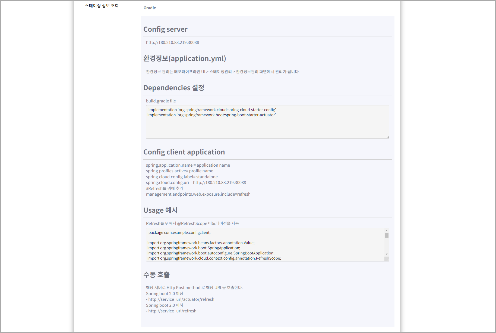
6. 형상관리 정보를 입력한 후 브랜치 조회 버튼을 클릭한다.
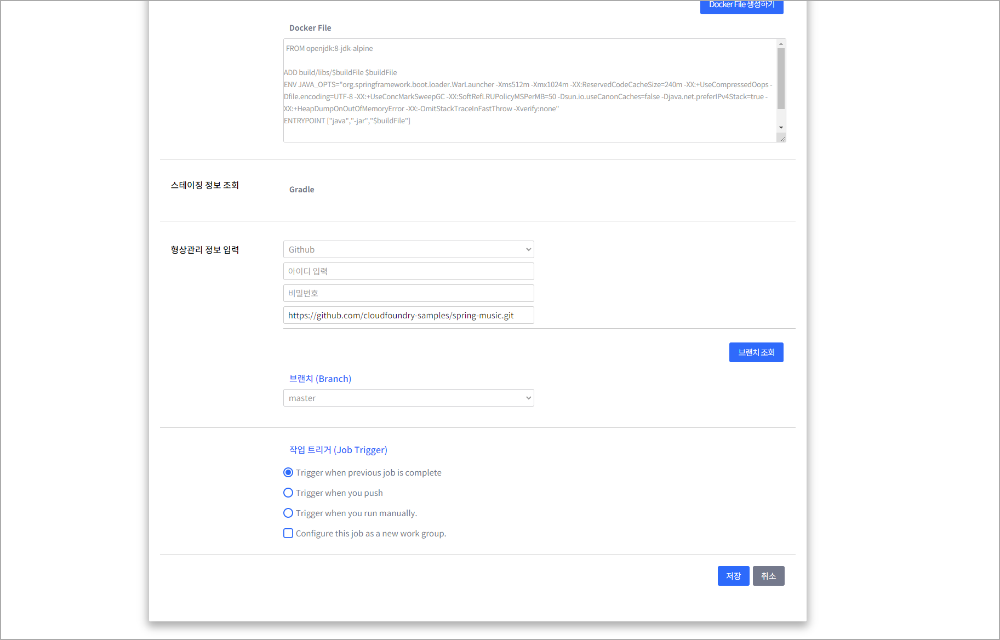

	***※ Github을 선택했을 때, 공개 레파지토리 경로를 입력하는 경우 브랜치 조회 시 아이디와 비밀번호를 입력하지 않아도 된다.***

7. 원하는 브랜치를 선택하고, 저장 버튼을 클릭한다.
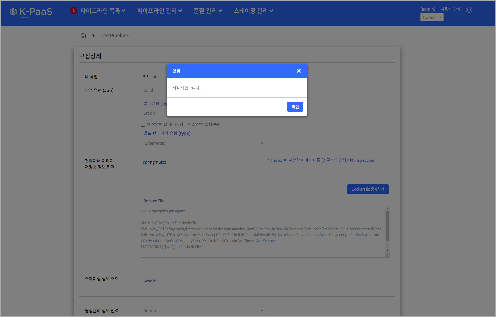

	***※ 빌드 Job 생성은 관리자와 파이프라인 참여자 중 생성 권한을 가진 참여자만 생성이 가능하다.***


###### <div id='3-2-2-4-2-2'/> 3.2.2.4.2.2. 빌드 Job 구성 조회/수정
1. 생성된 빌드 Job 의 “구성” 아이콘을 클릭한다.<br>


2. 구성 상세페이지로 이동하여 생성 시 저장해 놓았던 구성 정보들을 조회한다.


3. 수정 시에는 각 입력 폼에 수정할 정보들을 다시 입력한 후 “저장” 버튼을 클릭한다.(예제에서는  Dockerfile을 수정)


	***※ 빌드 Job 수정 시, 형상관리 정보의 경우 브랜치 이외에는 수정할 수 없다.***<br>

4. 구성 상세페이지로 이동하여 수정된 정보들을 확인한다.


	***※ 빌드 Job 구성 조회는 파이프라인 참여자이면 모두 조회가 가능하다. 하지만 수정은 관리자와 파이프라인 참여자 중 생성 권한을 가진 참여자만 수정이 가능하다.***

###### <div id='3-2-2-4-2-3'/> 3.2.2.4.2.3. 빌드 Job 실행
1. 파이프라인 상세페이지에서 “실행” 아이콘을 클릭한다.<br>

2. 실행이 될 때 파란색으로 바뀌며 깜빡이는 것을 확인할 수 있다. (실행 중에 “로그/히스토리” 아이콘을 클릭하여 실시간으로 로그를 조회할 수 있다.)

3. 실행이 완료되면 초록색으로 바뀌며 작업 부분에 Build(실행완료) 로 표시된다.
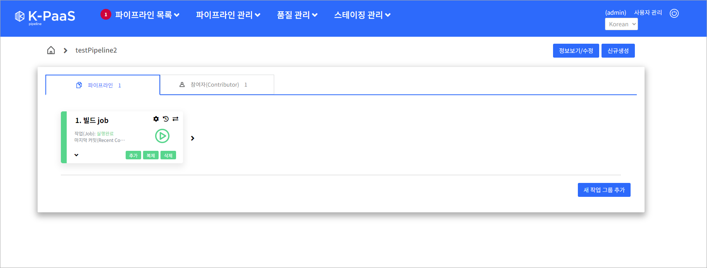

	***※	빌드 Job 실행은 관리자와 파이프라인 참여자 중 생성 권한과 실행 권한을 가진 참여자만 가능하다.***


###### <div id='3-2-2-4-2-4'/> 3.2.2.4.2.4. 빌드 Job 정지
1.	실행 중인 빌드 Job을 정지 및 취소하고 싶을 때 “정지” 아이콘을 클릭한다.
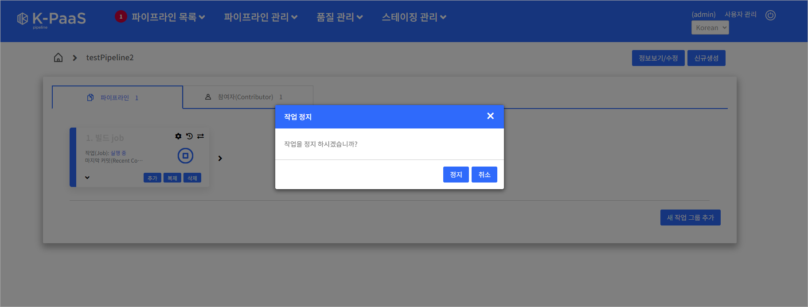
2.	정지된 빌드 Job은 주황색으로 바뀌는 것을 확인할 수 있다.
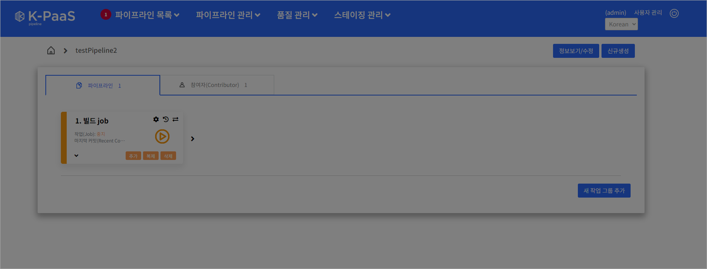

	***※	빌드 Job 정지는 관리자와 파이프라인 참여자 중 생성 권한과 실행 권한을 가진 참여자만 가능하다.***


###### <div id='3-2-2-4-2-5'/> 3.2.2.4.2.5.	빌드 Job 로그/히스토리
1.	빌드 Job 실행이 진행 중일 때 “로그/히스토리” 아이콘을 클릭하여 실시간으로 로그를 조회할 수 있다.

2.	로그 조회 페이지로 이동한다. 실시간으로 로그가 보이고 있는 것을 확인한다.
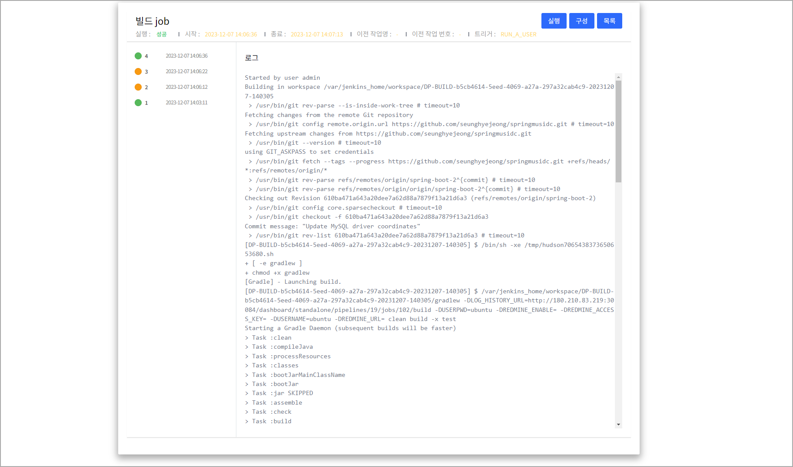
3.	빌드 Job 실행이 완료된 것을 확인하고, 히스토리를 확인한다.
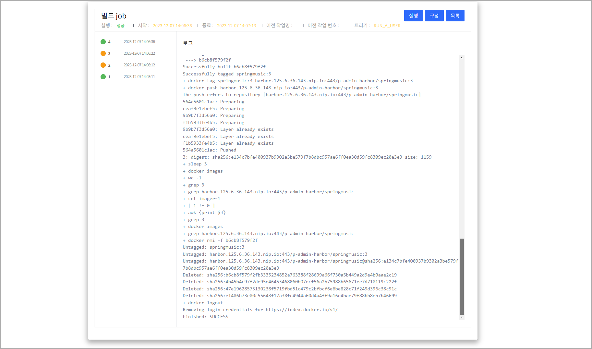
4.	로그/히스토리 페이지에서 상단의 “취소” 버튼 또는 “실행” 버튼을 클릭하여 Job을 취소하고, 실행할 수 있다.

5.	로그/히스토리 페이지에서 “구성” 버튼을 클릭하면 빌드 Job 구성 조회 페이지로 이동한다.

6.	로그/히스토리 페이지에서 “목록” 버튼을 클릭하면 파이프라인 상세페이지로 이동한다.


	***※	빌드 Job 로그/히스토리는 관리자와 모든 파이프라인 참여자가 조회 가능하나 실행 및 정지 버튼은 생성 권한과 실행 권한을 가진 참여자만 가능하다.***

###### <div id='3-2-2-4-2-6'/> 3.2.2.4.2.6.	빌드 Job 추가
1.	파이프라인 상세페이지에서 빌드 Job의 “추가” 버튼을 클릭한다.

2.	구성 상세페이지로 이동 후 빌드 Job 생성과 같이 입력 폼에 알맞은 값들을 입력한 후 ”저장” 버튼을 클릭한다.(작업 유형은 빌드 이외에도 테스트, 배포 유형 선택이 가능하다.).
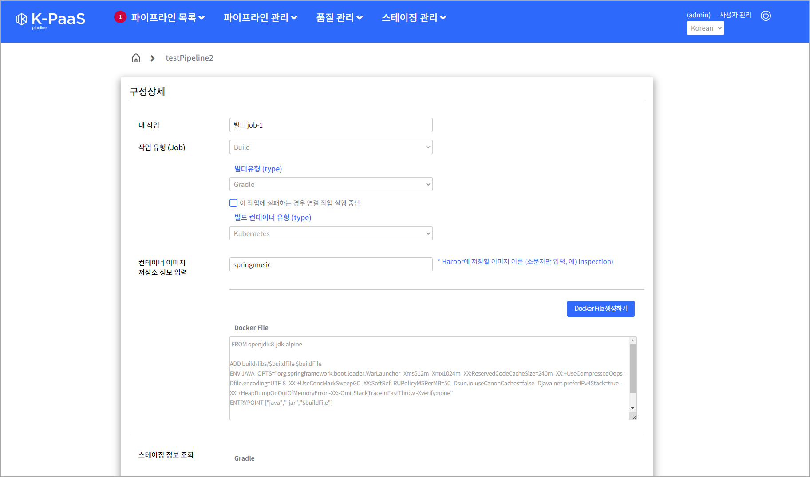
3.	추가된 빌드 Job 을 확인한다.<br>
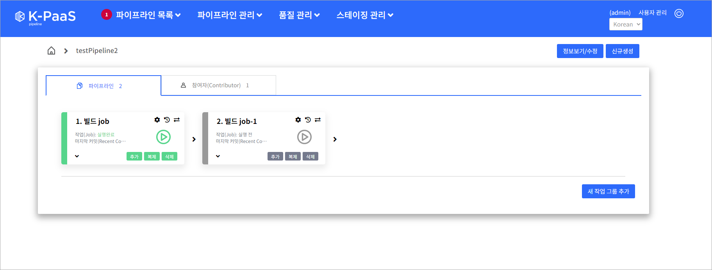
4.	작업 트리거에서 이 작업(Job)을 새 작업 그룹으로 구성을 체크하면 새로운 그룹으로 Job이 추가된다. (이후에 새 작업 그룹 추가 항목에서 설명하겠습니다.)

	***※	빌드 Job 추가는 관리자와 생성 권한을 가진 파이프라인 참여자만 가능하다.***

###### <div id='3-2-2-4-2-7'/> 3.2.2.4.2.7.	빌드 Job 복제
1.	파이프라인 상세페이지에서 빌드 Job의 “복제” 버튼을 클릭한다.
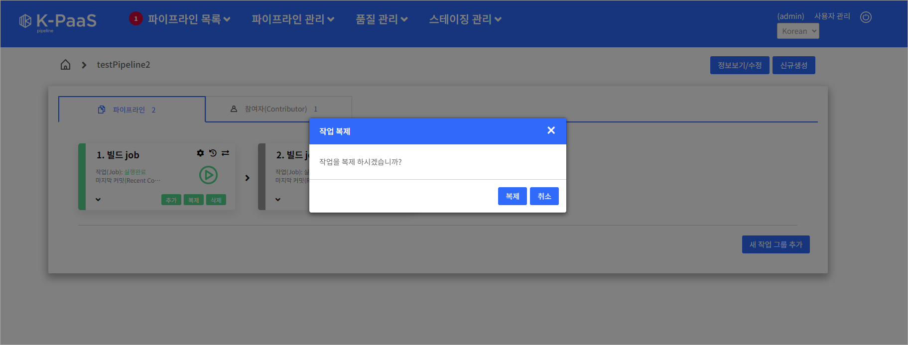
2. 빌드 Job 이 복제된 것을 확인한다.
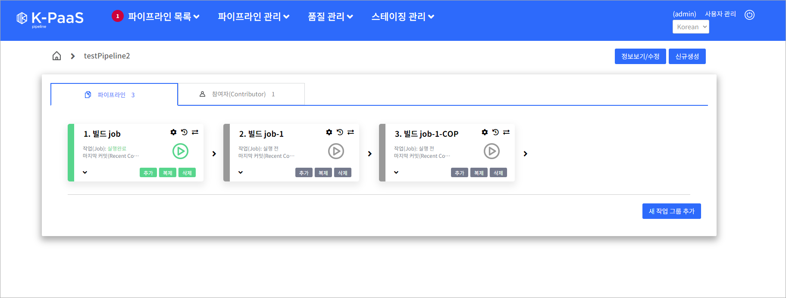

	***※	빌드 Job 복제는 관리자와 생성 권한을 가진 파이프라인 참여자만 가능하다.***

###### <div id='3-2-2-4-2-8'/> 3.2.2.4.2.8.	빌드 Job 삭제
1.	파이프라인 상세페이지에서 빌드 Job의 “삭제” 버튼을 클릭한다.
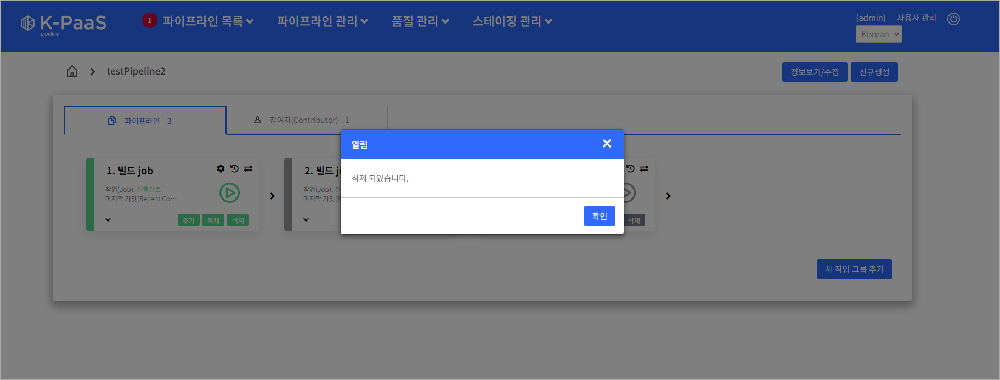
2.	빌드 Job 이 삭제된 것을 확인한다.
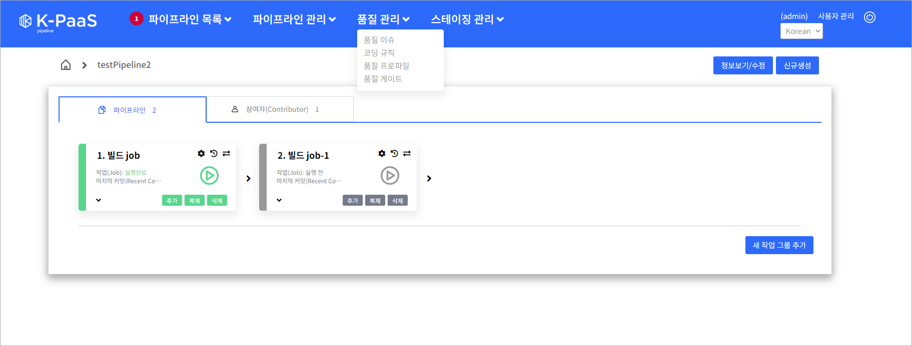

***※	빌드 Job 삭제는 관리자와 생성 권한을 가진 파이프라인 참여자만 가능하다.***


##### <div id='3-2-2-4-3'/> 3.2.2.4.3. 정적분석 Job
###### <div id='3-2-2-4-3-1'/> 3.2.2.4.3.1. 정적분석 Job 생성
1.	Job의 “추가” 버튼을 클릭한다.

2.	구성 페이지로 이동하여 작업 유형을 정적분석(Static-Analysis)으로 선택한 후 입력 유형에서 원하는 품질 프로파일과 품질 게이트, 작업 그룹을 선택한다. 그 후에 작업 트리거는 각자의 상황에 맞게 선택한다. (처음에는 품질 게이트가 존재하지 않는다. [품질 게이트 생성](#3-2-4-4-1) 을 참조하여 생성한다.)
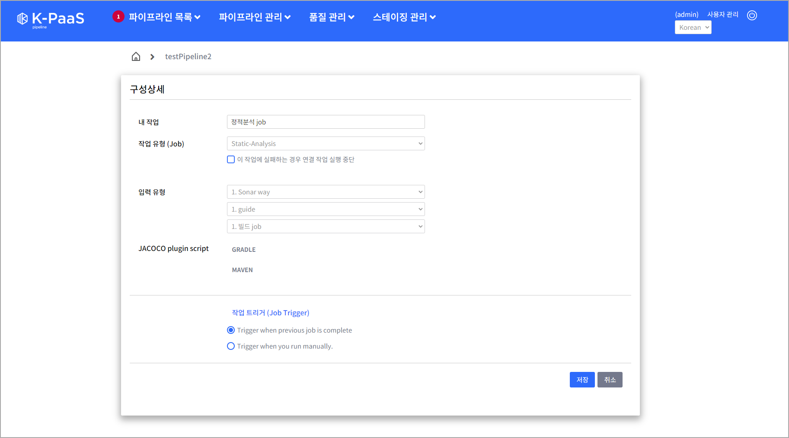 
3.	JACOCO plugin script tab의 GRADLE, MAVEN을 클릭하면 jacoco plugin 적용방법을 확인할 수 있다.(예시이므로 상황에 맞게 플러그인을 적용한다.)
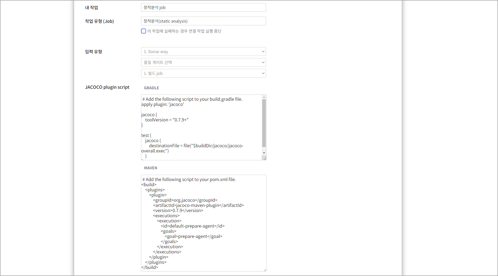
4.	“저장” 버튼을 클릭하고, 파이프라인 상세페이지에서 테스트 Job 생성된 것을 확인한다.
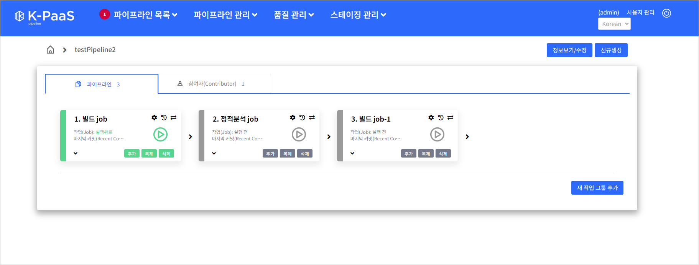

	***※	정적분석 Job 생성은 관리자와 파이프라인 참여자 중 생성 권한을 가진 참여자만 생성이 가능하다.***

###### <div id='3-2-2-4-3-2'/> 3.2.2.4.3.2. 정적분석 Job 구성 조회/수정
1.	생성된 정적분석 Job 의 “구성” 아이콘을 클릭한다.

2.	구성 상세페이지로 이동하여 생성 시 저장해 놓았던 구성 정보들을 조회한다.
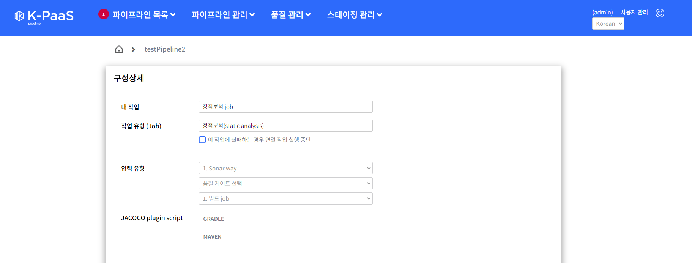
3.	수정 시에는 각 입력 폼에 수정할 정보들을 다시 입력한 후 “저장” 버튼을 클릭한다.


	***※	정적분석 Job 구성 조회는 파이프라인 참여자이면 모두 조회가 가능하다. 하지만 수정은 관리자와 파이프라인 참여자 중 생성 권한을 가진 참여자만 수정이 가능하다.***

###### <div id='3-2-2-4-3-3'/> 3.2.2.4.3.3.	정적분석 Job 실행
1.	파이프라인 상세페이지에서 정적분석 Job의 “실행” 아이콘을 클릭한다.
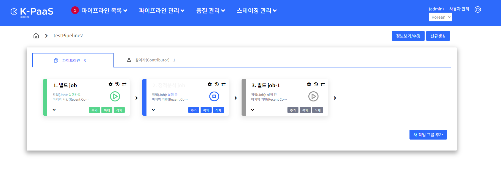
2.	실행이 될 때 파란색으로 바뀌며 깜빡이는 것을 확인할 수 있다. (실행 중에 “로그/히스토리” 아이콘을 클릭하여 실시간으로 로그를 조회할 수 있다.)
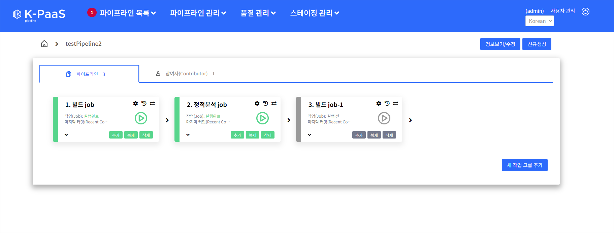
3. 실행이 완료되면 초록색으로 바뀌며 작업 부분에 Test(실행완료) 로 표시된다.

	***※	 Job 실행은 관리자와 파이프라인 참여자 중 생성 권한과 실행 권한을 가진 참여자만 가능하다.***

###### <div id='3-2-2-4-3-4'/> 3.2.2.4.3.4.	정적분석 Job 정지
1.	실행 중인 정적분석 Job을 정지 및 취소하고 싶을 때 “정지” 아이콘을 클릭한다.

2.	정지된 정적분석 Job은 주황색으로 바뀌는 것을 확인할 수 있다


	***※ Job 정지는 관리자와 파이프라인 참여자 중 생성 권한과 실행 권한을 가진 참여자만 가능하다.***

###### <div id='3-2-2-4-3-5'/> 3.2.2.4.3.5.	정적분석 Job 로그/히스토리
1.	정적분석 Job 실행이 진행 중일 때 “로그/히스토리” 아이콘을 클릭하여 실시간으로 로그를 조회할 수 있다.

2.	로그 조회 페이지로 이동한다. 실시간으로 로그가 보이고 있는 것을 확인한다.

3.	정적분석 Job 실행이 완료된 것을 확인하고, 히스토리를 확인한다.

4.	“실행”, “취소”, “구성”, “목록” 버튼은 3.2.2.4.2.5. 빌드 Job 로그/히스토리 항목을 참고한다.

	***※	 Job 로그/히스토리는 관리자와 모든 파이프라인 참여자가 조회 가능하나 실행 및 정지 버튼은 생성 권한과 실행 권한을 가진 참여자만 가능하다.***

###### <div id='3-2-2-4-3-6'/> 3.2.2.4.3.6.	정적분석 Job 추가
1.	파이프라인 상세페이지에서 정적분석 Job의 “추가” 버튼을 클릭한다.

2.	그 이후의 과정은 3.2.2.4.2.7. 빌드 Job 추가 항목을 참고한다.

	***※	정적분석 Job 추가는 관리자와 생성 권한을 가진 파이프라인 참여자만 가능하다.***

###### <div id='3-2-2-4-3-7'/> 3.2.2.4.3.7.	정적분석 Job 품질 이슈 결과
1.	테스트 Job의 로그/히스토리 “품질 이슈 결과” 버튼을 누르면 수행된 소스 코드의 오류 해결 여부 및 오류의 수준, 활성화 상태를 관리하는 품질 관리 대시보드로 이동한다.

2.	품질 관리 대시보드에 대해서는 이후 3.2.4 품질 관리 부분을 참고한다.

	***※	 Job 품질 이슈 결과는 관리자와 모든 파이프라인 참여자가 조회 가능하다.***

##### <div id='3-2-2-4-4'/> 3.2.2.4.4. 테스트 Job
###### <div id='3-2-2-4-4-1'/> 3.2.2.4.4.1. 테스트 Job 생성
1.	Job의 “추가” 버튼을 클릭한다.

2.	구성 페이지로 이동하여 작업 유형을 테스트(JUnit-Test)로 선택한 후 테스트할 입력유형을 선택한다. 그 후에 작업 트리거는 각자의 상황에 맞게 선택한다. 

3.	“저장” 버튼을 클릭하고, 파이프라인 상세페이지에서 테스트 Job 생성된 것을 확인한다.


	***※	테스트 Job 생성은 관리자와 파이프라인 참여자 중 생성 권한을 가진 참여자만 생성이 가능하다.***

###### <div id='3-2-2-4-4-3'/> 3.2.2.4.4.3.	테스트 Job 실행
1.	파이프라인 상세페이지에서 테스트 Job의 “실행” 아이콘을 클릭한다.

2.	실행이 될 때 파란색으로 바뀌며 깜빡이는 것을 확인할 수 있다. (실행 중에 “로그/히스토리” 아이콘을 클릭하여 실시간으로 로그를 조회할 수 있다.)

3. 실행이 완료되면 초록색으로 바뀌며 작업 부분에 Test(실행완료) 로 표시된다.

	***※	테스트 Job 실행은 관리자와 파이프라인 참여자 중 생성 권한과 실행 권한을 가진 참여자만 가능하다.***

###### <div id='3-2-2-4-4-5'/> 3.2.2.4.4.5.	테스트 Job 로그/히스토리
1.	빌드 Job 실행이 진행 중일 때 “로그/히스토리” 아이콘을 클릭하여 실시간으로 로그를 조회할 수 있다.


2.	테스트 Job 실행이 완료된 것을 확인하고, 히스토리를 확인한다.

3.	“실행”, “취소”, “구성”, “목록” 버튼은 3.2.2.4.2.5. 빌드 Job 로그/히스토리 항목을 참고한다.

	***※	테스트 Job 로그/히스토리는 관리자와 모든 파이프라인 참여자가 조회 가능하나 실행 및 정지 버튼은 생성 권한과 실행 권한을 가진 참여자만 가능하다.***

###### <div id='3-2-2-4-4-6'/> 3.2.2.4.4.6.	테스트 Job 추가
1.	파이프라인 상세페이지에서 테스트 Job의 “추가” 버튼을 클릭한다.

2.	그 이후의 과정은 3.2.2.4.2.6. 빌드 Job 추가 항목을 참고한다.

	***※	테스트 Job 추가는 관리자와 생성 권한을 가진 파이프라인 참여자만 가능하다.***

###### <div id='3-2-2-4-4-7'/> 3.2.2.4.4.7.	테스트 Job 결과
1.	테스트 Job의 로그/히스토리 “Test 결과” 버튼을 누르면 수행된 소스 코드의 JUnit Test 결과 팝업 창이 뜬다.


***※	테스트 Job 품질 이슈 결과는 관리자와 모든 파이프라인 참여자가 조회 가능하다.***

###### <div id='3-2-2-4-4-8'/> 3.2.2.4.4.8.	테스트 Job 복제
1.	파이프라인 상세페이지에서 테스트 Job의 “복제” 버튼을 클릭한다.

2.	그 이후의 과정은 3.2.2.4.2.7 빌드 Job 복제 항목을 참고한다.

	***※	테스트 Job 복제는 관리자와 생성 권한을 가진 파이프라인 참여자만 가능하다.***

###### <div id='3-2-2-4-4-9'/> 3.2.2.4.4.9.	테스트 Job 삭제
1.	파이프라인 상세페이지에서 테스트 Job의 “삭제” 버튼을 클릭한다.

2.	그 이후의 과정은 3.2.2.4.2.8 빌드 Job 삭제 항목을 참고한다.

	***※	테스트 Job 삭제는 관리자와 생성 권한을 가진 파이프라인 참여자만 가능하다.***

##### <div id='3-2-2-4-5'/> 3.2.2.4.5.	배포 Job
###### <div id='3-2-2-4-5-1'/> 3.2.2.4.5.1.	배포 Job 생성
1. Job의 “추가” 버튼을 클릭한다.<br>


2.	구성 페이지로 이동하여 작업 유형을 배포(Deploy)로 선택한 후 유형에서 원하는 배포 유형 및 앱 유형을 선택, 파이프라인 관리에서 저장해 놓은 Kubernetes 정보를 선택한다. (Kubernetes 정보를 가져오기 위해서는 선행 과정이 필요하다. 과정은 3.2.3.1. Kubernetes 정보 관리 항목을 참고한다).

	***※	선택한 유형(type), 앱 유형에 따라 DEPLOYMENT.YML, DEPLOYMENT_SERVICE.YML 서식이 달라진다.***

3.	DEPLOYMENT.YML, DEPLOYMENT_SERVICE.YML을 앱 설정에 맞게 변경한다.

	***※	YML 파일 내부에 들어 있는 %INTERNAL_SERVICE_PORT% 등의 %{VALUE}% 값은 반드시 변경해야 한다.***

4.	“저장” 버튼을 클릭하고, 파이프라인 상세페이지에서 배포 Job이 생성된 것을 확인한다.


###### <div id='3-2-2-4-5-3'/> 3.2.2.4.5.3.	배포 Job 실행
1.	파이프라인 상세페이지에서 배포 Job의 “실행” 아이콘을 클릭한다.

2.	실행이 될 때 파란색으로 바뀌며 깜빡이는 것을 확인할 수 있다. (실행 중에 “로그/히스토리” 아이콘을 클릭하여 실시간으로 로그를 조회할 수 있다.)

3. 실행이 완료되면 초록색으로 바뀌며 작업 부분에 Deploy(실행완료) 로 표시된다.

***※	배포 Job 실행/정지는 관리자와 파이프라인 참여자 중 생성 권한과 실행 권한을 가진 참여자만 가능하다.***

###### <div id='3-2-2-4-5-5'/> 3.2.2.4.5.5.	배포 Job 로그/히스토리
1.	배포 Job 실행이 진행 중일 때 “로그/히스토리” 아이콘을 클릭하여 실시간으로 로그를 조회할 수 있다.
2.	로그 조회 페이지로 이동한다. 실시간으로 로그가 보이고 있는 것을 확인한다.

3.	배포 Job 실행이 완료된 것을 확인하고, 히스토리를 확인한다.

4.	K-PaaS 컨테이너 플랫폼 포탈로 조회한 결과 디플로이먼트 부분에 ‘spring-music-test’라는 애플리케이션이 배포되었음을 확인할 수 있다.


***※	배포 Job 로그/히스토리는 관리자와 모든 파이프라인 참여자가 조회 가능하나 실행 및 정지 버튼은 생성권한과 실행 권한을 가진 참여자만 가능하다.***

###### <div id='3-2-2-4-5-6'/> 3.2.2.4.5.6.	배포 Job 현재 작업으로 롤백
1.	배포 Job 의 로그/히스토리 페이지에서 “현재 작업으로 롤백” 버튼을 현재 지원하지 않는다.


###### <div id='3-2-2-4-5-7'/> 3.2.2.4.5.7.	배포 Job 추가
1.	파이프라인 상세페이지에서 테스트 Job의 “추가” 버튼을 클릭한다.

2.	그 이후의 과정은 3.2.2.4.2.6. 빌드 Job 추가 항목을 참고한다.

***※	배포 Job 추가는 관리자와 생성권한을 가진 파이프라인 참여자만 가능하다.***

###### <div id='3-2-2-4-5-8'/> 3.2.2.4.5.8.	배포 Job 복제
1.	파이프라인 상세페이지에서 배포 Job의 “복제” 버튼을 클릭한다.

2.	그 이후의 과정은 3.2.2.4.2.7. 빌드 Job 복제 항목을 참고한다.

***※	배포 Job 복제는 관리자와 생성권한을 가진 파이프라인 참여자만 가능하다.***

###### <div id='3-2-2-4-5-9'/> 3.2.2.4.5.9.	배포 Job 삭제
1.	파이프라인 상세페이지에서 배포 Job의 “삭제” 버튼을 클릭한다.

2.	그 이후의 과정은 3.2.2.4.2.8. 빌드 Job 삭제 항목을 참고한다.


***※	배포 Job 삭제는 관리자와 생성권한을 가진 파이프라인 참여자만 가능하다.***

##### <div id='3-2-2-4-6'/> 3.2.2.4.6. Job 작업 정렬
1.	파이프라인 상세페이지에서 각 Job의 “작업 정렬” 아이콘을 클릭한다.

2.	현재 작업 그룹 내에서 정렬할 수 있는 나머지 Job의 번호의 목록이 drop down 메뉴로 보인다.

3.	그중 정렬하고자 하는 번호를 클릭 시 그 번호의 Job 과 위치가 서로 바뀌게 되며 정렬된다.


***※	Job 작업 정렬은 관리자와 생성권한을 가진 파이프라인 참여자만 가능하다.***

##### <div id='3-2-2-4-7'/> 3.2.2.4.7. 새 작업 그룹 추가
1.	파이프라인 상세페이지에서 “새 작업 그룹 추가” 버튼을 클릭한다.

2.	Job 구성 상세페이지로 이동한다.

3.	새로운 Job 한 개를 생성한 뒤 파이프라인 상세페이지로 이동한다. 이전 작업 그룹 아래로 점선이 생기며 새로 생성한 Job이 새로운 그룹 내로 나눠진 것을 확인할 수 있다.


***※	Job 새 작업  그룹 추가는 관리자와 생성권한을 가진 파이프라인 참여자만 가능하다.***

### <div id='3-2-3'/> 3.2.3. 파이프라인 관리
#### <div id='3-2-3-1'/> 3.2.3.1. Kubernetes 정보 관리
###### <div id='3-2-3-1-1'/> 3.2.3.1.1. Kubernetes 정보 등록
1. 파이프라인 관리 > Kubernetes 정보 관리 메뉴를 클릭한다.

2. 대시보드에서 우측 상단에 “Kuber Config 등록” 버튼을 클릭한다.

3. kubernetes config 등록 페이지로 이동한다.

4. config 명과 kube config를 입력한 후 등록 버튼을 클릭한다.

5. kubernetes config가 등록되었음을 확인한다.<br>


#### <div id='3-2-3-2'/> 3.2.3.2. JOB 감사 추적
###### <div id='3-2-3-2-1'/> 3.2.3.2.1. JOB 감사 추적 조회
1. 파이프라인 관리 > JOB 감사 추적 메뉴를 클릭한다.

2. JOB 감사 추적 대시보드에서 최근 등록/실행/수정/삭제된 JOB 목록을 조회할 수 있다.


###### <div id='3-2-3-2-2'/> 3.2.3.2.2. JOB 감사 추적 검색 조회
1.	JOB 감사 추적 대시보드에서 검색하고자 하는 메시지를 입력한다.


2.	JOB 감사 추적 페이지 안에 검색한 메시지와 일치하는 추적 기록만 조회된다.


### <div id='3-2-4'/> 3.2.4. 품질 관리
본 장에서는 정적분석 Job을 통해 검사한 소스 코드와 관련하여 품질 이슈와 코딩 규칙, 품질 프로파일, 품질 게이트에 대한 설명을 기술한다.
#### <div id='3-2-4-1'/> 3.2.4.1. 품질 이슈
1.	품질 관리 메뉴에서 품질 이슈를 클릭하여 품질 이슈 대시보드로 이동한다.

2. 보고자하는 코딩 규칙의 “상세” 버튼을 클릭한다.

3. 오른쪽 상단의 “목록” 버튼을 클릭하면 Job 테스트 목록이 있는 품질 이슈 대시보드로 이동한다.

<br>


#### <div id='3-2-4-2'/> 3.2.4.2. 코딩 규칙
1.	품질 관리 메뉴에서 코딩 규칙을 클릭하여 코딩 규칙 대시보드로 이동한다.

2.	“프로파일에 추가” 버튼을 클릭한 뒤 프로파일 추가 팝업 창에서 이슈 수준을 정한 후 “추가” 버튼을 클릭한다.
 

3. 왼쪽 하단에 품질 프로파일 메뉴에서 이전 단계에서 선택한 default-paasta 을 클릭하여 추가한 코딩 규칙이 추가되었는지 확인한다.

4.	“프로파일에 제거” 버튼을 클릭한다.

5.	제거한 코딩 규칙이 품질 프로파일에서 삭제된 것을 확인한다.


#### <div id='3-2-4-3'/> 3.2.4.3. 품질 프로파일
##### <div id='3-2-4-3-1'/> 3.2.4.3.1. 품질 프로파일 생성
1.	품질 관리 메뉴에서 품질 프로파일을 선택하여 품질 프로파일 대시보드로 이동한다.

2.	우측 상단의 “생성” 버튼을 클릭한다.

3.	품질 프로파일 명을 입력하고, 개발언어를 선택하여 “생성” 버튼을 클릭한다.

4.	품질 프로파일이 생성된 것을 확인한다.


##### <div id='3-2-4-3-2'/> 3.2.4.3.2. 품질 프로파일 복제
1.	품질 프로파일 대시보드에서 “복제” 버튼을 클릭한다.

2.	복제할 품질 프로파일의 이름을 입력하고, “복제” 버튼을 클릭한다.

3.	복제된 품질 프로파일을 확인한다.


##### <div id='3-2-4-3-3'/> 3.2.4.3.3. 품질 프로파일 수정
1.	품질 프로파일 대시보드에서 “수정” 버튼을 클릭한다.

2.	수정할 품질 프로파일 팝업창이 뜨면 품질 프로파일 명을 수정하고 “수정” 버튼을 클릭한다.

3. 품질 프로파일 명이 수정되었음을 확인한다.


##### <div id='3-2-4-3-4'/> 3.2.4.3.4. 품질 프로파일 프로젝트 연결
1.	품질 프로파일 대시보드에서 연결된 프로젝트 항목을 확인한다. (첫 번째 사진은 테스트 Job 구성 조회 시 품질 프로파일을 Sonar way 로 설정한 것이다. 그러므로 두 번째 사진에서 예시로 새로 생성한 품질 프로파일[GuideModified]에는 연결된 프로젝트가 보이지 않는다.)

2.	연결된 프로젝트가 없을 경우 “미연결” 탭을 클릭한다.
 
3.	프로파일을 연결할 경우 "연결됨" 탭에 연결된 프로젝트가 확인된다.
 
 

##### <div id='3-2-4-3-5'/> 3.2.4.3.5. 품질 프로파일 삭제
1.	품질 프로파일 대시보드에서 “삭제” 버튼을 클릭한다.


#### <div id='3-2-4-4'/> 3.2.4.4. 품질 게이트
##### <div id='3-2-4-4-1'/> 3.2.4.4.1. 품질 게이트 생성
1.	품질 관리 메뉴에서 품질 게이트를 선택하여 품질 게이트 대시보드로 이동한다.

2.	우측 상단의 “생성” 버튼을 클릭한다.

3.	품질 게이트 명을 입력하고, “생성” 버튼을 클릭한다.


##### <div id='3-2-4-4-2'/> 3.2.4.4.2. 품질 게이트 복제
1.	품질 게이트 대시보드에서 “복제” 버튼을 클릭한다.

2.	복제할 품질 게이트의 이름을 입력하고, “복제” 버튼을 클릭한다.


##### <div id='3-2-4-4-3'/> 3.2.4.4.3. 품질 게이트 수정
1.	품질 게이트 대시보드에서 “수정” 버튼을 클릭한다.

2.	수정할 품질 게이트 팝업창이 뜨면 품질 게이트 명을 수정하고 “수정” 버튼을 클릭한다.


##### <div id='3-2-4-4-4'/> 3.2.4.4.4. 품질 게이트 조건추가
1.	품질 게이트 대시보드에서 Job 테스트 시 통과 기준이 되는 조건을 설정할 수 있는 조건 추가 부분을 확인한다. 사용자가 직접 조건을 추가하고 기준 설정이 가능하다. 저장/수정 열에서 저장을 클릭하여 저장한다.

2.	조건에 따라 어느 기준 이상/이하가 될 시에 테스트를 통과시키도록 한다.


##### <div id='3-2-4-4-5'/> 3.2.4.4.5. 품질 게이트 프로젝트 연결
1. 품질 게이트 대시보드에서 연결된 프로젝트 항목을 확인한다. (첫 번째 사진은 정적분석 Job 구성 조회 시 품질 게이트를 fortest 로 설정한 것이다. )

2. 품질 게이트도 품질 프로파일과 마찬가지로 품질 게이트 1개당 여러 프로젝트 연결이 가능하다.


##### <div id='3-2-4-4-6'/> 3.2.4.4.6. 품질 게이트 삭제
1.	품질 게이트 대시보드에서 “삭제” 버튼을 클릭한다.

2.	품질 게이트가 삭제되었음을 확인한다.


#### <div id='3-2-4-5'/> 3.2.4.5. 스테이징 관리
##### <div id='3-2-4-5-1'/> 3.2.4.5.1. 환경 정보 관리
배포된 애플리케이션의 환경 설정을 관리하는 페이지이다. 컨테이너 플랫폼 파이프라인에서는 spring cloud config server 를 제공하며, 환경 정보를 DB에 저장하여 관리한다.

###### <div id='3-2-4-5-1-1'/> 3.2.4.5.1.1. 환경 정보 등록
1. 환경 정보 관리 페이지에 접속한다.
 
2. 환경 정보 관리 대시보드 우측의 추가 버튼을 클릭한다.

3. 환경 정보 등록 페이지 내 파일 선택 버튼을 클릭한다.

***※    .properties, .yaml', .yml 형식을 선택하며, '----' 등의 구분선이 포함되지 않아야한다.***
4. 올바르게 선택한 경우 정상이라는 팝업 알림창이 뜬다.

5. 상황에 맞게 Application 명, Profile 명을 입력한다.

***※	Container Platform 파이프라인에서는 Label 명이 'standalone'으로 고정된다.***
6. 등록 버튼을 클릭하여 환경정보를 등록한다.

7. 환경 정보가 제대로 등록되었음을 확인한다.


###### <div id='3-2-4-5-1-2'/> 3.2.4.5.1.2. 환경 정보 목록 검색
환경정보 관리 대시보드에서는 'Application 명', 'profile 명', 'Key 검색' 3가지를 통해 검색할 수 있다.
1. Application 필터를 확장시켜 원하는 어플리케이션을 선택한다.

2. 선택된 어플리케이션으로 필터링되어 조회된다.

3. 선택된 프로필명으로 필터링되어 조회되는 것을 확인한다.

3. 입력한 Key명으로 필터링되어 조회되는 것을 확인한다.


###### <div id='3-2-4-5-1-3'/> 3.2.4.5.1.3. 환경 정보 삭제
환경정보 관리 대시보드에서는 선택한 어플리케이션/프로파일 정보를 삭제할 수 있다.
1. Application 필터를 확장시켜 삭제하고자 하는 어플리케이션을 선택한다.

2. Profile 필터를 확장시켜, 삭제하고자하는 프로필을 선택한다.
 
3.'Application 삭제' 버튼을 클릭한다.

4. 선택한 환경정보가 삭제되었음을 확인한다.


<br>

### [Index](https://github.com/K-PaaS/container-platform/blob/master/README.md) > [CP Install](https://github.com/K-PaaS/container-platform/blob/master/install-guide/Readme.md) > Pipeline 서비스 사용 가이드