### [Index](https://github.com/K-PaaS/container-platform/blob/playpark/README.md) > [CP Use](../Readme.md) >  Playpark 컨테이너 플랫폼 포털 배포 가이드


# Playpark 컨테이너 플랫폼 포털 배포 가이드
## 목차 
1. [문서 개요](#1)
    * [1.1. 목적](#1-1)
    * [1.2. 범위](#1-2)
2. [컨테이너 플랫폼 포털 접속](#2)
    * [2.1. 컨테이너 플랫폼 포털 접속](#2-1)
3. [(예제)컨테이너 플랫폼 포털을 사용한 MySQL과 WordPress 배포 : Stateful](#3)
    * [3.1. MySQL 배포](#3-1)
    * [3.1.1. 퍼시스턴트 볼륨 생성](#3-1-1)
    * [3.1.2. 퍼시스턴트 볼륨 클레임 생성](#3-1-2)
    * [3.1.3. MySQL 디플로이먼트 생성](#3-1-3)
    * [3.1.4. MySQL 서비스 생성](#3-1-4)
    * [3.2. WordPress 배포](#3-2)
    * [3.2.1. 퍼시스턴트 볼륨 배포](#3-2-1)
    * [3.2.2. 퍼시스턴트 볼륨 클레임 배포](#3-2-2)
    * [3.2.3. WordPress 디플로이먼트 생성](#3-2-3)
    * [3.2.4. WordPress 서비스 생성](#3-3)
    * [3.3. 확인하기](#3-3)
4. [(예제)컨테이너 플랫폼 포털을 사용한 Redis와 PHP 방명록 애플리케이션 배포 : StateLess](#4)
   * [4.1 Redis 생성 ](#4-1)
   * [4.1.1. Redis-leader 생성 ](#4-1-1)
   * [4.1.1.1. Redis-leader 디플로이먼트 생성 ](#4-1-1-1)
   * [4.1.1.2. Redis-leader 서비스 생성 ](#4-1-1-2)
   * [4.1.2. Redis-follower 생성 ](#4-1-2)
   * [4.1.2.1. Redis-follower 디플로이먼트 생성 ](#4-1-2-1)
   * [4.1.2.2. Redis-follower 서비스 생성 ](#4-1-2-2)
   * [4.2. 방명록 프론트엔드 생성](#4-2)
   * [4.2.1. frontend 디플로이먼트 생성](#4-2-1)
   * [4.2.1. frontend 서비스 생성](#4-2-2)
   * [4.3. 확인하기](#4-3)
   
5. [(참고)컨테이너 플랫폼을 사용하여 삭제](#5)
    * [5.1. 컨테이너 플랫폼 포털을 사용한 WordPress 삭제](#5-1)
    * [5.1.1. WordPress 서비스 삭제](#5-1-1)
    * [5.1.2. WordPress 디플로이먼트 삭제](#5-1-2)
    * [5.1.3. WordPress 퍼시스턴트 볼륨 클레임 삭제](#5-1-3)
    * [5.1.4. WordPress 퍼시스턴트 볼륨 삭제](#5-1-4)
    * [5.2.컨테이너 플랫폼 포털을 사용한 MySQL 삭제](#5-2)
    * [5.2.1. MySQL 서비스 삭제](#5-2-1)
    * [5.2.2. MySQL 디플로이먼트 삭제](#5-2-2)
    * [5.2.3. MySQL 퍼시스턴트 볼륨 클레임 삭제](#5-2-3)
    * [5.2.4. MySQL 퍼시스턴트 볼륨 삭제](#5-2-4)
    * [5.3 컨테이너 플랫폼 포털을 사용한 Redis-leader 삭제](#5-3)
    * [5.3.1 Redis-leader 서비스 삭제](#5-3-1)
    * [5.3.2 Redis-leader 디플로이먼트 삭제](#5-3-2)
    * [5.4. 컨테이너 플랫폼 포털을 사용한 Redis-follower 삭제](#5-4)
    * [5.4.1 Redis-follower 서비스 삭제](#5-4-1)
    * [5.4.2 Redis-follower 디플로이먼트 삭제](#5-4-2)
    * [5.5. 컨테이너 플랫폼 포털을 사용한 Frontend 삭제](#5-5)
    * [5.5.1 Frontend 서비스 삭제](#5-5-1)
    * [5.5.2 Frontend 디플로이먼트 삭제](#5-5-2)

# <div id='1'/> 1. 문서 개요

## <div id='1-1'/> 1.1. 목적
본 문서는 플레이파크를 사용하여 서비스를 배포하는 방법에 대해 기술한다.

## <div id='1-2'/> 1.2. 범위
플레이파크를 사용하여 MySQL과 WordPress를 퍼시스턴트 볼륨으로 배포하는 방법과 Redis와 PHP 방명록 애플리케이션 배포하는 방법에 대해 작성되었다.
   * MySQL과 WordPress를 퍼시스턴트 볼륨으로 배포하는 방법
   * Redis와 PHP 방명록 애플리케이션 배포하는 방법

<br>

# <div id='2'/> 2. 플레이파크 컨테이너 플랫폼 포털 접속

## <div id='2-1'/>2.1. 플레이파크 컨테이너 플랫폼 포털 접속
1. 플레이 파크 포털에 접속해서 로그인을 한다.
      * <a href="http://portal.k-paas.org" target="_blank">http://portal.k-paas.org</a>
<!--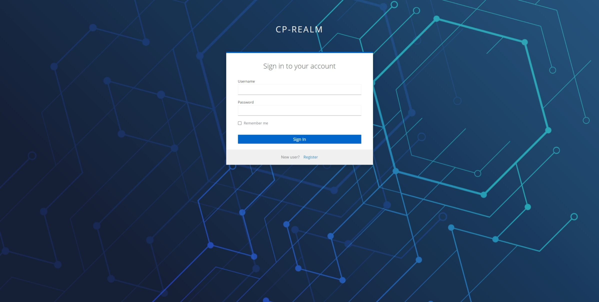-->
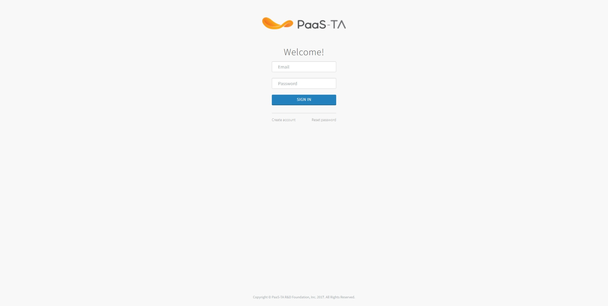
   
3. 로그인에 성공하면 다음과 같은 대시보드가 보여진다.
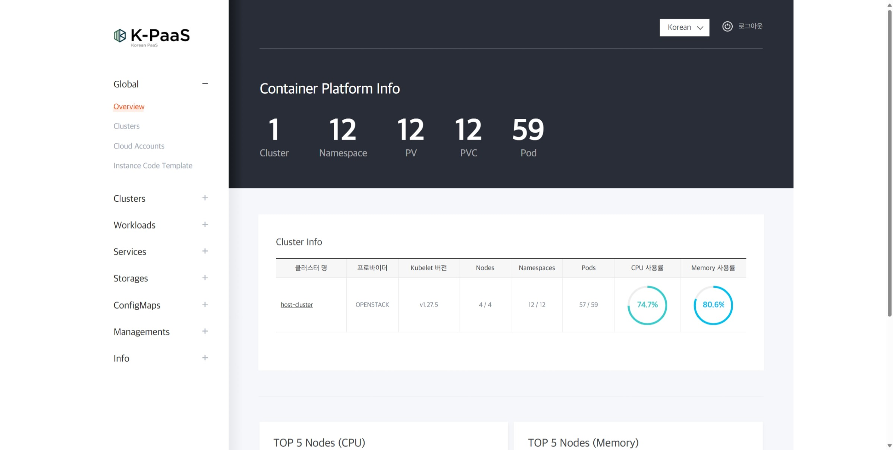

<br>

# <div id='3'/> 3. (예제)컨테이너 플랫폼 포털을 사용한 MySQL과 WordPress 배포 : Stateful
## <div id='3-1'/> 3.1. MySQL 배포
### <div id='3-1-1'/> 3.1.1. 퍼시스턴트 볼륨 생성

MySQL은 각 데이터를 저장하기 위해서 퍼시스턴트 볼륨이 필요하다.

1. 포털 접속을 성공한 이후에 퍼시스턴트 볼륨을 배포하기위해 Storage > Persistent Volumes 버튼을 눌러 접속을 진행한다.
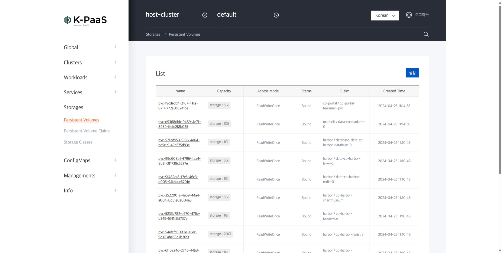

2. "생성" 버튼을 클릭할 시 퍼시스턴트 볼륨 생성창이 뜬다.


3. 퍼시스턴트 볼륨을 생성하는 코드를 작성한다.
   * 작성을 마치면 "저장" 버튼을 누른다.


MySQL 퍼시스턴트 볼륨을 생성하는 예시 코드이다.  
기본 스토리지클래스를 사용하여 퍼시스턴트 볼륨을 생성하도록 작성되었다.  
다음 코드를 참고하여 컨테이너 플랫폼 포털에서 퍼시스턴트 볼륨을 생성한다.


#### Mysql Persistent Volume
```bash

kind: PersistentVolume
apiVersion: v1
metadata:
  name: mysql-pv
  labels:
    app: wordpress
spec:
  capacity:
    storage: 20Gi
  accessModes:
    - ReadWriteOnce
  hostPath:
    path: "/data/k8s/mysql" 
  storageClassName: cp-storageclass

```

4. 코드에 문제가 없다면 정상적으로 처리되었다는 팝업창이 뜬다.
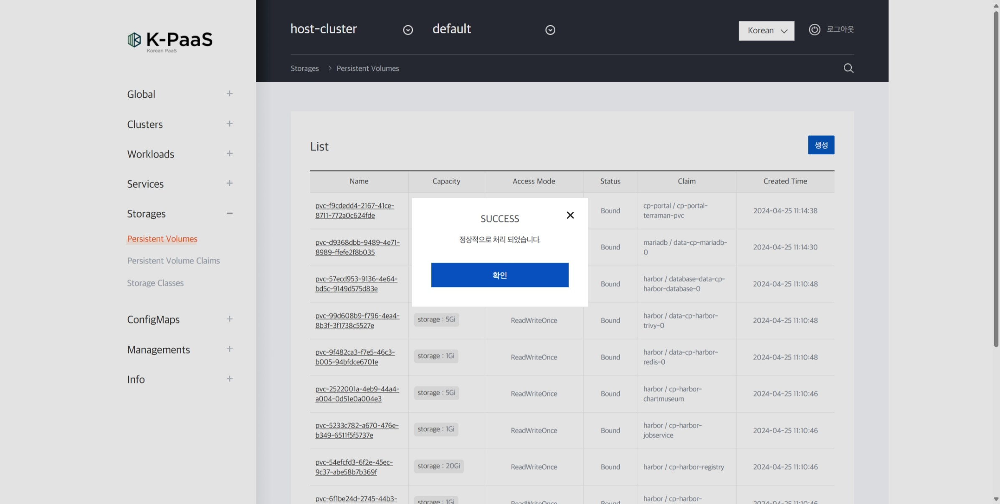


5. 다음과 같이 퍼시스턴트 볼륨이 생성된 모습을 확인할 수있다.


### <div id='3-1-2'/> 3.1.2. 퍼시스턴트 볼륨 클레임 생성

1. 퍼시스턴트 볼륨 클레임을 배포하기위해 Storage > Persistent Volume Claims 버튼을 눌러 접속을 진행한다.
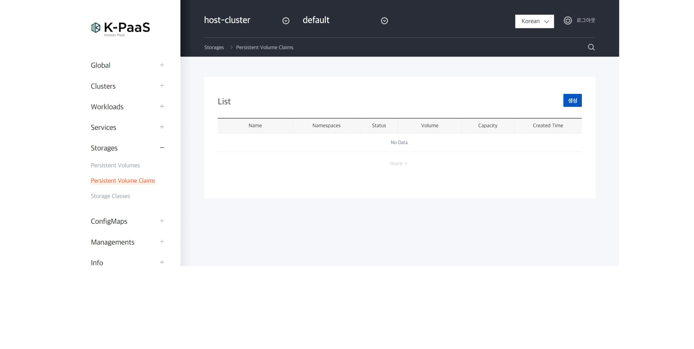


2."생성" 버튼을 클릭할 시 퍼시스턴트 볼륨 클레임 생성창이 뜬다.
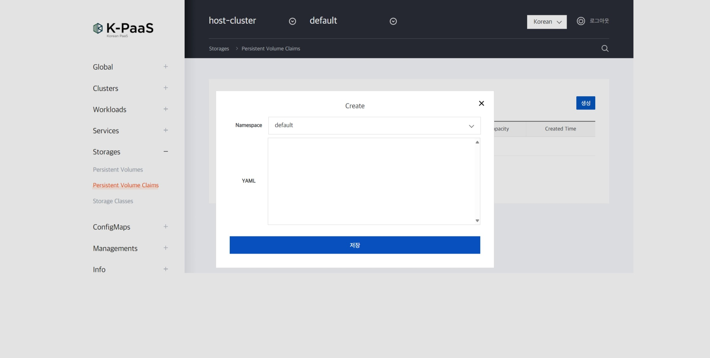


3. 퍼시스턴트 볼륨 클레임을 생성하는 코드를 작성한다.
   * 작성을 마치면 "저장" 버튼을 누른다.
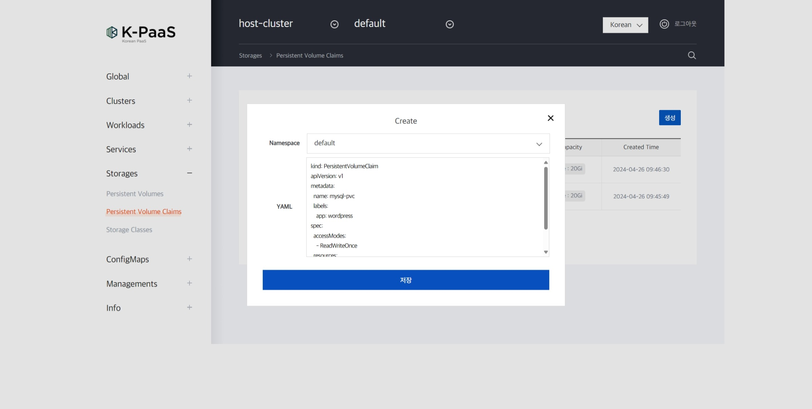

MySQL 퍼시스턴트 볼륨 클레임을 생성하는 예시 코드이다.  
다음 코드를 참고하여 컨테이너 플랫폼 포털에서 퍼시스턴트 볼륨 클레임을 생성한다.

#### Mysql Persistent Volume Claim
```bash

kind: PersistentVolumeClaim
apiVersion: v1
metadata:
  name: mysql-pvc
  labels:
    app: wordpress
spec:
  accessModes:
    - ReadWriteOnce
  resources:
    requests:
      storage: 20Gi
```


4. 코드에 문제가 없다면 정상적으로 처리되었다는 팝업창이 뜬다.
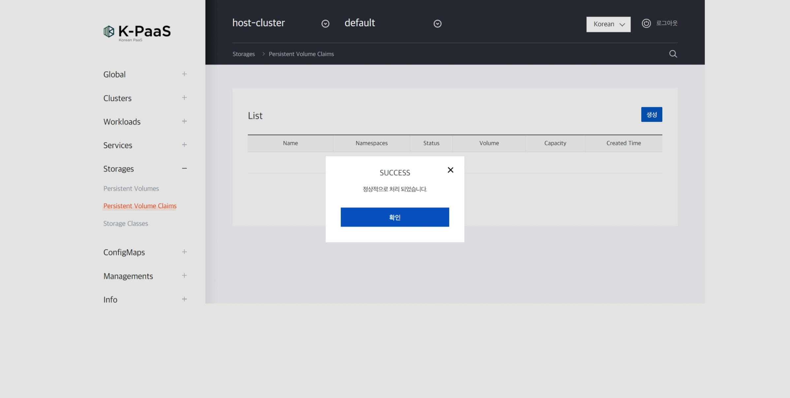


5. 다음과 같이 퍼시스턴트 볼륨 클레임이 생성된 모습을 확인할 수있다.


### <div id='3-1-3'/> 3.1.3. MySQL 디플로이먼트 생성


1. MySql을 디플로이먼트 형식으로 배포하기위해서 workloads > Deployments 버튼을 눌러 접속을 진행한다.


2. "생성" 버튼을 눌러 디플로이먼트 생성창을 띄운다.


3. 디플로이먼트를 생성하는 코드를 작성한다.
   * 작성을 마치면 "저장" 버튼을 누른다.
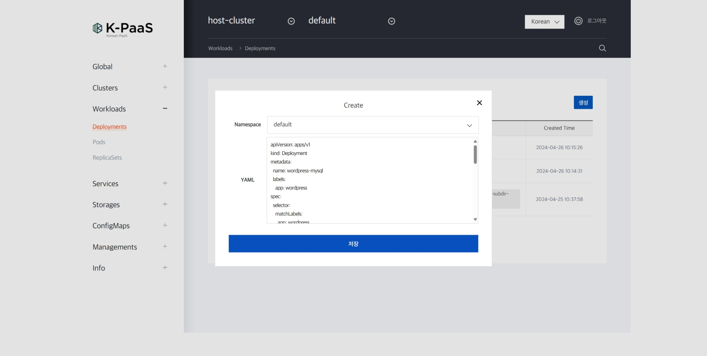

MySQL 디플로이먼트를을 생성하는 예시 코드이다.  
다음 코드를 참고하여 컨테이너 플랫폼 포털에서 디플로이먼트를 생성한다.

#### Mysql Deployment
```bash

apiVersion: apps/v1
kind: Deployment
metadata:
  name: wordpress-mysql
  labels:
    app: wordpress
spec:
  selector:
    matchLabels:
      app: wordpress
      tier: mysql
  strategy:
    type: Recreate
  template:
    metadata:
      labels:
        app: wordpress
        tier: mysql
    spec:
      containers:
      - image: mysql:5.6
        name: mysql
        env:
         - name: MYSQL_DATABASE
           value: wordpress
         - name: MYSQL_ROOT_PASSWORD
           value: password
        ports:
        - containerPort: 3306
          name: mysql
        volumeMounts:
        - name: mysql-persistent-storage
          mountPath: /var/lib/mysql
      volumes:
      - name: mysql-persistent-storage
        persistentVolumeClaim:
          claimName: mysql-pvc

```

4. 코드에 문제가 없다면 정상적으로 처리되었다는 팝업창이 뜬다.
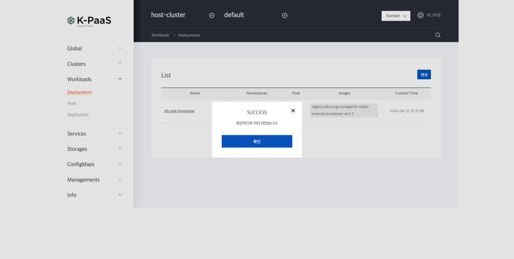


5. 다음과 같이 디플로이먼트가 생성된 모습을 확인할 수있다.


### <div id='3-1-4'/> 3.1.4. MySQL 서비스 생성


1. MySql 서비스를 배포하기위해서 Services > Services 버튼을 눌러 접속을 진행한다.
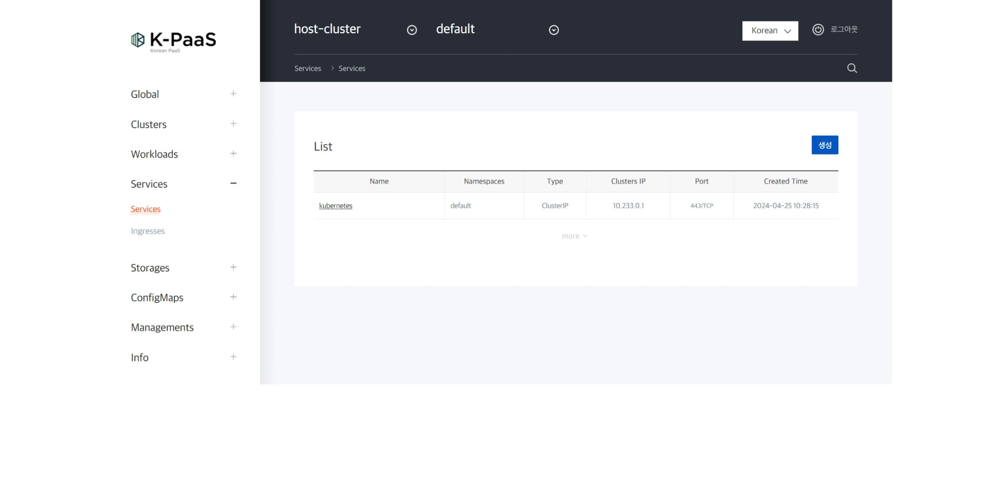


2. "생성" 버튼을 눌러 서비스 생성창을 띄운다.
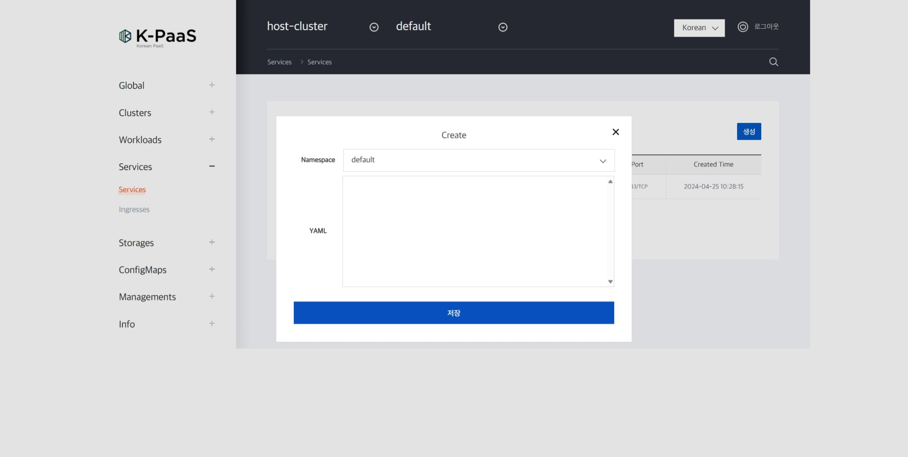


3. 서비스를 생성하는 코드를 작성한다.
   * 작성을 마치면 "저장" 버튼을 누른다.


MySQL 서비스를 생성하는 예시 코드이다.  
다음 코드를 참고하여 컨테이너 플랫폼 포털에서 서비스를 생성한다.


#### Mysql Service
```bash
apiVersion: v1
kind: Service
metadata:
  name: wordpress-mysql
  labels:
    app: wordpress
spec:
  ports:
    - port: 3306
      protocol: TCP
  selector:
    app: wordpress
    tier: mysql
```

4. 코드에 문제가 없다면 정상적으로 처리되었다는 팝업창이 뜬다.


5. 다음과 같이 서비스가 생성된 모습을 확인할 수있다.
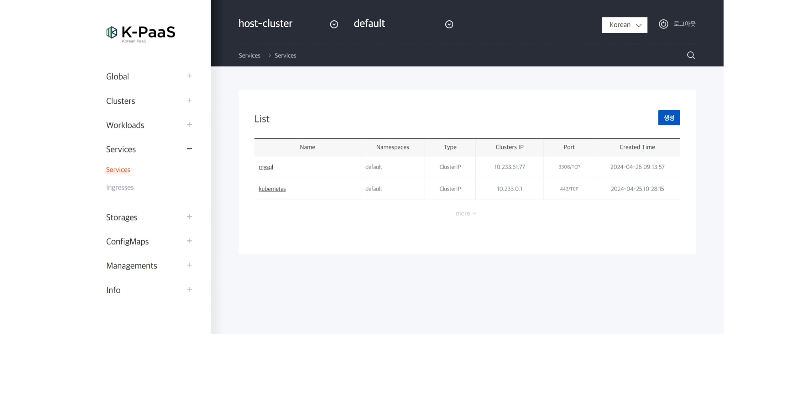


<br>


## <div id='3-2'/>3.2. WordPress 배포

### <div id='3-2-1'/> 3.2.1. 퍼시스턴트 볼륨 생성

1. 포털에 접속을 성공한 이후에 퍼시스턴트 볼륨을 배포하기위해 Storage > Persistent Volumes 버튼을 눌러 접속을 진행한다.


2. "생성" 버튼을 눌러 퍼시스턴트 볼륨 생성창을 띄운다.
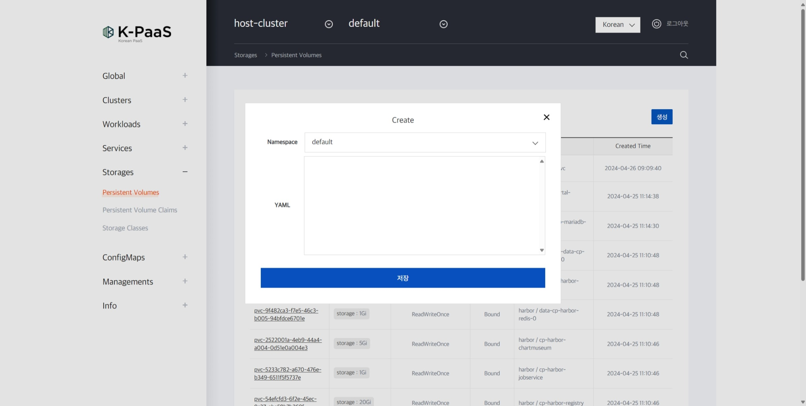


3. 퍼시스턴트 볼륨을 생성하는 코드를 작성한다.
   * 작성을 마치면 "저장" 버튼을 누른다.
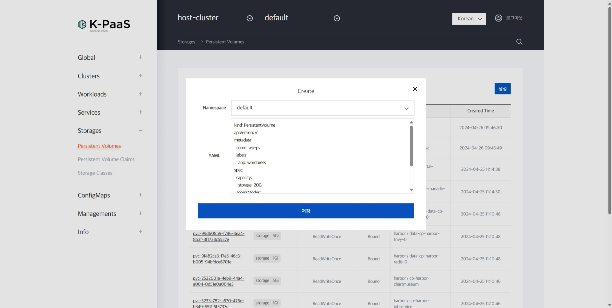

WordPress 퍼시스턴트 볼륨을 생성하는 예시 코드이다.  
기본 스토리지클래스를 사용하여 퍼시스턴트 볼륨을 생성하도록 작성되었다.  
다음 코드를 참고하여 컨테이너 플랫폼 포털에서 퍼시스턴트 볼륨을 생성한다.

#### Wordpress Persistent Volume
```bash


kind: PersistentVolume
apiVersion: v1
metadata:
  name: wp-pv
  labels:
    app: wordpress
spec:
  capacity:
    storage: 20Gi
  accessModes:
    - ReadWriteOnce
  hostPath:
    path: "/data/k8s/wp"
  storageClassName: cp-storageclass
```


4. 코드에 문제가 없다면 정상적으로 처리되었다는 팝업창이 뜬다.


5. 다음과 같이 퍼시스턴트 볼륨이 생성된 모습을 확인할 수있다.
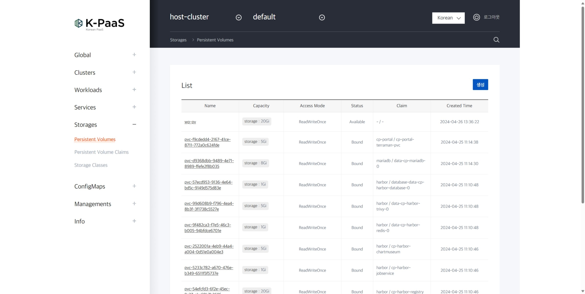


### <div id='3-2-2'/> 3.2.2. 퍼시스턴트 볼륨 클레임 생성

1. 퍼시스턴트 볼륨 클레임을 배포하기위해 Storage > Persistent Volume Claims 버튼을 눌러 접속을 진행한다.


2. "생성" 버튼을 눌러 퍼시스턴트 볼륨 클레임 생성창을 띄운다.


3. 퍼시스턴트 볼륨 클레임을 생성하는 코드를 작성한다.
   * 작성을 마치면 "저장" 버튼을 누른다.


WordPress 퍼시스턴트 볼륨 클레임을 생성하는 예시 코드이다.  
다음 코드를 참고하여 컨테이너 플랫폼 포털에서 퍼시스턴트 볼륨 클레임을 생성한다.

#### Wordpress Persistent Volume Claim
```bash

apiVersion: v1
kind: PersistentVolumeClaim
metadata:
  name: wp-pvc
  labels:
    app: wordpress
spec:
  accessModes:
    - ReadWriteOnce
  resources:
    requests:
      storage: 20Gi
```


4. 코드에 문제가 없다면 정상적으로 처리되었다는 팝업창이 뜬다.
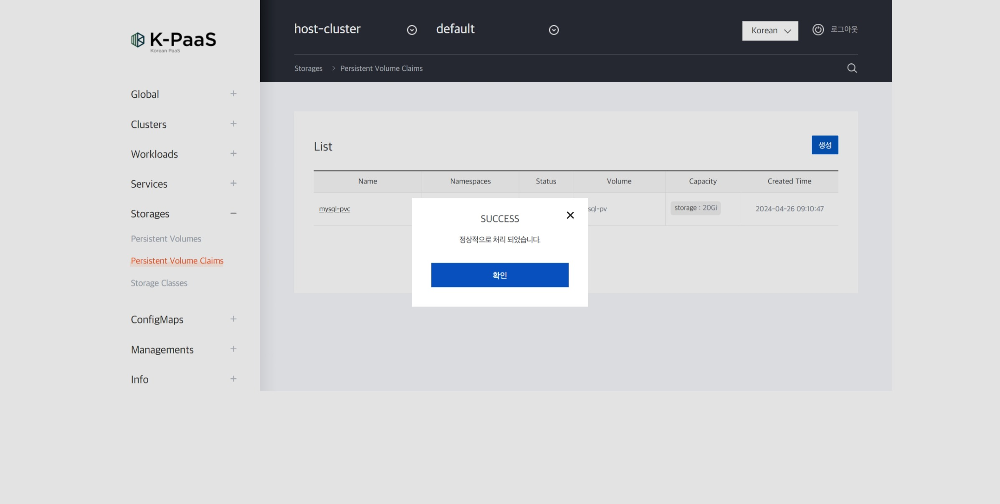


5. 다음과 같이 퍼시스턴트 볼륨 클레임이 생성된 모습을 확인할 수있다.


### <div id='3-2-3'/> 3.2.3. WordPress 디플로이먼트 생성


1. WordPress를 디플로이먼트 형식으로 배포하기위해서 Workloads > Deployments 버튼을 눌러 접속을 진행한다.


2. "생성" 버튼을 눌러 디플로이먼트 생성창을 띄운다.


3. 디플로이먼트를 생성하는 코드를 작성한다.
   * 작성을 마치면 "저장" 버튼을 누른다.
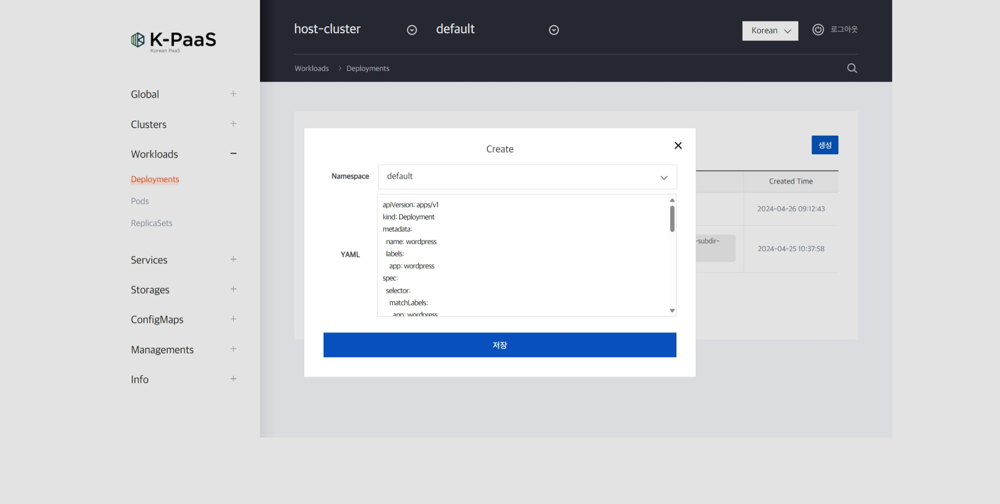


WordPress 디플로이먼트를 생성하는 예시 코드이다.  
다음 코드를 참고하여 컨테이너 플랫폼 포털에서 디플로이먼트를 생성한다.


#### Wordpress Deployment
```bash

apiVersion: apps/v1
kind: Deployment
metadata:
  name: wordpress
  labels:
    app: wordpress
spec:
  selector:
    matchLabels:
      app: wordpress
      tier: frontend
  strategy:
    type: Recreate
  template:
    metadata:
      labels:
        app: wordpress
        tier: frontend
    spec:
      containers:
      - image: wordpress:4.8-apache
        name: wordpress
        env:
            - name: WORDPRESS_DB_HOST
              value: wordpress-mysql
            - name: WORDPRESS_DB_NAME
              value: wordpress
            - name: WORDPRESS_DB_USER
              value: root
            - name: WORDPRESS_DB_PASSWORD
              value: password
        ports:
        - containerPort: 80
          name: wordpress
        volumeMounts:
        - name: wordpress-persistent-storage
          mountPath: /var/www/html
      volumes:
      - name: wordpress-persistent-storage
        persistentVolumeClaim:
          claimName: wp-pvc
```  
4. 코드에 문제가 없다면 정상적으로 처리되었다는 팝업창이 뜬다.
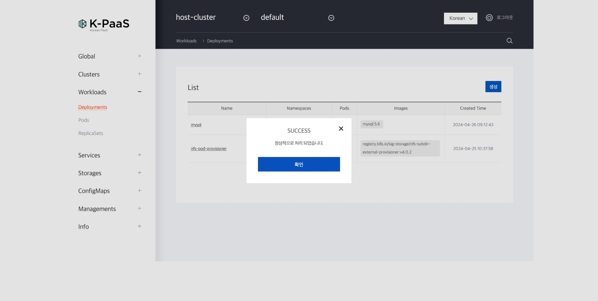


5. 다음과 같이 디플로이먼트가 생성된 모습을 확인할 수있다.
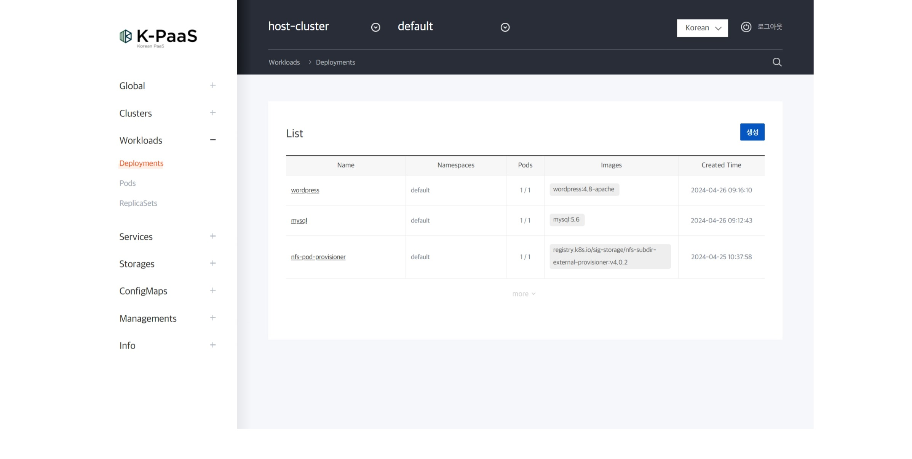


### <div id='3-2-4'/> 3.2.4. WordPress 서비스 생성


1. 서비스를 배포하기위해서 Services > Services 버튼을 눌러 접속을 진행한다.


2. "생성" 버튼을 눌러 서비스 생성창을 띄운다.


3. 서비스를 생성하는 코드를 작성한다.
   * 작성을 마치면 "저장" 버튼을 누른다.


WordPress 서비스를 노드포트로 생성하는 예시 코드이다.  
다음 코드를 참고하여 컨테이너 플랫폼 포털에서 서비스를 생성한다.


#### Wordpress Service
```bash

apiVersion: v1
kind: Service
metadata:
  name: wordpress
  labels:
    app: wordpress
spec:
  ports:
    - port: 80
  type: NodePort
  selector:
    app: wordpress
    tier: frontend
```

4. 코드에 문제가 없다면 정상적으로 처리되었다는 팝업창이 뜬다.


5. 다음과 같이 서비스가 생성된 모습을 확인할 수있다.


## <div id='3-3'/> 3.3. 확인하기

컨테이너 플랫폼 포털에서 배포한 WordPress 접속 방법 

- Services 메뉴의 Services에서 WordPress 서비스의 port를 확인한다.
  
  <br>


* <k>http://</k>playpark-cp.k-paas.org:{WordPress_node_port} 접속을 확인한다.  
             예시: <k>http://</k>playpark-cp.k-paas.org:32715
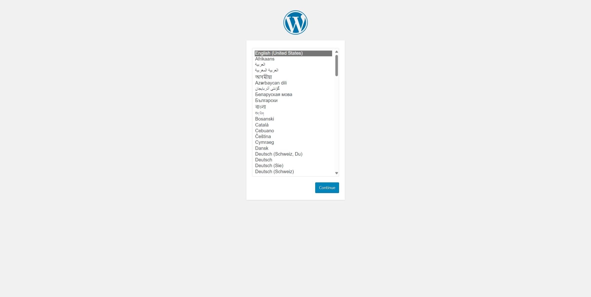


# <div id='4'/> 4. (예제)컨테이너 플랫폼 포털을 사용한 Redis와 PHP 방명록 애플리케이션 배포 : StateLess
## <div id='4-1'/> 4.1. Redis 생성
### <div id='4-1-1'/> 4.1.1. Redis-leader 생성
#### <div id='4-1-1-1'/> 4.1.1.1. Redis-leader 디플로이먼트 생성

- Workloads 메뉴의 Deployments 클릭한 후 생성 버튼을 클릭한다.
  ![IMG_2_2]

<br>

- Yaml 작성박스에 하단의 Redis-leader 디플로이먼트 yaml을 입력하고 저장 버튼을 클릭한다.
  ![IMG_2_3]
  
<br>

#### Redis-leader deployment 
``` bash

apiVersion: apps/v1
kind: Deployment
metadata:
  name: redis-leader
  labels:
    app: redis
    role: leader
    tier: backend
spec:
  replicas: 1
  selector:
    matchLabels:
      app: redis
  template:
    metadata:
      labels:
        app: redis
        role: leader
        tier: backend
    spec:
      containers:
      - name: leader
        image: "docker.io/redis:6.0.5"
        resources:
          requests:
            cpu: 100m
            memory: 100Mi
        ports:
        - containerPort: 6379
```
<br>

- redis-leader 디플로이먼트가 생성되었는지 확인한다.
  ![IMG_2_4]

<br>

#### <div id='4-1-1-2'/> 4.1.1.2. Redis-leader 서비스 생성
- Services 메뉴의 Services를 클릭한 후 생성 버튼을 클릭한다.
  ![IMG_2_5]

<br>

- Yaml 작성박스에 하단의 Redis-leader 서비스 yaml을 입력하고 저장 버튼을 클릭한다.
  ![IMG_2_6]

<br>

#### Redis-leader Service 
```bash

apiVersion: v1
kind: Service
metadata:
  name: redis-leader
  labels:
    app: redis
    role: leader
    tier: backend
spec:
  ports:
  - port: 6379
    targetPort: 6379
  selector:
    app: redis
    role: leader
    tier: backend
```

<br>

- 서비스가 생성되었는지 확인한다.
  <br>
  ![IMG_2_7]
  
<br>

### <div id='4-1-2'/> 4.1.2. Redis-follower 생성
#### <div id='4-1-2-1'/> 4.1.2.1. Redis-follower 디플로이먼트 생성
- Workloads 메뉴의 Deployments를 클릭한 후 생성 버튼을 클릭한다.
  ![IMG_2_8]
  
<br>
  
- Yaml 작성박스에 하단의 Redis-follower 디플로이먼트 yaml을 입력하고 저장 버튼을 클릭한다.
  ![IMG_2_9]

  <br>
  
#### Redis-follower deployment 
```bash

apiVersion: apps/v1
kind: Deployment
metadata:
  name: redis-follower
  labels:
    app: redis
    role: follower
    tier: backend
spec:
  replicas: 2
  selector:
    matchLabels:
      app: redis
  template:
    metadata:
      labels:
        app: redis
        role: follower
        tier: backend
    spec:
      containers:
      - name: follower
        image: gcr.io/google_samples/gb-redis-follower:v2
        resources:
          requests:
            cpu: 100m
            memory: 100Mi
        ports:
        - containerPort: 6379
```
<br>


- Redis-follower 디플로이먼트가 생성되었는지 확인한다.
  <br>
  ![IMG_2_10]
  
<br>

#### <div id='4-1-2-2'/> 4.1.2.2. Redis-follower 서비스 생성

- Services 메뉴의 Services를 클릭한 후 생성 버튼을 클릭한다.
  ![IMG_2_11]

<br>

- Yaml 작성박스에 하단의 Redis-follower 서비스 yaml을 입력하고 저장 버튼을 클릭한다.
  ![IMG_2_12]

<br>

#### Redis-follower service 
```bash

apiVersion: v1
kind: Service
metadata:
  name: redis-follower
  labels:
    app: redis
    role: follower
    tier: backend
spec:
  ports:
    # the port that this service should serve on
  - port: 6379
  selector:
    app: redis
    role: follower
    tier: backend
```
  
<br>

- 화면에서 Redis-follower 서비스가 생성되었는지 확인한다.
  ![IMG_2_13]

<br>

## <div id='4-2'/> 4.2. 방명록 프론트엔드 생성
#### <div id='-2-1'/> 4.2.1. frontend 디플로이먼트 생성

- Workloads 메뉴의 Deployments 클릭한 후 생성 버튼을 클릭한다.
  ![IMG_3_1]
  
<br>

- Yaml 작성박스에 하단의 frontend 디플로이먼트 yaml을 입력하고 저장 버튼을 클릭한다.
  <br>
  ![IMG_3_2]

<br>

#### frontend deployment 

```bash

apiVersion: apps/v1
kind: Deployment
metadata:
  name: frontend
spec:
  replicas: 3
  selector:
    matchLabels:
        app: guestbook
        tier: frontend
  template:
    metadata:
      labels:
        app: guestbook
        tier: frontend
    spec:
      containers:
      - name: php-redis
        image: corelab/gb-frontend:v5
        env:
        - name: GET_HOSTS_FROM
          value: "dns"
        resources:
          requests:
            cpu: 100m
            memory: 100Mi
        ports:
        - containerPort: 80
```
  <br>
  
- 화면에서 frontend 디플이먼트가 생성되었는지 확인한다.
  <br>
  ![IMG_3_3]
  
  <br>
  

#### <div id='4-2-2'/> 4.2.2. frontend 서비스 생성

- Services 메뉴의 Services를 선택한 후 생성 버튼을 클릭한다.
  <br>
  ![IMG_3_4]
  
<br>

- Yaml 작성박스에 하단의 frontend 서비스 yaml을 입력하고 저장 버튼을 클릭한다.
  <br>
  ![IMG_3_5]

  <br>
  
#### frontend service 

```bash

apiVersion: v1
kind: Service
metadata:
  name: frontend
  labels:
    app: guestbook
    tier: frontend
spec:
  type: NodePort
  ports:
  - port: 80
  selector:
    app: guestbook
    tier: frontend
```
<br>

- 화면에서 서비스가 등록된 것을 확인한다.
  <br>
  ![IMG_4_3]

<br>

## <div id='4-3'/> 4.3. 확인하기

  
- Services 메뉴의 Services에서 frontend 서비스의 port를 확인한다.
  <br>
  ![IMG_4_3]

<br>
  
* <k>http://</k>playpark-cp.k-paas.org:{frontend_Node_port} 접속을 확인한다.  
            예시: <k>http://</k>playpark-cp.k-paas.org:30705


<br>
  
- 동일한 화면이 나타나는지 확인한다.
  <br>
  ![IMG_4_5]

<br>


# <div id='5'/> 5. (참고) 삭제하기
본 장에서는 컨테이너 플랫폼 포털을 사용하여 WordPress와 MySQL을 삭제하는 방법에 대해서 기술한다.


## <div id='5-1'/> 5.1. 플레이파크 컨테이너 플랫폼 포털을 사용한 WordPress 삭제
   * 일반적으로 삭제는 배포 순서의 반대로 진행한다.

### <div id='5-1-1'/>5.1.1 WordPress 서비스 삭제
1. Services > Services를 클릭해서 Service 목록으로 이동한다. 


2. 목록에서 삭제할 서비스를 클릭하여 상세 페이지로 이동한다.
  * 서비스 상세 페이지에서 하단 왼쪽에 있는 "삭제" 버튼 클릭한다.
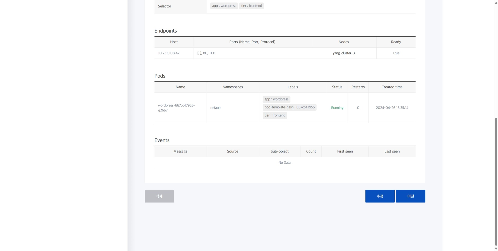


3. 팝업창이 뜨면 "확인" 버튼을 누르면 삭제를 시작한다.
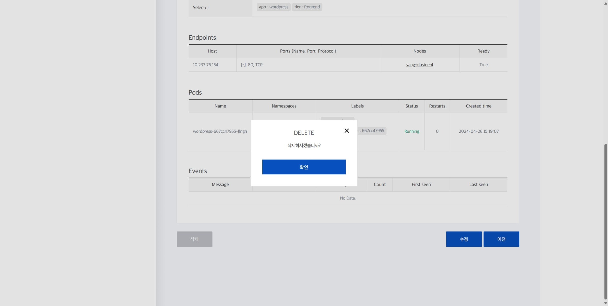


4. 정상적으로 삭제가 된 것을 확인한다.


### <div id='5-1-2'/>5.1.2 WordPress 디플로이먼트 삭제
1. Workloads > Deployments 클릭해서 Deployment 목록으로 이동한다. 
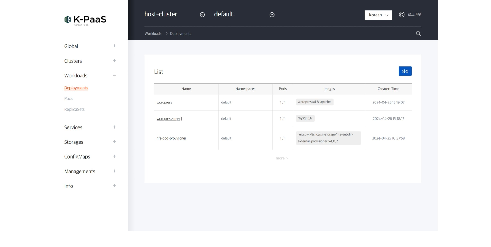


2. 목록에서 삭제할 디플로이먼트를 클릭하여 상세 페이지로 이동한다.
  * 디플로이먼트 상세 페이지에서 하단 왼쪽에 있는 "삭제" 버튼 클릭한다.
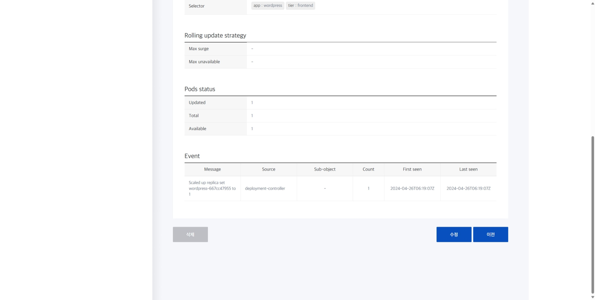


3. 팝업창이 뜨면 "확인" 버튼을 누르면 삭제를 시작한다.
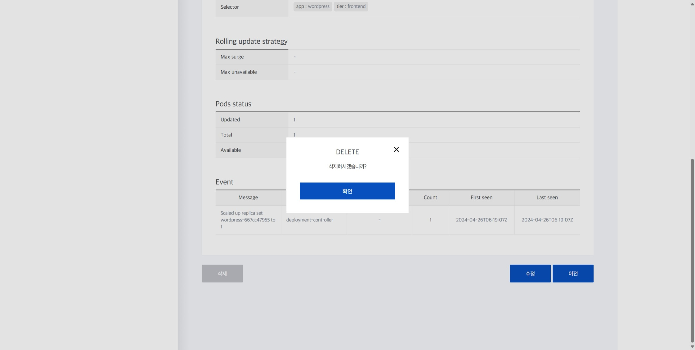


4. 정상적으로 삭제가 된 것을 확인한다.
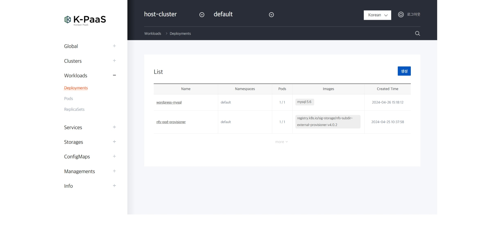


### <div id='5-1-3'/>5.1.3 WordPress 퍼시스턴트 볼륨 클레임 삭제
1. Storage > Persistent Volume Claims 클릭해서 Persistent Volume Claim 목록으로 이동한다.


2. 목록에서 삭제할 퍼시스턴트 볼륨 클레임을 클릭하여 상세 페이지로 이동한다.
  * 퍼시스턴트 볼륨 클레임 상세 페이지에서 하단 왼쪽에 있는 "삭제" 버튼 클릭한다.
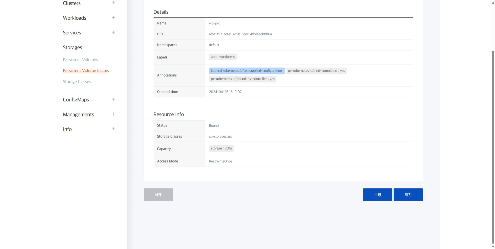


3. 팝업창이 뜨면 "확인" 버튼을 누르면 삭제를 시작한다.
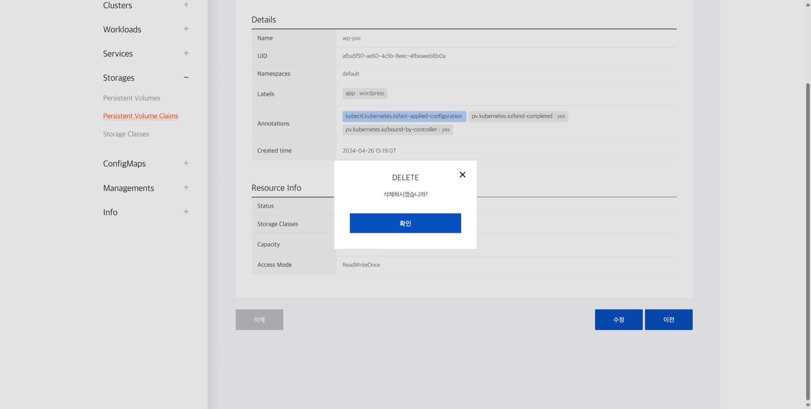


4. 정상적으로 삭제가 된 것을 확인한다.
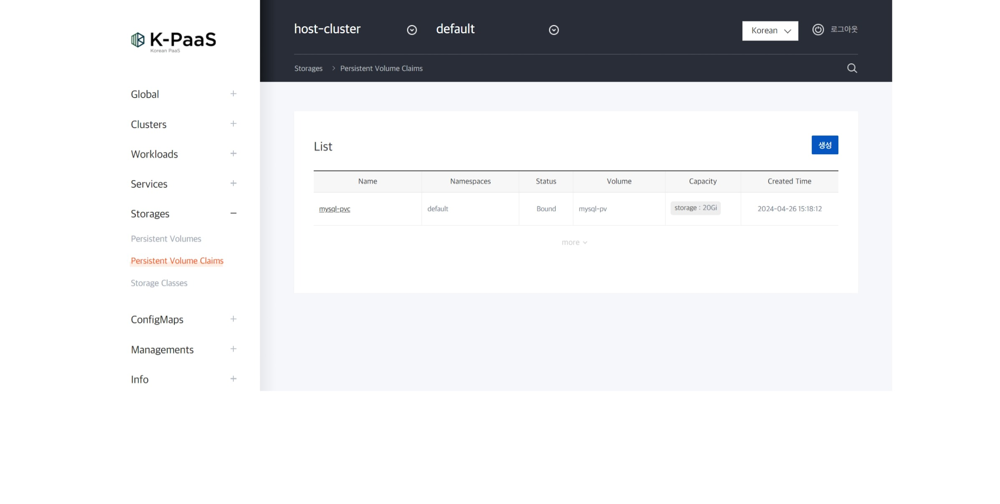


### <div id='5-1-4'/>5.1.4 WordPress 퍼시스턴트 볼륨 삭제
1. Storage > Persistent Volumes 클릭해서 Persistent Volume 목록으로 이동한다.
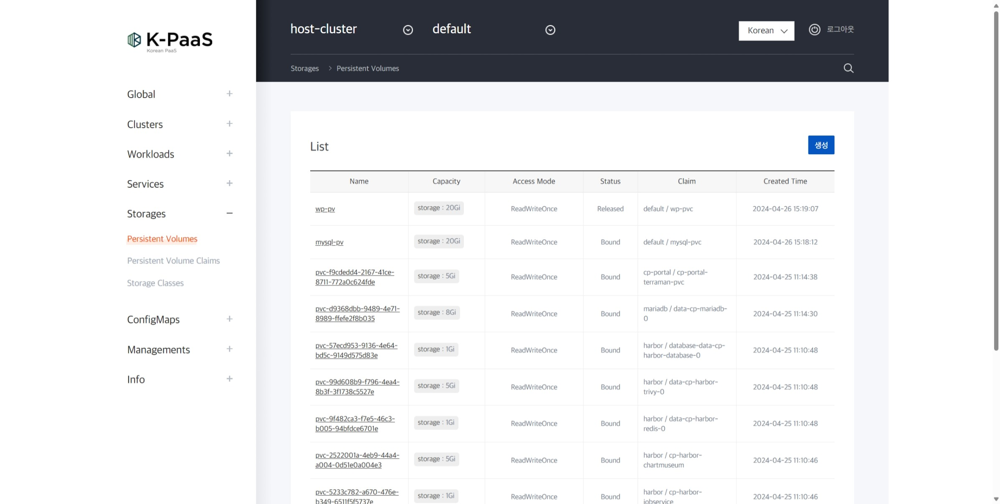


2. 목록에서 삭제할 퍼시스턴트 볼륨을 클릭하여 상세 페이지로 이동한다.
  * 퍼시스턴트 볼륨 상세 페이지에서 하단 왼쪽에 있는 "삭제" 버튼 클릭한다.
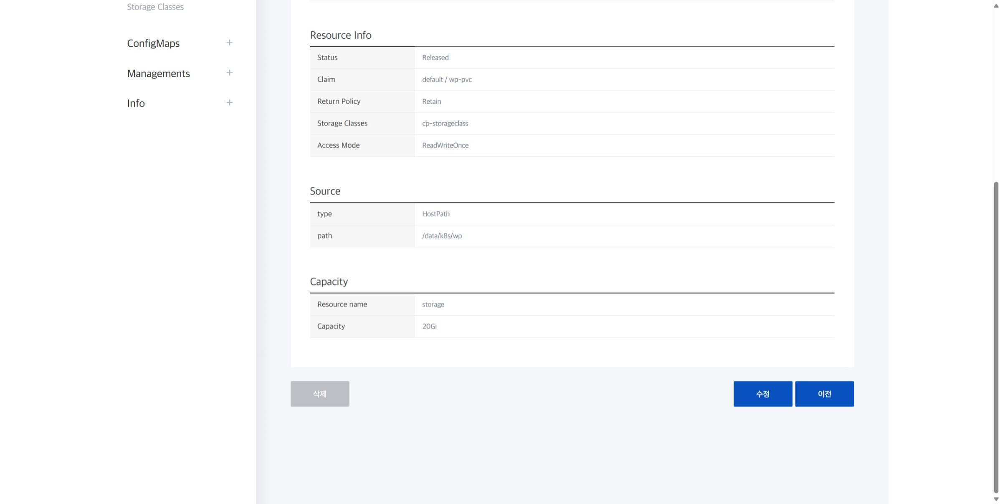


3. 팝업창이 뜨면 "확인" 버튼을 누르면 삭제를 시작한다.


4. 정상적으로 삭제가 된 것을 확인한다.


## <div id='5-2'/> 5.2. 컨테이너 플랫폼 포털을 사용한 MySQL 삭제
   * 일반적으로 삭제는 배포 순서의 반대로 진행한다.

### <div id='5-2-1'/>5.2.1 MySQL 서비스 삭제
1. Services > Services를 클릭해서 Service 목록으로 이동한다. 


2. 목록에서 삭제할 서비스를 클릭하여 상세 페이지로 이동한다.
  * 서비스 상세 페이지에서 하단 왼쪽에 있는 "삭제" 버튼 클릭한다.


3. 팝업창이 뜨면 "확인" 버튼을 누르면 삭제를 시작한다.


4. 정상적으로 삭제가 된 것을 확인한다.


### <div id='5-2-2'/>5.2.2 MySQL 디플로이먼트 삭제
1. Workloads > Deployments 클릭해서 Deployment 목록으로 이동한다. 


2. 목록에서 삭제할 디플로이먼트를 클릭하여 상세 페이지로 이동한다.
  * 디플로이먼트 상세 페이지에서 하단 왼쪽에 있는 "삭제" 버튼 클릭한다.


3. 팝업창이 뜨면 "확인" 버튼을 누르면 삭제를 시작한다.


4. 정상적으로 삭제가 된 것을 확인한다.


### <div id='5-2-3'/>5.2.3 MySQL 퍼시스턴트 볼륨 클레임 삭제
1. Storage > Persistent Volumes Claims 클릭해서 Persistent Volume Claim 목록으로 이동한다.


2. 목록에서 삭제할 퍼시스턴트 볼륨 클레임을 클릭하여 상세 페이지로 이동한다.
  * 퍼시스턴트 볼륨 클레임 상세 페이지에서 하단 왼쪽에 있는 "삭제" 버튼 클릭한다.
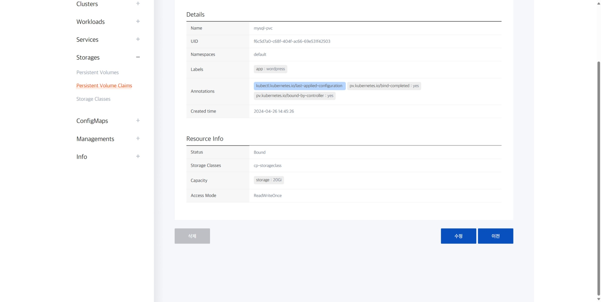


3. 팝업창이 뜨면 "확인" 버튼을 누르면 삭제를 시작한다.


4. 정상적으로 삭제가 된 것을 확인한다.


### <div id='5-2-4'/>5.2.4 MySQL 퍼시스턴트 볼륨 삭제
1. Storage > Persistent Volumes 클릭해서 Persistent Volume 목록으로 이동한다.


2. 목록에서 삭제할 퍼시스턴트 볼륨을 클릭하여 상세 페이지로 이동한다.
  * 퍼시스턴트 볼륨 상세 페이지에서 하단 왼쪽에 있는 "삭제" 버튼 클릭한다.


3. 팝업창이 뜨면 "확인" 버튼을 누르면 삭제를 시작한다.
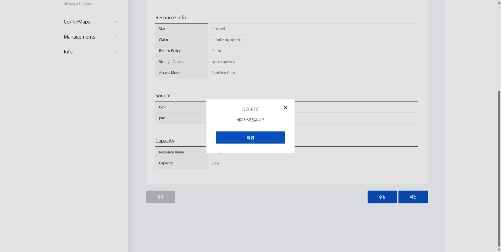


4. 정상적으로 삭제가 된 것을 확인한다.


## <div id='5-3'/> 5.3. 컨테이너 플랫폼 포털을 사용한 Redis-leader 삭제
### <div id='5-3-1'/> 5.3.1. Redis-leader 서비스 삭제

- Services메뉴에서 Services를 선택한 후 redis-leader를 클릭한다.
  <br>
  ![IMG_9_1]
  
  <br>
- 화면 하단의 삭제 버튼을 클릭하여 redis-leader 서비스를 삭제한다.
  <br>
  ![IMG_9_2]


  <br>
- List에서 redis-leader 서비스가 삭제되었는지 확인한다.
  <br>
  ![IMG_9_5]
<br>

### <div id='5-3-2'/> 5.3.2. Redis-leader 디플로이먼트 삭제

-  Workloads메뉴에서 Deployment를 선택한 후 redis-leader를 클릭한다.
  ![IMG_10_1]

<br>

- 화면 하단의 삭제 버튼을 클릭하여 redis-leader 디플로이먼트를 삭제한다.

![IMG_10_2]


<br>

- List에서 redis-leader 디플로이먼트가 삭제되었는지 확인한다.

![IMG_10_5]

<br>

## <div id='5-4'/> 5.4. 컨테이너 플랫폼 포털을 사용한 Redis-follower 삭제
### <div id='5-4-1'/> 5.4.1. Redis-follower 서비스 삭제하기

- Services메뉴에서 Services를 선택한 후 redis-follower를 클릭한다.
  <br>
  ![IMG_11_1]
  <br>

- 화면 하단의 삭제 버튼을 클릭하여 redis-follower 서비스를 삭제한다.
  <br>
  ![IMG_11_2]

  <br>

- List에서 redis-follower 서비스가 삭제되었는지 확인한다.
  ![IMG_11_5]

<br>

### <div id='5-4-2'/> 5.4.2. Redis-follower 디플로이먼트 삭제하기

-  Workloads메뉴에서 Deployment를 선택한 후 redis-follower를 클릭한다.
   <br>
  ![IMG_12_1]

<br>

- 화면 하단의 삭제 버튼을 클릭하여 redis-follower 디플로이먼트를 삭제한다.
  <br>
  ![IMG_12_2]


<br>

- List에서 redis-follower 디플로이먼트가 삭제되었는지 확인한다.
  <br>
  ![IMG_12_5]

<br>

## <div id='5-5'/> 5.5. 컨테이너 플랫폼 포털을 사용한 frontend 삭제
### <div id='5-5-1'/> 5.5.1. frontend 서비스 삭제하기

- Services메뉴에서 Services를 선택한 후 frontend를 클릭한다.
  <br>
  ![IMG_13_1]
<br>

- 화면 하단의 삭제 버튼을 클릭하여 frontednd 서비스를 삭제한다.
  <br>
  ![IMG_13_2]
<br>

- List에서 frontend 서비스가 삭제되었는지 확인한다.
  <br>
  ![IMG_13_5]
  <br>

### <div id='5-5-2'/> 5.5.2. frontend 디플로이먼트 삭제

-  Workloads메뉴에서 Deployment를 선택한 후 frontend를 클릭한다.
  ![IMG_14_1]
  
  <br>

- 화면 하단의 삭제 버튼을 클릭하여 frontend 디플로이먼트를 삭제한다.
  <br>
  ![IMG_14_2]

<br>

- List에서 frontend 디플로이먼트가 삭제되었는지 확인한다.
  <br>
  ![IMG_14_5]

<br>

---


[IMG_1_1]:../images/sample_stateless/IMG_1_1.png
[IMG_1_2]:../images/sample_stateless/IMG_1_2.png
[IMG_1_3]:../images/sample_stateless/IMG_1_3.png
[IMG_1_4]:../images/sample_stateless/IMG_1_4.png  
[IMG_1_5]:../images/sample_stateless/IMG_1_5.png  
[IMG_1_6]:../images/sample_stateless/IMG_1_6.png
[IMG_2_1]:../images/sample_stateless/IMG_2_1.png
[IMG_2_2]:../images/sample_stateless/IMG_2_2.png
[IMG_2_3]:../images/sample_stateless/IMG_2_3.png
[IMG_2_4]:../images/sample_stateless/IMG_2_4.png
[IMG_2_5]:../images/sample_stateless/IMG_2_5.png
[IMG_2_6]:../images/sample_stateless/IMG_2_6.png
[IMG_2_7]:../images/sample_stateless/IMG_2_7.png
[IMG_2_8]:../images/sample_stateless/IMG_2_8.png
[IMG_2_9]:../images/sample_stateless/IMG_2_9.png
[IMG_2_10]:../images/sample_stateless/IMG_2_10.png
[IMG_2_11]:../images/sample_stateless/IMG_2_11.png
[IMG_2_12]:../images/sample_stateless/IMG_2_12.png
[IMG_2_13]:../images/sample_stateless/IMG_2_13.png
[IMG_3_1]:../images/sample_stateless/IMG_3_1.png
[IMG_3_2]:../images/sample_stateless/IMG_3_2.png
[IMG_3_3]:../images/sample_stateless/IMG_3_3.png
[IMG_3_4]:../images/sample_stateless/IMG_3_4.png
[IMG_3_5]:../images/sample_stateless/IMG_3_5.png
[IMG_3_6]:../images/sample_stateless/IMG_3_6.png
[IMG_4_1]:../images/sample_stateless/IMG_4_1.png
[IMG_4_2]:../images/sample_stateless/IMG_4_2.png
[IMG_4_3]:../images/sample_stateless/IMG_4_3.png
[IMG_5_1]:../images/sample_stateless/IMG_5_1.png
[IMG_4_5]:../images/sample_stateless/IMG_4_5.png
[IMG_8_1]:../images/sample_stateless/IMG_8_1.png
[IMG_8_2]:../images/sample_stateless/IMG_8_2.png
[IMG_8_3]:../images/sample_stateless/IMG_8_3.png
[IMG_6_1]:../images/sample_stateless/IMG_6_1.png
[IMG_6_2]:../images/sample_stateless/IMG_6_2.png
[IMG_6_3]:../images/sample_stateless/IMG_6_3.png
[IMG_7_1]:../images/sample_stateless/IMG_7_1.png
[IMG_7_2]:../images/sample_stateless/IMG_7_2.png
[IMG_7_3]:../images/sample_stateless/IMG_7_3.png
[IMG_9_1]:../images/sample_stateless/IMG_9_1.png
[IMG_9_2]:../images/sample_stateless/IMG_9_2.png
[IMG_9_3]:../images/sample_stateless/IMG_9_3.png
[IMG_9_4]:../images/sample_stateless/IMG_9_4.png
[IMG_9_5]:../images/sample_stateless/IMG_9_5.png
[IMG_10_1]:../images/sample_stateless/IMG_10_1.png
[IMG_10_2]:../images/sample_stateless/IMG_10_2.png
[IMG_10_3]:../images/sample_stateless/IMG_10_3.png
[IMG_10_4]:../images/sample_stateless/IMG_10_4.png
[IMG_10_5]:../images/sample_stateless/IMG_10_5.png
[IMG_11_1]:../images/sample_stateless/IMG_11_1.png
[IMG_11_2]:../images/sample_stateless/IMG_11_2.png
[IMG_11_3]:../images/sample_stateless/IMG_11_3.png
[IMG_11_4]:../images/sample_stateless/IMG_11_4.png
[IMG_11_5]:../images/sample_stateless/IMG_11_5.png
[IMG_12_1]:../images/sample_stateless/IMG_12_1.png
[IMG_12_2]:../images/sample_stateless/IMG_12_2.png
[IMG_12_3]:../images/sample_stateless/IMG_12_3.png
[IMG_12_4]:../images/sample_stateless/IMG_12_4.png
[IMG_12_5]:../images/sample_stateless/IMG_12_5.png
[IMG_13_1]:../images/sample_stateless/IMG_13_1.png
[IMG_13_2]:../images/sample_stateless/IMG_13_2.png
[IMG_13_3]:../images/sample_stateless/IMG_13_3.png
[IMG_13_4]:../images/sample_stateless/IMG_13_4.png
[IMG_13_5]:../images/sample_stateless/IMG_13_5.png
[IMG_14_1]:../images/sample_stateless/IMG_14_1.png
[IMG_14_2]:../images/sample_stateless/IMG_14_2.png
[IMG_14_3]:../images/sample_stateless/IMG_14_3.png
[IMG_14_4]:../images/sample_stateless/IMG_14_4.png
[IMG_14_5]:../images/sample_stateless/IMG_14_5.png
