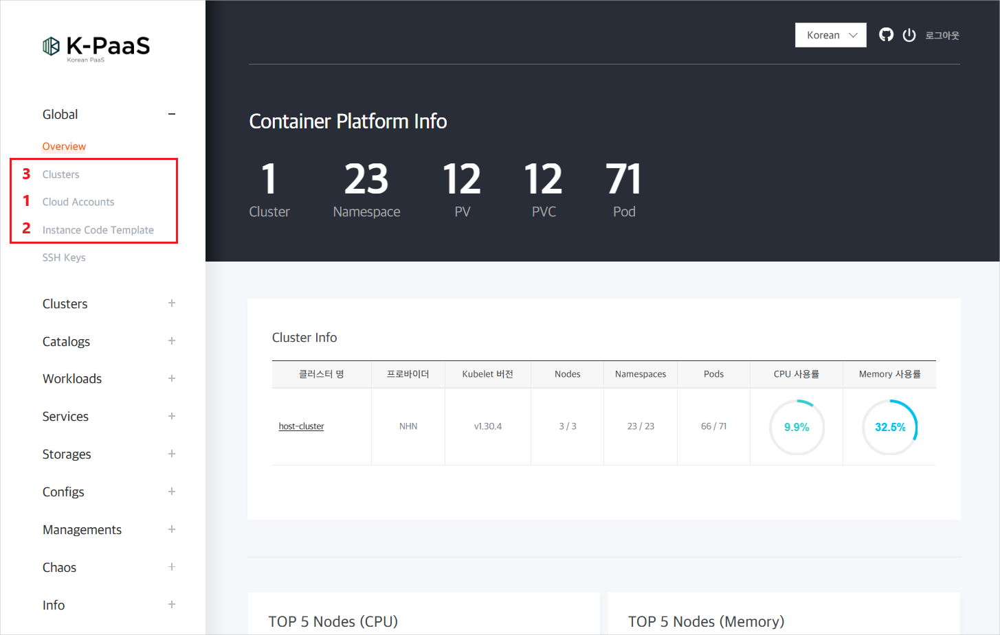
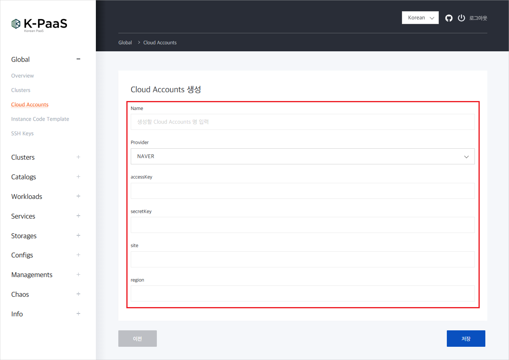
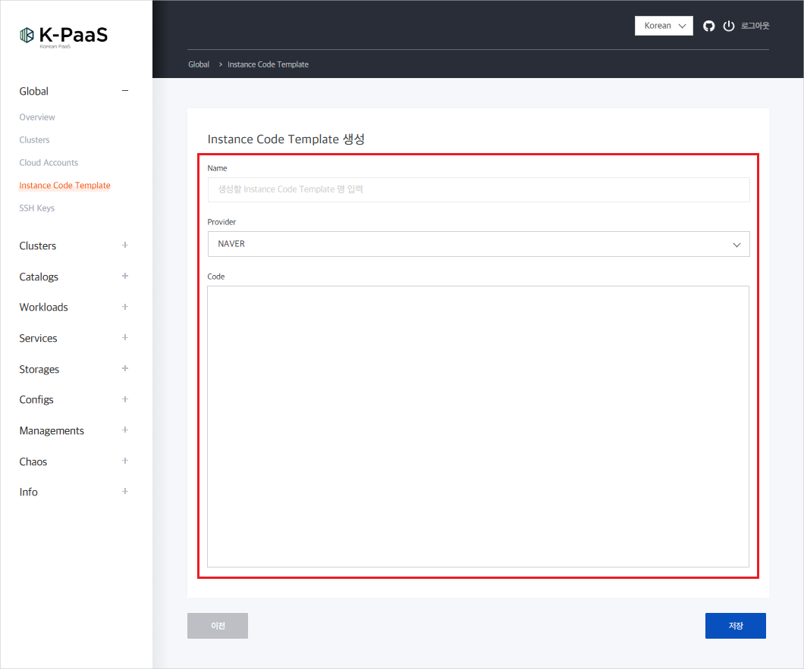
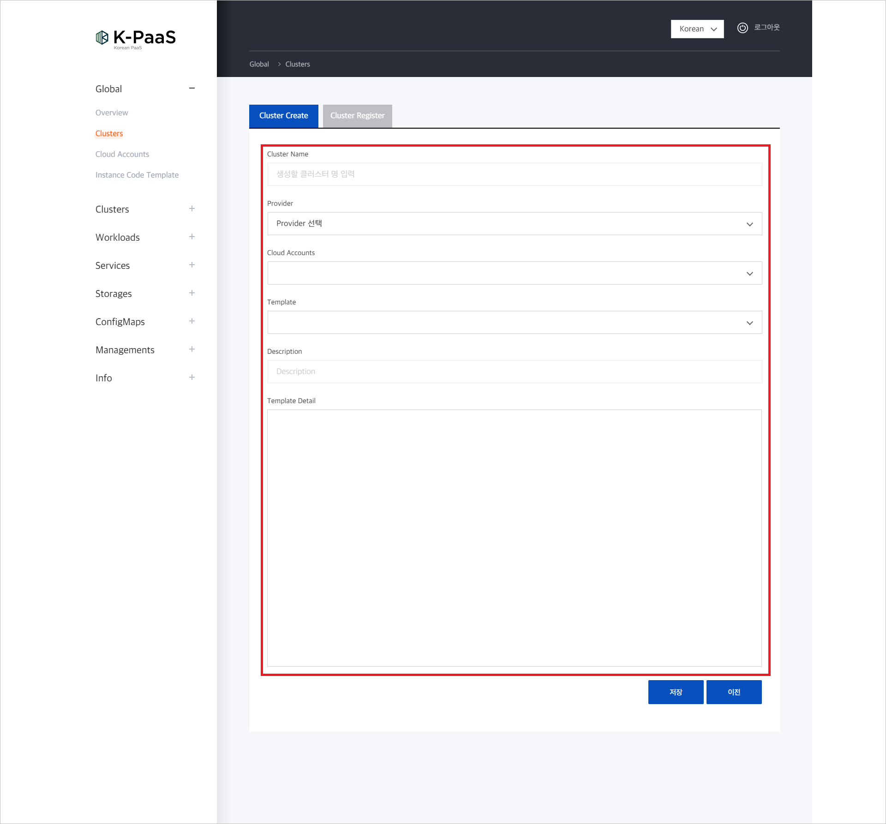
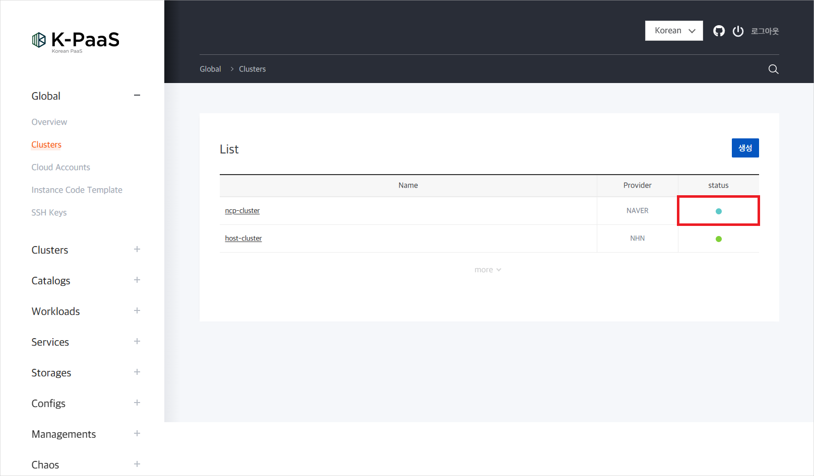
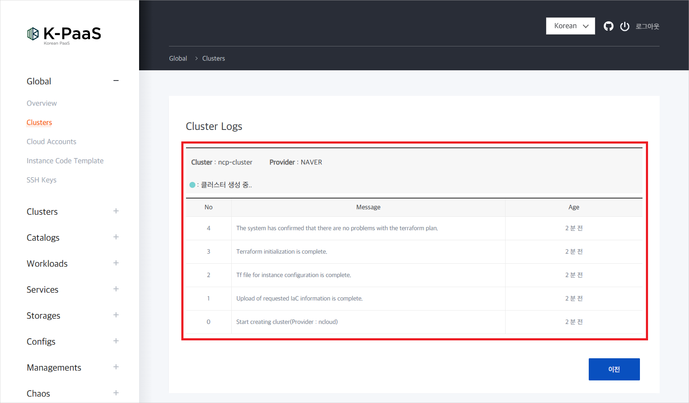
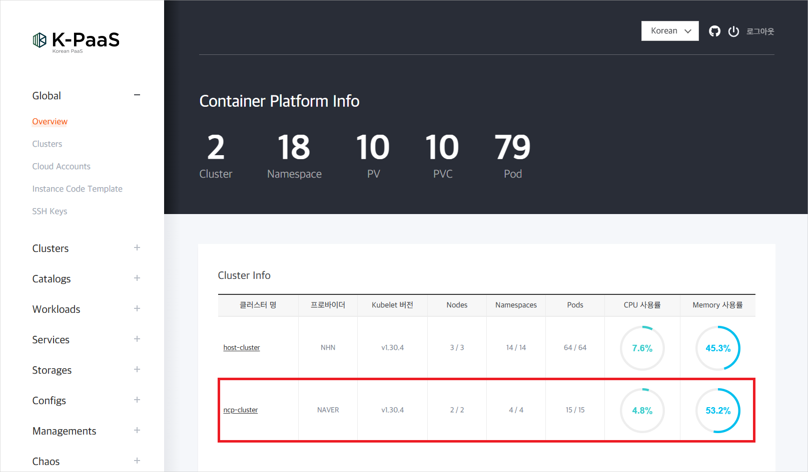

### [Index](https://github.com/K-PaaS/container-platform/blob/master/README.md) > [CP Use](https://github.com/K-PaaS/container-platform/blob/master/use-guide/Readme.md) > [Terraman 사용 가이드](../cp-terraman-guide.md) > Terraman 배포 가이드

## Table of Contents

1. [문서 개요](#1)  
	1.1. [목적](#1.1)  
	1.2. [범위](#1.2)  
	1.3. [참고자료](#1.3)
2. [Prerequisite](#2)  
  2.1. [방화벽 정보](#2.1)
3. [클러스터 배포 프로세스 설명](#3)  	
4. [Cloud Accounts](#4)  
 4.1. [Cloud Accounts 등록](#4.1)  
　4.1.1. [NAVER](#4.1.1)   
5. [Instance Code Template](#5)  
  5.1. [Instance Code Template 예제](#5.1)  
  　5.1.1. [NAVER](#5.1.1)   
  5.2. [Instance Code Template 등록](#5.2)  
6. [Clusters](#6)  
 6.1. [Clusters 생성](#6.1)  

## <div id='1'> 1. 문서 개요

### <div id='1.1'> 1.1. 목적
#### 들어가기 전
- **Host Cluster**: 컨테이너플랫폼의 Kubernetes 메인 클러스터
- **Sub Cluster**: 컨테이너 플랫폼 포털을 통해 신규 배포되거나, 등록된 관리 클러스터

Terraman 배포 가이드는 OpenTofu를 이용하여 Sub Cluster를 생성하기 위한 각 IaaS별 HCL(Hashicorp Configuration Language) 구문을 설명하여, 사용자가 실제 배포할 IaC 코드를 작성하고 Terraman을 이용하여 Sub Cluster 배포하는데 도움을 주기 위한 목적으로 제작되었다.

### <div id='1.2'> 1.2. 범위
Kubernetes Cluster를 배포하는 것을 기준으로 작성되었다.
### <div id='1.3'> 1.3. 참고자료
- NAVER
> https://registry.terraform.io/providers/NaverCloudPlatform/ncloud/latest/docs

## <div id='2'> 2. Prerequisite
- [Container Platform Cluster](https://github.com/K-PaaS/container-platform/blob/master/install-guide/standalone/cp-cluster-install-single.md) 설치가 사전에 진행 되어야한다.
- [Container Platform Portal](https://github.com/K-PaaS/container-platform/blob/master/install-guide/portal/cp-portal-standalone-guide.md) 설치가 사전에 진행 되어야한다.
- Terraman을 실행하기 전 필요한 사전 작업에 대한 설명이다.

### <div id='2.1'> 2.1 방화벽 정보
- Master Node

|프로토콜|포트|비고|
|---|---|---|
|TCP|22|SSH|
|TCP|6443|Kubernetes API Server|
- IaaS 별 API 방화벽 오픈  
    (예: OpenStack API - 8000, 8774, 5000, 9292, 9876, 9696, 8004, 8780, 8776)
- 각 IaaS에서 생성되는 Instance는 원격 접속을 위한 포트가 열려 있어야 한다.

## <div id='3'> 3. 클러스터 배포 프로세스 설명
- [Clusters](#6) 배포를 위한 [Cloud Accounts](#4)를 기반으로 [Instance Code Template](#5)을 활용해서 Sub Cluster를 배포한다.
- [Cloud Accounts](#4) 등록 > [Instance Code Template](#5) 등록 또는 기본 IaC 코드 활용 > [Clusters](#6) 등록 순으로 Terraman 배포를 진행한다.
- 각 메뉴의 자세한 내용은 아래 내용을 참고한다.

<kbd>
  
</kbd>

<br>

## <div id='4'> 4. Cloud Accounts
### <div id='4.1'> 4.1 Cloud Accounts 등록
- Container Platform Portal 화면에서 Global > Cloud Accounts 메뉴에서 Cloud Accounts 정보를 등록한다.
#### <div id='4.1.1'> 4.1.1 NAVER
- 입력시 Ncloud 정보를 아래와 같이 Cloud Accounts 등록 화면에 입력하면 된다.  
- 네이버 클라우드 플랫폼 포털의 마이페이지 > 계정 관리 > 인증키 관리에서 인증키 생성, 관리 및 확인을 할 수 있다.
- Ncloud Site 값은 기본적으로 "public"이며 사용하고 있는 Ncloud 도메인에 따라 "public", "gov", "fin" 중 하나를 입력하면 된다.

  |도메인|입력 값|
  |:------:|:------:|
  |www.ncloud.com|public|
  |www.gov-ncloud.com|gov|
  |www.fin-ncloud.com|fin|

  <br>

  |Cloud Accounts 입력|Ncloud 정보|정보 위치|     
  |:------:|:------:|:------:|
  |accessKey 필드|Access Key|마이페이지 > 계정 관리 > 인증키 관리|
  |secretKey 필드|Secret Key|마이페이지 > 계정 관리 > 인증키 관리|
  |site 필드|Site|[가이드 참고](https://registry.terraform.io/providers/NaverCloudPlatform/ncloud/latest/docs#argument-reference)|
  |region 필드|Region|대시보드 확인[(리전 이름 가이드 참고)](https://guide.ncloud-docs.com/docs/ko/environment-environment-1-1#%EC%A1%B4zone%EC%9D%98-%EC%A2%85%EB%A5%98%EC%99%80-%ED%8A%B9%EC%A7%95)|

<kbd>
  
</kbd>

## <div id='5'> 5. Instance Code Template
> 기본적으로 Terraman을 이용한 인스턴스 생성에 필요한 IaC 가 각 CSP당 한 종류씩 등록되어 있다.   
추가로 필요한 Code Template를 등록하여 클러스터 생성 시 사용이 가능하다.
### <div id='5.1'> 5.1 Instance Code Template 예제
#### <div id='5.1.1'> 5.1.1 NAVER
- Terraman을 사용하여 NAVER에서 인스턴스를 생성하는 방법을 설명한다. 기본 IaC 코드는 인스턴스 생성에 초점을 맞추고 있다.
- [NAVER IaC 코드 작성시 변수 참고](https://registry.terraform.io/providers/NaverCloudPlatform/ncloud/latest/docs#argument-reference)
- 인스턴스 생성시 "master"와 "worker" 명칭을 반드시 표기해야 한다.  
*예시*
  + 인스턴스 1개 생성시 
    - resource "ncloud_server" "master" {...}
  + 인스턴스 n개 생성시 
    - resource "ncloud_server" "master" {...}
    - resource "ncloud_server" "worker1" {...}
    - resource "ncloud_server" "worker2" {...}
    - resource "ncloud_server" "worker3" {...} ...

<details>
<summary>NAVER Instance Code Template </summary>
<div markdown="1">

```
variable server_name01 {
  default = "cp-master"
}

variable server_name02 {
  default = "cp-worker"
}

variable client_ip {
  default = "x.x.x.x"                                                                               #client ip 지정
}

## Provides a Login key resource.
resource "ncloud_login_key" "key_scn_01" {
  key_name = var.server_name01
}

## Provides a VPC resource.
resource "ncloud_vpc" "vpc_scn_01" {
  name            = var.server_name01
  ipv4_cidr_block = "10.0.0.0/16"
}

## Provides a Subnet resource.
resource "ncloud_subnet" "subnet_scn_01" {
  name           = var.server_name01
  vpc_no         = ncloud_vpc.vpc_scn_01.id
  subnet         = cidrsubnet(ncloud_vpc.vpc_scn_01.ipv4_cidr_block, 8, 1)                          # 10.0.1.0/24
  zone           = "KR-1"                                                                           # Available zone where the subnet will be placed physically.
  network_acl_no = ncloud_vpc.vpc_scn_01.default_network_acl_no                                     # The ID of Network ACL.
  subnet_type    = "PUBLIC"                                                                         # PUBLIC(Public) | PRIVATE(Private)
}

## Provides a Network Interface resource
resource "ncloud_network_interface" "nic01" {
  name                  = "server-nic1"
  description           = "for server-nic"
  subnet_no             = ncloud_subnet.subnet_scn_01.id                                            # The ID of the associated Subnet.
  access_control_groups = [ncloud_access_control_group.acg_scn_01.id]                               # List of ACG ID to apply to network interfaces. A maximum of three ACGs can be applied.
}

 resource "ncloud_network_interface" "nic02" {
 name                  = "server-nic2"
 description           = "for server-nic"
 subnet_no             = ncloud_subnet.subnet_scn_01.id
 access_control_groups = [ncloud_access_control_group.acg_scn_01.id]
 }

## Provides a Server instance resource.
resource "ncloud_server" "server_01_master" {                                                       # 인스턴스 생성시 반드시 "master"와 "worker" 명칭으로 구분
  subnet_no                 = ncloud_subnet.subnet_scn_01.id
  name                      = var.server_name01
  server_image_product_code = "SW.VSVR.OS.LNX64.UBNTU.SVR2004.B050"                                 # Server image product code to determine which server image to create. It can be obtained through data.ncloud_server_image(s)
  login_key_name            = ncloud_login_key.key_scn_01.key_name
  description = "master"
  network_interface {                                                                               # List of Network Interface. You can assign up to three network interfaces.
    network_interface_no = ncloud_network_interface.nic01.id
    order                = 0
  }
}

resource "ncloud_server" "server_02" {
  subnet_no                 = ncloud_subnet.subnet_scn_01.id
  name                      = var.server_name02
  server_image_product_code = "SW.VSVR.OS.LNX64.UBNTU.SVR2004.B050"
  login_key_name            = ncloud_login_key.key_scn_01.key_name
  network_interface {
    network_interface_no = ncloud_network_interface.nic02.id
    order                = 0
  }
}

## Provides a Public IP instance resource.
resource "ncloud_public_ip" "public_ip_01" {
  server_instance_no = ncloud_server.server_01_master.id
  description        = "for ${var.server_name01}"
}

resource "ncloud_public_ip" "public_ip_02" {
  server_instance_no = ncloud_server.server_02.id
  description        = "for ${var.server_name02}"
}

## priority, protocol, ip_block, port_range, rule_action for networkACL
locals {
  scn01_inbound = [
    [1, "TCP", "0.0.0.0/0", "80", "ALLOW"],
    [2, "TCP", "0.0.0.0/0", "443", "ALLOW"],
    [3, "TCP", "${var.client_ip}/32", "22", "ALLOW"],
    [4, "TCP", "0.0.0.0/0", "111", "ALLOW"],
    [5, "TCP", "0.0.0.0/0", "2049", "ALLOW"],
    [6, "TCP", "0.0.0.0/0", "6443", "ALLOW"],
    [7, "TCP", "0.0.0.0/0", "2379-2380", "ALLOW"],
    [8, "TCP", "0.0.0.0/0", "10250-10255", "ALLOW"],
    [9, "UDP", "0.0.0.0/0", "4789", "ALLOW"],
    [10, "TCP", "0.0.0.0/0", "30000-32767", "ALLOW"],
    [197, "TCP", "0.0.0.0/0", "1-65535", "ALLOW"],
    [198, "UDP", "0.0.0.0/0", "1-65535", "ALLOW"],
    [199, "ICMP", "0.0.0.0/0", null, "ALLOW"],
  ]

  scn01_outbound = [
    [1, "TCP", "0.0.0.0/0", "80", "ALLOW"],
    [2, "TCP", "0.0.0.0/0", "443", "ALLOW"],
    [3, "TCP", "${var.client_ip}/32", "1000-65535", "ALLOW"],
    [4, "TCP", "0.0.0.0/0", "30000-32767", "ALLOW"],
    [5, "UDP", "0.0.0.0/0", "30000-32767", "ALLOW"],
    [197, "TCP", "0.0.0.0/0", "1-65535", "ALLOW"],
    [198, "UDP", "0.0.0.0/0", "1-65535", "ALLOW"],
    [199, "ICMP", "0.0.0.0/0", null, "ALLOW"]
  ]
}

## Provides a rule of Network ACL resource. 
resource "ncloud_network_acl_rule" "network_acl_01_rule" {
  network_acl_no = ncloud_vpc.vpc_scn_01.default_network_acl_no
  dynamic "inbound" {
    for_each = local.scn01_inbound
    content {
      priority    = inbound.value[0]
      protocol    = inbound.value[1]
      ip_block    = inbound.value[2]
      port_range  = inbound.value[3]
      rule_action = inbound.value[4]
      description = "for ${var.server_name01}"
    }
  }

  dynamic "outbound" {
    for_each = local.scn01_outbound
    content {
      priority    = outbound.value[0]
      protocol    = outbound.value[1]
      ip_block    = outbound.value[2]
      port_range  = outbound.value[3]
      rule_action = outbound.value[4]
      description = "for ${var.server_name01}"
    }
  }
}

## protocol, ip_loack, port_range for ACG
locals {
  default_acg_rules_inbound = [
    ["TCP", "0.0.0.0/0", "80"],
    ["TCP", "0.0.0.0/0", "443"],
    ["TCP", "0.0.0.0/0", "111"],
    ["TCP", "0.0.0.0/0", "2049"],
    ["TCP", "0.0.0.0/0", "2379-2380"],
    ["TCP", "0.0.0.0/0", "6443"],
    ["TCP", "0.0.0.0/0", "10250-10255"],
    ["TCP", "0.0.0.0/0", "30000-32767"],
    ["UDP", "0.0.0.0/0", "4789"],
    ["TCP", "10.0.1.0/24", "22"],
    ["TCP", "${var.client_ip}/32", "22"],
    ["TCP", "0.0.0.0/0", "1-65535"],
    ["UDP", "0.0.0.0/0", "1-65534"],
    ["ICMP", "0.0.0.0/0", null]
  ]

  default_acg_rules_outbound = [
    ["TCP", "0.0.0.0/0", "1-65535"],
    ["UDP", "0.0.0.0/0", "1-65534"],
    ["ICMP", "0.0.0.0/0", null]
  ]
}

## Provides an ACG(Access Control Group) resource.
resource "ncloud_access_control_group" "acg_scn_01" {
  vpc_no      = ncloud_vpc.vpc_scn_01.id
}

## Provides an rule of ACG(Access Control Group) resource.
resource "ncloud_access_control_group_rule" "acg_rule_scn_01" {
  access_control_group_no = ncloud_access_control_group.acg_scn_01.id

  dynamic "inbound" {
    for_each = local.default_acg_rules_inbound
    content {
      protocol    = inbound.value[0]
      ip_block    = inbound.value[1]
      port_range  = inbound.value[2]
    }
  }

  dynamic "outbound" {
    for_each = local.default_acg_rules_outbound
    content {
      protocol    = outbound.value[0]
      ip_block    = outbound.value[1]
      port_range  = outbound.value[2]
    }
  }
}
```
</div>
</details>

### <div id='5.2'> 5.2 Instance Code Template 등록
- Container Platform Portal 화면에서 Global > Instance Code Template 메뉴에서 Instance Code Template을 등록한다. 

<kbd>
  
</kbd>

## <div id='6'> 6. Clusters
### <div id='6.1'> 6.1 Clusters 생성
- Container Platform Portal 화면에서 Global > Clusters 메뉴에서 Cluster를 생성한다. 

<kbd>
  
</kbd>

- Cluster 생성시 Terraman API에 의해서 Sub Cluster 생성이 진행되며 우측 status 로딩 버튼을 누르게 되면 Cluster Logs 목록 페이지로 이동하게 된다.

<kbd>
  
</kbd>

- Cluster Logs 목록 페이지에서 Sub Cluster 진행 사항을 실시간으로 확인할 수 있다.

<kbd>
  
</kbd>

- Sub Cluster 구축이 완료되면 화면과 같이 status의 상태아이콘이 녹색으로 변경 된다.

<kbd>
  
</kbd>

- Sub Cluster 구축이 완료되면 화면과 같이 Overview 페이지에 Sub Cluster 등록이 된 것을 확인할 수 있다.

<kbd>
  
</kbd>